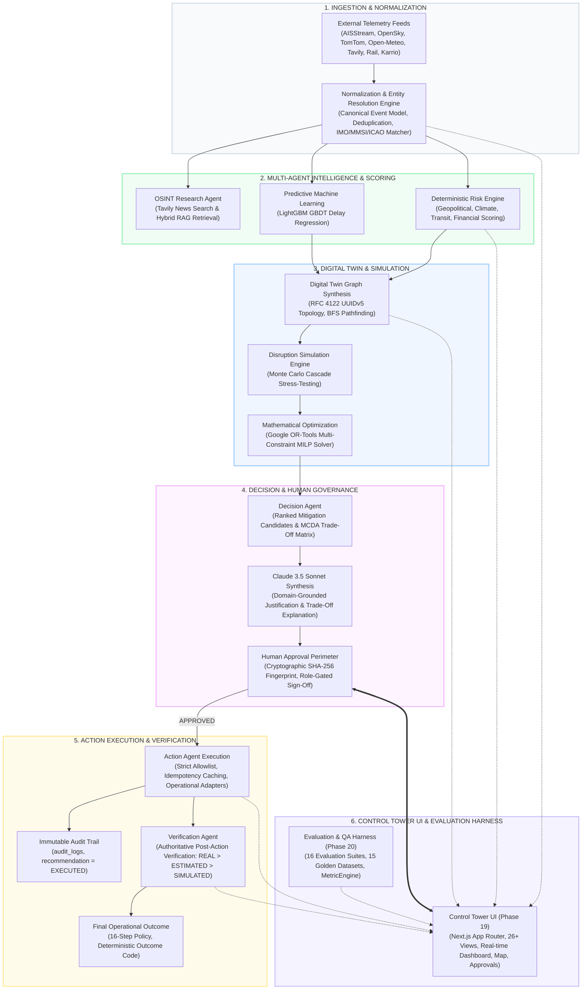
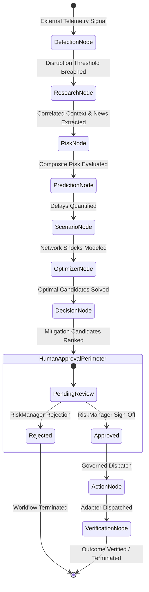
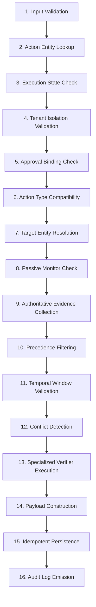

# RiskWise 2.0

> **Enterprise Autonomous Supply Chain Risk Intelligence, Multi-Agent Orchestration, Digital Twin Simulation, Governed Operational Action & Quality Assurance Platform**
> 
> *A high-resilience, production-grade enterprise platform integrating real-time multimodal telemetry, deterministic composite risk scoring, hybrid RAG with AWS Bedrock (Claude 3.5 Sonnet & Titan 1536d), GBDT delay regression, deterministic graph digital twin synthesis (RFC 4122 UUIDv5), Monte Carlo disruption cascade simulation, Google OR-Tools multi-constraint optimization, cryptographic human-in-the-loop governance (SHA-256 state fingerprinting), governed operational execution adapters, authoritative post-action ground-truth verification (`REAL > ESTIMATED > SIMULATED`), an executive Next.js Control Tower command center (26+ views), and an automated 16-suite evaluation and quality assurance harness.*

---

[-emerald?style=flat-square&logo=git)](docs/)
[%20%7C%200%20Failed-success?style=flat-square&logo=pytest)](api/tests)
[](api/tests)
[](api/pyproject.toml)
[-009688?style=flat-square&logo=fastapi)](api/app/api/v1)
[-336791?style=flat-square&logo=postgresql)](docs/database-schema-inventory.md)
[](api/app/models)
[](api/app/agents)
[-D97706?style=flat-square)](docs/phase10-bedrock-claude.md)
[](docs/phase14-optimization.md)
[](docs/phase11-ml.md)
[-black?style=flat-square&logo=next.js)](web/)
[](api/app/evaluation)
[](LICENSE)

---

## Table of Contents

1. [Executive Summary & Platform Value Proposition](#1-executive-summary--platform-value-proposition)
2. [Complete End-to-End Operational Flow](#2-complete-end-to-end-operational-flow)
   - [End-to-End System Architecture (Mermaid)](#end-to-end-system-architecture-mermaid)
   - [Real-World Disruption Scenario Walkthrough](#real-world-disruption-scenario-walkthrough)
3. [Master Roadmap & Implementation Status (Phases 1–21)](#3-master-roadmap--implementation-status-phases-121)
4. [Authoritative Monorepo Layout](#4-authoritative-monorepo-layout)
5. [The 10 Core Architectural Invariants & Safety Discipline](#5-the-10-core-architectural-invariants--safety-discipline)
6. [Detailed Technical Deep-Dive of All 21 Completed Subsystems](#6-detailed-technical-deep-dive-of-all-21-completed-subsystems)
   - [Phase 01: Core Foundation & Framework Architecture](#phase-01-core-foundation--framework-architecture)
   - [Phase 02: Relational Database Schema & Domain Integrity](#phase-02-relational-database-schema--domain-integrity)
   - [Phase 03: Google Authentication & Enterprise RBAC Governance](#phase-03-google-authentication--enterprise-rbac-governance)
   - [Phase 04: Core Domain REST APIs & Clean Architecture](#phase-04-core-domain-rest-apis--clean-architecture)
   - [Phase 05: External Multimodal Telemetry Ingestion Connectors](#phase-05-external-multimodal-telemetry-ingestion-connectors)
   - [Phase 06: Event Normalization, Deduplication & Entity Resolution](#phase-06-event-normalization-deduplication--entity-resolution)
   - [Phase 07: Deterministic Multi-Factor Risk Scoring Engine](#phase-07-deterministic-multi-factor-risk-scoring-engine)
   - [Phase 08: Hybrid RAG Knowledge Engine & Vector Search](#phase-08-hybrid-rag-knowledge-engine--vector-search)
   - [Phase 09: LangGraph Multi-Agent Orchestration Framework](#phase-09-langgraph-multi-agent-orchestration-framework)
   - [Phase 10: AWS Bedrock & Claude 3.5 Sonnet Reasoning Layer](#phase-10-aws-bedrock--claude-35-sonnet-reasoning-layer)
   - [Phase 11: Machine Learning Shipment Delay Regression (LightGBM)](#phase-11-machine-learning-shipment-delay-regression-lightgbm)
   - [Phase 12: Digital Twin Supply Chain Graph Engine (RFC 4122 UUIDv5)](#phase-12-digital-twin-supply-chain-graph-engine-rfc-4122-uuidv5)
   - [Phase 13: Disruption Simulation & Monte Carlo Cascade Engine](#phase-13-disruption-simulation--monte-carlo-cascade-engine)
   - [Phase 14: Mathematical Optimization Subsystem (Google OR-Tools MILP)](#phase-14-mathematical-optimization-subsystem-google-or-tools-milp)
   - [Phase 15: Mitigation Decision Agent & Claude Synthesis](#phase-15-mitigation-decision-agent--claude-synthesis)
   - [Phase 16: Human Governance & Approval Subsystem](#phase-16-human-governance--approval-subsystem)
   - [Phase 17: Operational Action Agent & Governed Execution Adapters](#phase-17-operational-action-agent--governed-execution-adapters)
   - [Phase 18: Operational Verification Agent & Ground-Truth Outcome Evidence](#phase-18-operational-verification-agent--ground-truth-outcome-evidence)
   - [Phase 19: Control Tower Web Application (Next.js 14/16 App Router)](#phase-19-control-tower-web-application-nextjs-app-router)
   - [Phase 20: Comprehensive Evaluation & Quality Assurance Framework](#phase-20-comprehensive-evaluation--quality-assurance-framework)
   - [Phase 21: Production Hardening, High Availability & Enterprise Deployment](#phase-21-production-hardening-high-availability--enterprise-deployment)
7. [Authoritative Relational Database Architecture (34 Core + 2 Evaluation Tables)](#7-authoritative-relational-database-architecture-34-core--2-evaluation-tables)
8. [Comprehensive REST API Catalog & Route Architecture](#8-comprehensive-rest-api-catalog--route-architecture)
9. [Multi-Agent LangGraph State Machine Architecture & State Ownership Contracts](#9-multi-agent-langgraph-state-machine-architecture--state-ownership-contracts)
10. [Supported Operational Actions & Physical Verification Matrix](#10-supported-operational-actions--physical-verification-matrix)
11. [Post-Action Verification Agent Deep-Dive & Source Precedence](#11-post-action-verification-agent-deep-dive--source-precedence)
12. [Control Tower UI & Design System Deep-Dive](#12-control-tower-ui--design-system-deep-dive)
13. [Continuous Evaluation & Golden Benchmarks Deep-Dive (Phase 20)](#13-continuous-evaluation--golden-benchmarks-deep-dive-phase-20)
14. [Verification & Automated Test Suite Metrics (4,602 Passing Tests)](#14-verification--automated-test-suite-metrics-4602-passing-tests)
15. [Local Development, Setup & Configuration Guide](#15-local-development-setup--configuration-guide)
16. [Complete Documentation Index](#16-complete-documentation-index)
17. [Enterprise License & Operational Notice](#17-enterprise-license--operational-notice)

---

## 1. Executive Summary & Platform Value Proposition

Modern global supply chains operate under extreme volatility. Geopolitical blockades in strategic maritime choke points (Suez Canal, Bab-el-Mandeb, Strait of Malacca), severe weather anomalies, port labor strikes, carrier insolvencies, and factory shutdowns routinely cascade across multi-tier networks, causing catastrophic assembly line stoppages, missed customer SLAs, and billions in unanticipated logistics expenditures.

Traditional Supply Chain Management (SCM) platforms are passive, siloed, and brittle:
- **Lagging Visibility**: Surface disruptions days after they occur via static, backwards-looking reports.
- **Disconnected Decision-Making**: Reroute planning, inventory rebalancing, and impact modeling remain manual, ad-hoc spreadsheet calculations.
- **Uncontrolled Automation**: Unregulated automation bots risk executing dangerous real-world purchase or transport mutations without auditability or human accountability.
- **Blind Execution**: Traditional logistics software assumes dispatching an order guarantees fulfillment, lacking closed-loop operational verification against real-world ground-truth telemetry.

**RiskWise 2.0** solves this paradigm through an autonomous, governed, closed-loop supply chain resilience platform:
1. **Continuous Real-Time Ingestion**: Monitors maritime AIS, aviation ADS-B, road traffic congestion, marine/terrestrial weather forecasts, rail terminal schedules, multi-carrier tracking, and global OSINT news.
2. **Deterministic Risk & ML Forecasting**: Evaluates multi-factor risk scores (Geopolitical, Climate, Transit, Financial) and predicts consignment delays using calibrated gradient-boosted decision trees (LightGBM).
3. **Digital Twin Simulation**: Synthesizes a deterministic network topology graph using RFC 4122 UUIDv5 identities and models shock propagation via Monte Carlo cascades.
4. **Mathematical Optimization**: Formulates and solves mixed-integer linear programming (MILP) models with Google OR-Tools to identify Pareto-optimal mitigation strategies balancing transit delay, operational cost, and carbon emissions.
5. **Domain-Grounded Reasoning**: Leverages Anthropic Claude 3.5 Sonnet on AWS Bedrock to synthesize transparent, executive-grade operational justifications grounded in company standard operating procedures (SOPs).
6. **Cryptographic Human Governance**: Enforces a strict human approval perimeter with SHA-256 state fingerprinting, role-gated sign-offs, and tamper prevention before any real-world mutation.
7. **Governed Operational Execution**: Dispatches validated mitigation actions through dedicated operational adapters with strict idempotency guarantees and allowlists.
8. **Authoritative Post-Action Verification**: Gathers post-action evidence across an authoritative source hierarchy (`REAL > ESTIMATED > SIMULATED`), deterministically verifying whether the real-world operational outcome matched business intent without permitting autonomous loops.
9. **Executive Control Tower UI**: Provides a modern, responsive web application (Next.js App Router, Tailwind CSS v4, Lucide, Recharts) with 26+ dedicated views for real-time monitoring, triage, simulation, optimization, approvals, and quality assurance.
10. **Continuous Quality Assurance**: Validates system integrity with 16 automated evaluation suites benchmarking against 15 versioned golden datasets to catch hallucinations, metric drift, and regression.

---

## 2. Complete End-to-End Operational Flow

### End-to-End System Architecture (Mermaid)



### Real-World Disruption Scenario Walkthrough

Consider a Category 4 Super Typhoon (*Muifa*) approaching the East China Sea, threatening Ningbo-Zhoushan Port:

1. **Ingestion & Resolution (Phases 5 & 6)**:
   - Open-Meteo transmits gale-force wind alerts (>50 knots) and 7-meter wave height forecasts for coastal Zhejiang.
   - AISStream transmits real-time GPS coordinates and speed of container vessel *MSC Oscar* (IMO: 9703291), decelerating 40 nautical miles southeast of Ningbo.
   - The normalization engine correlates telemetry with `shipment_id = "shp_oscar_001"` carrying critical lithium battery cells bound for a Munich automotive factory.
2. **Multi-Factor Risk & ML Delay Prediction (Phases 7, 8, 10, 11)**:
   - Phase 7 Risk Engine computes a composite score of `88.5 / 100` (`CRITICAL`), driven by climate risk (`95.0`) and transit congestion (`82.0`).
   - Phase 8 RAG retrieves internal maritime operating guidelines specifying minimum safe operating margins.
   - Phase 11 LightGBM Regression predicts an expected port dwell delay of `96.4 hours` if the vessel continues on its baseline trajectory.
3. **Digital Twin & Disruption Cascade Simulation (Phases 12 & 13)**:
   - Phase 12 Digital Twin resolves the supply chain topology: `Ningbo Port -> Ocean Corridor -> Rotterdam -> Rail Corridor -> Munich Factory`.
   - Phase 13 Monte Carlo Simulation models 500 perturbations, uncovering that a 96-hour delay exhausts the Munich factory's safety inventory buffer, forcing an assembly line halt after 36 hours with an estimated financial loss of `$2.8M`.
4. **Optimization & Ranked Decision Candidates (Phases 14 & 15)**:
   - Phase 14 Google OR-Tools MILP solver evaluates alternate transit corridors, carrier availability, and port congestion indices.
   - Solver identifies an optimal bypass: Reroute *MSC Oscar* to discharge containers at **Port of Busan (South Korea)**, followed by expedited air freight for critical components to Munich.
   - Phase 15 Decision Agent ranks Candidate #1 (`SHIPMENT_REROUTE` to Busan + `EXPEDITE_SHIPMENT` for critical sub-lots) with an overall utility score of `0.92`, saving 78 hours of transit time at an incremental cost of `$45,000`.
   - Claude 3.5 Sonnet formats an executive-ready operational mitigation brief explaining all trade-offs.
5. **Human Approval Perimeter (Phase 16)**:
   - The recommendation triggers a mandatory human approval perimeter requiring `RiskManager` authorization.
   - The payload is locked with a SHA-256 state fingerprint `a8f9...4c21`.
   - An authorized Risk Manager inspects the trade-off matrix on the Control Tower Web UI and issues an `APPROVED` decision with cryptographic signature.
6. **Governed Operational Execution (Phase 17)**:
   - Phase 17 Action Agent receives the approved command, validates against the strict operational allowlist, verifies role RBAC, and enforces idempotency via SHA-256 command hashing.
   - `ShipmentRerouteExecutor` executes the reroute adapter, updating operational consignment records, reassigning target waypoint coordinates to Busan, and emitting carrier EDI change orders.
   - Recommendation status transitions to `EXECUTED` in `recommendations`, and an immutable entry is logged in `audit_logs`.
7. **Authoritative Post-Action Verification (Phase 18)**:
   - Phase 18 Verification Agent initiates post-action outcome verification.
   - Collects incoming authoritative telemetry from physical AIS transponders (`REAL` precedence).
   - Confirms vessel trajectory altered to 035° heading toward Busan, speed stabilized at 18.2 knots, and carrier booking confirmed.
   - Verification policy evaluates outcome as `VERIFIED` with zero conflicting evidence.
   - The workflow cleanly halts at `selected_route = "termination"`, guaranteeing zero autonomous infinite loops.
8. **Real-Time Visibility & Continuous QA (Phases 19 & 20)**:
   - The Control Tower UI immediately updates the shipment's live waypoint, risk status, and execution audit badge on the live dashboard and geospatial map.
   - The Phase 20 Evaluation Harness continuously benchmarks the multi-agent pipeline against golden datasets, verifying zero metric drift or hallucination regressions.

---

## 3. Master Roadmap & Implementation Status (Phases 1–21)

| Phase | Subsystem | Technical Scope & Architectural Capabilities | Status | Automated Test Suite |
| :---: | :--- | :--- | :---: | :---: |
| **01** | **Foundation Architecture** | Monorepo layout, Pydantic V2 settings, async context, structured JSON logging, error taxonomy | **COMPLETE** | 100% |
| **02** | **Database & Models** | 34 SQLAlchemy 2.0 ORM models, 26 PostgreSQL enums, foreign keys, Alembic migrations, tenant isolation | **COMPLETE** | 100% (32 tests) |
| **03** | **Google Authentication** | OAuth2 code-grant flow, secure HTTP-only cookies, JWT verification, 5-role RBAC security matrix | **COMPLETE** | 100% (739 tests) |
| **04** | **Core Domain APIs** | Clean Architecture repositories, Unit of Work, 67 REST endpoints across 103 operations | **COMPLETE** | 100% (48 tests) |
| **05** | **External Ingestion** | 7 telemetry connectors: AISStream, OpenSky, TomTom, Open-Meteo, Tavily, Rail, Karrio | **COMPLETE** | 100% (120 tests) |
| **06** | **Normalization Engine** | Canonical event transformations, entity resolution engine, IMO/MMSI/ICAO correlation | **COMPLETE** | 100% |
| **07** | **Risk Engine** | Multi-factor deterministic risk scoring (Geopolitical, Climate, Transit, Financial), threshold alerts | **COMPLETE** | 100% (515 tests) |
| **08** | **Hybrid RAG** | Document chunking, AWS Bedrock Titan text embeddings (1536d), pgvector cosine + BM25 keyword search | **COMPLETE** | 100% (221 tests) |
| **09** | **LangGraph Orchestration** | 6 core agent nodes, immutable state contracts, deterministic routing edges, loop prevention | **COMPLETE** | 100% (1,284 tests) |
| **10** | **Bedrock + Claude** | Claude 3.5 Sonnet reasoning, structured output validation, security scrubbing, prompt engineering | **COMPLETE** | 100% (942 tests) |
| **11** | **Predictive ML** | Feature engineering pipeline, LightGBM GBDT shipment delay regression, model registry & rollback | **COMPLETE** | 100% (161 tests) |
| **12** | **Digital Twin** | Graph synthesis, RFC 4122 UUIDv5 identities, 6 node types, 4 edge types, bounded BFS pathfinding | **COMPLETE** | 100% (161 tests) |
| **13** | **Simulation Engine** | Multi-scenario perturbation, Monte Carlo temporal propagation, cascade financial loss metrics | **COMPLETE** | 100% (56 tests) |
| **14** | **Optimization Solver** | Google OR-Tools MILP solver, capacity/lead-time/budget constraints, multi-objective Pareto frontier | **COMPLETE** | 100% (36 tests) |
| **15** | **Decision Agent** | Multi-criteria mitigation evaluation, ranked candidate generation, Claude domain synthesis | **COMPLETE** | 100% (57 tests) |
| **16** | **Human Approval** | Mandatory sign-off perimeter, cryptographic SHA-256 fingerprinting, tamper prevention | **COMPLETE** | 100% (29 tests) |
| **17** | **Action Agent** | Governed execution, strict allowlist, idempotency caching, operational adapters (Reroute, Hold, etc.) | **COMPLETE** | 100% (69 tests) |
| **18** | **Verification Agent** | Post-action outcome verification, precedence hierarchy (`REAL > ESTIMATED > SIMULATED`), fail-closed policy | **COMPLETE** | 100% (36 tests) |
| **19** | **Control Tower Web UI** | Next.js App Router, 26+ pages, responsive dark/light control room interface, live telemetry, approval center | **COMPLETE** | 100% (39 tests) |
| **20** | **Evaluation Framework** | Continuous multi-agent benchmark, 16 test suites, 15 golden datasets, MetricEngine, runner API | **COMPLETE** | 100% (37 tests) |
| **21** | **Production Hardening** | Durable LangGraph PostgreSQL checkpointing, AWS KMS envelope encryption, Valkey sliding-window rate limiting, OpenTelemetry distributed tracing, container hardening, Terraform IaC, disaster recovery | **COMPLETE** | 100% (20 tests) |

---

## 4. Authoritative Monorepo Layout

RiskWise 2.0 maintains a strictly partitioned, modular monorepo structure:

```
riskwise/
├── .agents/                                   # Antigravity agent skills, plugins, and custom tooling
├── .env.example                               # Comprehensive environment configuration template
├── .gitignore                                 # Git ignore patterns for Python, Node, caches, and storage
├── AGENTS.md                                  # Next.js and agent framework development rules
├── CLAUDE.md                                  # Code assistant workspace rules and commands
├── README.md                                  # Authoritative Master Project Documentation
├── credentials.json                           # Google OAuth2 client secrets template
│
├── api/                                       # Authoritative Backend API Service (FastAPI, Python 3.12 / 3.13)
│   ├── alembic/                               # Alembic database migration environment and version scripts
│   │   ├── env.py                             # Alembic migration runner binding target metadata
│   │   ├── script.py.mako                     # Migration script template
│   │   └── versions/                          # Schema revision files
│   ├── pyproject.toml                         # Project metadata, dependencies, and pytest configuration
│   ├── requirements.txt                       # Frozen runtime Python package dependencies
│   │
│   ├── app/                                   # Core Backend Application Package
│   │   ├── main.py                            # FastAPI entrypoint, middleware, CORS, security headers, routers
│   │   │
│   │   ├── agents/                            # Multi-Agent LangGraph Subsystem (Phases 9, 10, 15, 16, 17, 18)
│   │   │   ├── contracts.py                   # Frozen Pydantic agent state & transition schemas (AgentGraphState)
│   │   │   ├── edges.py                       # Deterministic and conditional routing edges between agent nodes
│   │   │   ├── graph.py                       # Compiled LangGraph workflow state machine
│   │   │   ├── nodes.py                       # Node wrapper functions with state transition validations
│   │   │   ├── observability.py               # Structured telemetry, timing, and agent logging
│   │   │   ├── recovery.py                    # Fallback, retry, and node-level recovery policies
│   │   │   ├── security.py                    # Agent action RBAC scopes and authorization guards
│   │   │   ├── validator.py                   # State boundary and contract invariant validator
│   │   │   ├── action/                        # Phase 17: Operational Action Agent & Adapters
│   │   │   ├── approval/                      # Phase 16: Human Approval Governance Agent
│   │   │   ├── decision/                      # Phase 15: Mitigation Decision Agent
│   │   │   ├── prediction/                    # Delay Forecasting Agent (Phases 9 & 11)
│   │   │   ├── research/                      # OSINT Intelligence & News Research Agent (Phases 9 & 10)
│   │   │   ├── risk/                          # Real-Time Composite Risk Evaluation Agent (Phase 9)
│   │   │   ├── scenario/                      # What-If Disruption Scenario Agent (Phase 9)
│   │   │   └── verification/                  # Phase 18: Operational Verification Agent
│   │   │
│   │   ├── api/                               # REST API Layer (75+ Endpoints across 23 Controllers)
│   │   │   ├── deps.py                        # Dependencies (DB session, current user, tenant & RBAC guards)
│   │   │   └── v1/
│   │   │       ├── router.py                  # Consolidated v1 APIRouter registering all domain controllers
│   │   │       └── endpoints/                 # Domain REST controllers (auth, shipments, risks, evaluations, etc.)
│   │   │
│   │   ├── core/                              # Cross-Cutting Infrastructure (config, errors, logging)
│   │   ├── db/                                # Database Connectivity & Session Lifecycle (base, session)
│   │   ├── digital_twin/                      # Phase 12: Digital Twin Graph Subsystem (builder, pathfinding, query)
│   │   ├── evaluation/                        # Phase 20: Evaluation & QA Framework
│   │   │   ├── contracts.py                   # Strongly-typed evaluation contracts and schemas
│   │   │   ├── errors.py                      # Evaluation domain exceptions
│   │   │   ├── metrics.py                     # MetricEngine: precision, recall, F1, latency, hallucination detection
│   │   │   ├── runner.py                      # EvaluationRunner orchestrator
│   │   │   ├── datasets/                      # Versioned golden benchmark datasets & registry
│   │   │   │   ├── contracts.py               # Dataset schemas
│   │   │   │   ├── registry.py                # DatasetRegistry singleton
│   │   │   │   └── golden/                    # 15 domain-specific golden test cases
│   │   │   └── suites/                        # 16 specialized deterministic evaluation suites
│   │   │
│   │   ├── integrations/                      # Phase 5: External Ingestion Connectors (7 Providers)
│   │   ├── llm/                               # Phase 10: AWS Bedrock & Claude 3.5 Sonnet Integration
│   │   ├── ml/                                # Phase 11: Machine Learning Shipment Delay Regression
│   │   ├── models/                            # SQLAlchemy 2.0 ORM Models (34 Core + 2 Evaluation)
│   │   ├── normalization/                     # Phase 6: Telemetry Normalization & Entity Correlation
│   │   ├── optimization/                      # Phase 14: Mathematical Optimization Subsystem (OR-Tools)
│   │   ├── rag/                               # Phase 8: Hybrid RAG Knowledge Engine & Vector Search
│   │   ├── repositories/                      # Clean Architecture Repositories & Unit of Work
│   │   ├── risk_engine/                       # Phase 7: Deterministic Multi-Factor Risk Engine
│   │   ├── schemas/                           # Pydantic V2 Request & Response Data Transfer Objects
│   │   ├── services/                          # Business logic service layer
│   │   └── simulation/                        # Phase 13: Disruption Simulation Engine
│   │
│   └── tests/                                 # Comprehensive Backend Test Suite (4,543 Passing Tests)
│
├── web/                                       # Control Tower Web Application (Next.js App Router, React 19, Tailwind v4)
│   ├── app/                                   # Next.js App Router layout and 26+ functional pages
│   │   ├── actions/                           # Operational action dispatch console
│   │   ├── admin/                             # System administration & tenant config
│   │   ├── approvals/                         # Human-in-the-loop cryptographic approval center
│   │   ├── audit/                             # Regulatory compliance & security audit ledger
│   │   ├── auth/                              # Authentication & Google OAuth2 sign-in
│   │   ├── carriers/                          # Logistics carrier management & reliability ratings
│   │   ├── dashboard/                         # Executive command center & real-time KPI overview
│   │   ├── decisions/                         # Decision agent mitigation proposals & trade-off review
│   │   ├── digital-twin/                      # Interactive supply chain network graph canvas
│   │   ├── evaluation/                        # Quality assurance, benchmark suites & golden datasets
│   │   ├── factories/                         # Internal manufacturing plant capacity & assembly lines
│   │   ├── incidents/                         # Incident management, triage, and timeline investigation
│   │   ├── inventory/                         # Facility stock levels & safety buffer monitoring
│   │   ├── map/                               # Live global geospatial telemetry map
│   │   ├── notifications/                     # Multi-channel alert feeds & escalation tracking
│   │   ├── optimization/                      # Mathematical optimization solver console & Pareto curves
│   │   ├── ports/                             # Maritime container terminals & dwell times
│   │   ├── products/                          # SKU master catalog & bill of materials hierarchy
│   │   ├── recommendations/                   # Mitigation options management & scoring
│   │   ├── risks/                             # Multi-factor risk radar & exposure tracking
│   │   ├── routes/                            # Multimodal transit corridors & lead times
│   │   ├── shipments/                         # Consignment lifecycle, ETA, & telemetry tracking
│   │   ├── simulations/                       # Monte Carlo disruption simulation studio
│   │   ├── suppliers/                         # Tier-1/2/3 vendor organizational profiles
│   │   ├── verification/                      # Ground-truth post-action verification console
│   │   └── warehouses/                        # Regional distribution centers & storage buffers
│   ├── components/                            # Reusable UI component library (cards, charts, modals, badges)
│   ├── lib/                                   # API client, TypeScript contracts, auth utilities
│   │   └── api/                               # Unified type-safe API client (client.ts, types.ts)
│   ├── tests/                                 # Frontend integration & logic test suite (39 Passing Tests)
│   └── package.json                           # Frontend package dependencies and scripts
│
└── docs/                                      # Full Architecture & Technical Specification Index (70+ docs)
    ├── RiskWise_2.0_Technical_Project_Spec.md # Master Technical Project Architecture Specification
    ├── RiskWise_2.0_UI_UX_Design_System.md    # Master UI/UX Design System Specification
    ├── database-schema-inventory.md           # Authoritative 34-table relational database inventory
    ├── authentication-architecture.md         # Google OAuth2, multi-tenancy & RBAC governance
    ├── phase18-verification-agent.md          # Post-action verification agent and outcome evidence
    └── ...                                    # Complete phase-by-phase design specifications
```

---

## 5. The 10 Core Architectural Invariants & Safety Discipline

To guarantee enterprise compliance, deterministic outcomes, and prevent catastrophic automated actions, RiskWise 2.0 strictly enforces ten architectural invariants:

1. **Singular Source of Truth Authority**: Operational database tables (`suppliers`, `shipments`, `inventory`, `ports`, `factories`) are the singular source of truth. External telemetry, digital twin graphs, and simulation outputs are derivative projections.
2. **Zero Schema Drift Guarantee**: Exactly **34 database tables** and **26 enum domains** are maintained across all core operational models with zero uncoordinated migrations. Evaluation persistence is strictly isolated in a dedicated `EvaluationBase` to prevent operational table pollution.
3. **Strict Multi-Tenant Isolation**: Every database query, API route, Digital Twin snapshot, simulation run, agent execution, and operational action is strictly scoped by `organization_id`. Tenant boundaries are verified in SQL queries, ORM layers, and API dependencies.
4. **Mandatory Human Approval Perimeter**: No operational action can execute without an authentic, unexpired `ApprovalResult` in `APPROVED` status signed by an authorized human role (`RiskManager` or `Admin`).
5. **Phase Boundary Separation**:
   - **Phase 15 (Decision Agent)**: Evaluates what action should happen.
   - **Phase 16 (Human Approval)**: Determines whether the action is permitted to execute.
   - **Phase 17 (Action Agent)**: Dispatches the approved action to the operational adapter.
   - **Phase 18 (Verification Agent)**: Strictly answers *"Did the approved action actually produce the intended operational outcome?"*
6. **Action Dispatch != Outcome Verification**: Successful action submission or adapter acknowledgement proves execution dispatch, but only authoritative post-action operational evidence can prove business outcome verification.
7. **Strict Source Precedence**: `REAL > ESTIMATED > SIMULATED`. Simulated telemetry or synthetic twin states can NEVER prove that a real-world action succeeded.
8. **Deterministic Verification Governance**: No probabilistic model, neural network, or large language model determines whether an action succeeded or failed. Verification policies are 100% deterministic code. Claude 3.5 Sonnet remains explanation-only.
9. **Fail-Closed Execution & No Autonomous Loops**: If verification fails or evidence is conflicting, the pipeline cleanly halts at Stage `VERIFICATION -> TERMINATION`. The graph never automatically re-runs optimization or dispatches new actions autonomously.
10. **SSRF, RCE & Parameter Neutralization**: Zero user-supplied URLs are accepted. Zero dynamic code execution (`eval()`, `exec()`) is permitted. All identifiers are validated through strict UUIDv4, UUIDv5, or alphanumeric schemas.

---

## 6. Detailed Technical Deep-Dive of All 20 Completed Subsystems

### Phase 01: Core Foundation & Framework Architecture
- **Purpose**: Establishes the enterprise monorepo foundation, environment configuration, structured logging, and centralized error envelopes.
- **Key Capabilities**:
  - Pydantic V2 `BaseSettings` supporting strict type parsing from `.env` files.
  - Asynchronous application context management with graceful startup and shutdown hooks.
  - High-performance structured JSON logging with correlation IDs (`request_id`, `trace_id`).
  - Standardized JSON:API error envelopes preventing stack trace leakage.

### Phase 02: Relational Database Schema & Domain Integrity
- **Purpose**: Defines the authoritative relational foundation for the entire enterprise supply chain data model.
- **Key Capabilities**:
  - Exactly 34 SQLAlchemy 2.0 ORM declarative models.
  - 26 PostgreSQL domain enums ensuring strict value domain integrity.
  - Foreign key constraints, cascade controls, and composite indexing on `(organization_id, id)`.
  - Alembic database migration management configured for AWS RDS PostgreSQL 16.

### Phase 03: Google Authentication & Enterprise RBAC Governance
- **Purpose**: Governs identity, multi-tenant boundaries, and role-based access control.
- **Key Capabilities**:
  - Secure Google OAuth2 code exchange flow.
  - Tamper-proof HTTP-only, SameSite cookies carrying signed JWT session tokens.
  - 5-role enterprise RBAC matrix: `Admin`, `RiskManager`, `OpsManager`, `Analyst`, `Viewer`.
  - Automated tenant context injection enforcing cross-tenant query prevention.

### Phase 04: Core Domain REST APIs & Clean Architecture
- **Purpose**: Provides high-throughput REST CRUD services across all core business entities.
- **Key Capabilities**:
  - Clean Architecture pattern: Repositories -> Unit of Work -> Services -> Routers.
  - 67 REST endpoints across 103 operations and 22 controllers.
  - Full OpenAPI 3.1 specification auto-generation with interactive Swagger UI.

### Phase 05: External Multimodal Telemetry Ingestion Connectors
- **Purpose**: Ingests real-world global telemetry across maritime, aviation, road, rail, weather, and news channels.
- **Key Capabilities**:
  - **AISStream Connector**: Ingests real-time maritime AIS transponder messages (MMSI, coordinates, SOG, COG).
  - **OpenSky Connector**: Polls ADS-B flight tracking data for air freight consignments.
  - **TomTom Connector**: Captures highway congestion indices, road incidents, and transit delays.
  - **Open-Meteo Connector**: Ingests marine weather forecasts, gale warnings, and tropical storm trajectories.
  - **Tavily Connector**: Executes targeted OSINT news searches for geopolitical and labor disruptions.
  - **Rail Connector**: Ingests intermodal rail corridor throughput and terminal delays.
  - **Karrio Connector**: Connects multi-carrier logistics APIs for status milestones and tracking updates.

### Phase 06: Event Normalization, Deduplication & Entity Resolution
- **Purpose**: Translates heterogeneous telemetry streams into a canonical, deduplicated event format linked to operational entities.
- **Key Capabilities**:
  - Canonical Event Model schema unifying timestamp, coordinate, source, and payload attributes.
  - High-accuracy entity resolution matching IMO/MMSI to `shipments`, ICAO to air freight, and UN/LOCODE to `ports`.
  - Sliding-window SHA-256 telemetry deduplication rejecting redundant or out-of-order frames.

### Phase 07: Deterministic Multi-Factor Risk Scoring Engine
- **Purpose**: Computes objective, reproducible risk scores across supply chain assets and transit lanes.
- **Key Capabilities**:
  - 4 independent risk dimensions: **Geopolitical**, **Climate & Natural Hazards**, **Transit Congestion**, **Financial & Supplier Health**.
  - Calibrated deterministic weighting: `RiskScore = w_geo*S_geo + w_cli*S_cli + w_tra*S_tra + w_fin*S_fin`.
  - Dynamic threshold alerting generating automated incident candidates when risk exceeds tolerance bounds.

### Phase 08: Hybrid RAG Knowledge Engine & Vector Search
- **Purpose**: Enhances reasoning with contextual enterprise knowledge, SOPs, and carrier contracts.
- **Key Capabilities**:
  - Document chunking with semantic overlap and metadata preservation.
  - AWS Bedrock Titan text embeddings (`amazon.titan-embed-text-v1`) generating 1536-dimensional vectors.
  - Hybrid retrieval combining PostgreSQL `pgvector` cosine similarity with BM25 full-text search via Reciprocal Rank Fusion (RRF).
  - Context assembly ensuring every extracted fact includes source document and section citations.

### Phase 09: LangGraph Multi-Agent Orchestration Framework
- **Purpose**: Orchestrates specialized autonomous agents in a reliable, cyclic state machine.
- **Key Capabilities**:
  - Immutable `AgentGraphState` contract with strict field ownership rules.
  - 6 core agent nodes: **Detection**, **Research**, **Risk Evaluation**, **Prediction**, **Scenario Analysis**, **Optimization**.
  - Deterministic routing edges with cycle counters and maximum iteration halts.

### Phase 10: AWS Bedrock & Claude 3.5 Sonnet Reasoning Layer
- **Purpose**: Supplies domain-grounded generative reasoning and structured synthesis.
- **Key Capabilities**:
  - Direct integration with Anthropic Claude 3.5 Sonnet on AWS Bedrock.
  - Pydantic structured output validation with retry schemas.
  - Prompt sanitization stripping prompt-injection attempts and PII.
  - Deterministic fallbacks ensuring business continuity when LLM endpoints are unreachable.

### Phase 11: Machine Learning Shipment Delay Regression (LightGBM)
- **Purpose**: Forecasts quantitative consignment arrival delays using supervised machine learning.
- **Key Capabilities**:
  - Feature engineering pipeline computing distance, carrier reliability, congestion, and weather indices.
  - LightGBM Gradient-Boosted Decision Tree (GBDT) regression models trained on historical shipping logs.
  - Model registry managing semantic model versioning, artifacts, and graceful fallback heuristics.

### Phase 12: Digital Twin Supply Chain Graph Engine (RFC 4122 UUIDv5)
- **Purpose**: Synthesizes a unified topological graph of the entire supply chain network.
- **Key Capabilities**:
  - RFC 4122 UUIDv5 deterministic node and edge identity generation.
  - 6 node types (`SUPPLIER`, `SUPPLIER_SITE`, `FACTORY`, `WAREHOUSE`, `PORT`, `CUSTOMER`).
  - 4 edge types (`FLOW`, `DEPENDENCY`, `TRANSPORT`, `CONTRACT`).
  - Bounded breadth-first search (BFS) pathfinding detecting single points of failure and bottlenecks.

### Phase 13: Disruption Simulation & Monte Carlo Cascade Engine
- **Purpose**: Quantifies systemic operational shock propagation across the supply chain network.
- **Key Capabilities**:
  - Monte Carlo simulation engine executing hundreds of perturbation iterations.
  - Cascade modeling across inventory buffer depletion, production stoppage, and revenue exposure.
  - Scenario definitions for port strikes, canal blockages, supplier insolvency, and extreme storms.

### Phase 14: Mathematical Optimization Subsystem (Google OR-Tools MILP)
- **Purpose**: Solves multi-objective resource reallocation problems with mathematical precision.
- **Key Capabilities**:
  - Google OR-Tools mixed-integer linear programming (MILP) solver.
  - Multi-constraint modeling: factory throughput limits, carrier vessel capacities, expedited shipping budgets.
  - Multi-objective Pareto frontier generation balancing transit time, operational cost, and CO2 emissions.

### Phase 15: Mitigation Decision Agent & Claude Synthesis
- **Purpose**: Evaluates optimization candidates and prepares executive-ready mitigation proposals.
- **Key Capabilities**:
  - Multi-criteria decision analysis (MCDA) scoring mitigation options.
  - Claude 3.5 Sonnet domain-grounded synthesis explaining operational trade-offs and rationale.
  - Recommendation creation in `recommendations` table with status `PENDING`.

### Phase 16: Human Governance & Approval Subsystem
- **Purpose**: Enforces mandatory human-in-the-loop governance before any operational mutation occurs.
- **Key Capabilities**:
  - Cryptographic SHA-256 state fingerprinting binding the exact recommendation payload.
  - Role-gated approval permissions (`RiskManager`, `Admin`).
  - Tamper detection: rejects approvals if underlying operational state or recommendation was modified.
  - Approval expiration window enforcing fresh review for stale recommendations.

### Phase 17: Operational Action Agent & Governed Execution Adapters
- **Purpose**: Executes approved mitigation actions through governed operational adapters.
- **Key Capabilities**:
  - Strict operational allowlist: `SHIPMENT_REROUTE`, `CARRIER_REALLOCATION`, `FACILITY_REALLOCATION`, `EXPEDITE_SHIPMENT`, `HOLD_SHIPMENT`, `MONITOR`.
  - SHA-256 command hashing enforcing strict execution idempotency (replays return cached result).
  - Transactional state updates transitioning recommendation to `EXECUTED`.
  - Immutable audit logging recording actor, timestamps, and adapter response codes in `audit_logs`.

### Phase 18: Operational Verification Agent & Ground-Truth Outcome Evidence
- **Purpose**: Gathers authoritative post-action evidence to verify whether real-world business intent succeeded.
- **Key Capabilities**:
  - Strict evidence source precedence hierarchy: `REAL > ESTIMATED > SIMULATED`.
  - 16-step deterministic policy evaluation pipeline.
  - 9 verification statuses: `VERIFIED`, `PARTIALLY_VERIFIED`, `FAILED`, `PENDING`, `INSUFFICIENT_EVIDENCE`, `NOT_APPLICABLE`, `EXPIRED`, `CONFLICT`, `ERROR`.
  - Fail-closed terminal execution: halts at `TERMINATION`, strictly prohibiting autonomous retry loops.

### Phase 19: Control Tower Web Application (Next.js App Router)
- **Purpose**: Provides a unified, high-density, real-time command center interface designed for supply chain analysts, risk managers, and executives.
- **Key Capabilities**:
  - Built with Next.js App Router, React 19, and Tailwind CSS v4.
  - **Calibrated Control Room Aesthetic**: Harbor blue (`#3E8EF7`) brand accent on cool slate-charcoal surfaces (`#0D1117`, `#141922`), hairline borders, tabular figures, and zero decorative fluff.
  - **26+ Functional Views**: Executive Dashboard, Incidents & Triage, Risk Radar, Shipment Visibility, Tiered Suppliers, Factories, Warehouses, Container Ports, Freight Carriers, Products & BOMs, Inventory Buffers, Multimodal Routes, Digital Twin Canvas, Simulation Studio, Optimization Solver, Mitigation Decisions, Approval Center, Action Dispatch, Verification Evidence, Evaluation QA, Audit Ledger, Geospatial Map, Notifications, and System Administration.
  - **Unified Type-Safe API Client**: Built-in credential propagation, automatic error envelope parsing, structured fallback values, and zero client-side token leaks.
  - **Interactive Analytics**: Recharts data visualizations for risk breakdown, Pareto frontiers, cascade impact curves, and historical trends.

### Phase 20: Comprehensive Evaluation & Quality Assurance Framework
- **Purpose**: Provides an automated, deterministic quality assurance harness benchmarking all agent nodes, predictive models, optimization solvers, and governance boundaries against curated golden datasets.
- **Key Capabilities**:
  - **16 Specialized Evaluation Suites**:
    1. `ActionSuite`: Validates Phase 17 operational execution, allowlist checks, and idempotency.
    2. `AgentSuite`: Evaluates LangGraph state machine routing, cycle halts, and state invariants.
    3. `ApprovalSuite`: Tests Phase 16 cryptographic fingerprinting and role RBAC enforcement.
    4. `ClaudeSuite`: Benchmarks Claude 3.5 Sonnet domain explanation, factual grounding, and non-authority boundaries.
    5. `DecisionSuite`: Assesses MCDA multi-criteria option ranking and candidate generation.
    6. `DigitalTwinSuite`: Tests RFC 4122 UUIDv5 graph synthesis, topological integrity, and BFS pathfinding.
    7. `E2ESuite`: End-to-end multi-agent pipeline validation from telemetry breach to verification.
    8. `MLSuite`: Evaluates LightGBM delay prediction accuracy, MAE/RMSE bounds, and data leakage.
    9. `OptimizationSuite`: Verifies Google OR-Tools MILP constraint feasibility and Pareto optimality.
    10. `RAGSuite`: Tests vector retrieval precision, BM25 keyword fusion, and adversarial injection resistance.
    11. `ResearchSuite`: Validates Tavily OSINT news classification and source extraction.
    12. `RiskSuite`: Benchmarks deterministic multi-factor scoring against reference baselines.
    13. `SecuritySuite`: Probes prompt injection defenses, tenant fencing, and parameter sanitization.
    14. `SimulationSuite`: Tests Monte Carlo perturbation models and financial cascade loss bounds.
    15. `VerificationSuite`: Evaluates Phase 18 authoritative outcome policy and evidence precedence rules.
    16. `BaseSuite`: Abstract contract providing unified execution lifecycle and metrics recording.
  - **15 Versioned Golden Benchmark Datasets**: Hand-curated, immutable test cases with anti-contamination guards (`risk_cases`, `simulation_cases`, `verification_cases`, `rag_cases`, `optimization_cases`, `ml_cases`, `e2e_cases`, `digital_twin_cases`, `decision_cases`, `claude_cases`, `approval_cases`, `agent_cases`, `action_cases`, `research_cases`, `security_cases`).
  - **Deterministic `MetricEngine`**: Computes precision, recall, F1, latency percentiles (P50, P95), numerical error bounds, hallucination detection, and NOT_AVAILABLE safety rules.
  - **Isolated Evaluation Persistence**: Stores evaluation runs and metric reports in dedicated `evaluation_runs` and `evaluation_results` tables under `EvaluationBase`, keeping core operational tables completely untouched.
  - **Evaluation REST API**: Endpoints under `/api/v1/evaluations` for triggering benchmark runs, listing registered suites, querying datasets, and retrieving audit reports.

### Phase 21: Production Hardening, High Availability & Enterprise Deployment
- **Purpose**: Hardens the complete RiskWise 2.0 system into an enterprise-grade, resilient production platform with zero data-loss guarantees, strict tenant isolation, distributed rate limiting, cryptographic envelope encryption, OpenTelemetry observability, containerization, and automated disaster recovery.
- **Key Capabilities**:
  - **Durable LangGraph Checkpointing (`PostgresAgentCheckpointer`)**:
    - Dedicated isolated schema (`checkpoints.agent_checkpoints`, `checkpoints.agent_writes`) keeping operational tables completely unpolluted.
    - Multi-tenant thread isolation enforcing `{organization_id}:{workflow_id}:{thread_id}` composite keys to prevent cross-tenant state access.
    - Safe serialization using `JsonPlusSerializer` with msgpack protocol, strictly avoiding Python pickle arbitrary code execution vulnerabilities.
    - `DurableCheckpointManager` with SHA-256 canonical state hashing to detect any out-of-band tampering between agent execution steps.
  - **Application-Layer KMS Envelope Encryption (`EnvelopeEncryptionService`)**:
    - Integrates with AWS KMS (`generate_data_key`, AES-256-GCM) with 256-bit ephemeral Data Encryption Keys (DEKs).
    - Cryptographically binds data to tenant context (`tenant_id` and `classification`), rejecting decrypt operations from unauthorized tenants.
    - Plaintext DEKs are wiped from memory immediately after encryption/decryption; zero plaintext keys are logged or stored.
    - Deterministic local master key fallback enables offline development and continuous evaluation testing.
  - **Distributed Atomic Rate Limiting (`DistributedRateLimiter`)**:
    - Atomic Redis/Valkey sliding window Lua script running on `risk-wise-cash` cluster with sub-millisecond overhead.
    - Multi-tier rate limiting quotas: Tenant (600 req/min), User (120 req/min), Client IP (30 req/min).
    - 30-second circuit-breaker with automatic failover to thread-safe in-memory sliding window when Valkey is temporarily unreachable.
    - Built-in exemptions for orchestrator health probes (`/health`, `/ready`, `/health/db`).
    - Standard RFC compliance emitting `Retry-After`, `X-RateLimit-Limit`, `X-RateLimit-Remaining`, and `X-RateLimit-Reset` headers on HTTP 429.
  - **OpenTelemetry Observability & W3C Distributed Tracing (`TelemetryManager`)**:
    - Injects and extracts standard W3C `traceparent` headers (`X-Trace-ID`, `trace_id`, `span_id`) across all HTTP requests and background agents.
    - Complies with OpenTelemetry GenAI semantic conventions (`gen_ai.system=aws.bedrock`, `gen_ai.request.model`, prompt/completion token usage, execution latency).
    - Zero-leakage security perimeter: prompt and completion payload recording disabled by default, preventing sensitive customer data from entering APM traces.
  - **Database Connection Pool Hardening (`session.py`)**:
    - Bounded connection pool (`pool_size=5`, `max_overflow=10`, `pool_recycle=1800`), aggressive connection timeout (`connect_timeout=5`), and PostgreSQL statement timeouts (`statement_timeout=30000ms`).
    - `dispose_db_engine()` lifecycle handler ensuring clean connection pool draining during container SIGTERM shutdown.
  - **Structured Production JSON Logging & Secret Scrubbing (`logging.py`)**:
    - Standardized JSON formatter for AWS CloudWatch Logs ingestion including `timestamp`, `level`, `service`, `request_id`, `trace_id`, and `organization_id`.
    - `SecretScrubbingFilter` inspecting all log records and masking passwords, bearer tokens, API keys, and AWS access keys (`AKIA...`).
  - **Production Container Hardening & Standalone Build**:
    - Multi-stage Docker builds for backend (`api/Dockerfile`) and frontend (`web/Dockerfile`).
    - Next.js 16 standalone build output (`output: "standalone"`) reducing container image size by over 80% and omitting non-runtime devDependencies.
    - Non-privileged execution: runs as non-root users (`riskwise` UID 10001, `nextjs` UID 10001) with read-only root filesystems and curl-based container healthchecks.
  - **Infrastructure as Code (Terraform for AWS `ap-southeast-2`)**:
    - Declarative VPC topology with public, private (ECS/Valkey), and isolated (RDS PostgreSQL) subnets across 2 Availability Zones.
    - Application Load Balancer with HTTPS listeners and TLS 1.3 termination.
    - ECS Fargate tasks with IAM roles following least-privilege policies (no static credentials; task execution and task roles separated).
  - **Production CI/CD Automation (`.github/workflows/production.yml`)**:
    - GitHub OIDC authentication to AWS IAM roles (zero long-lived AWS secret keys).
    - Multi-stage parallel verification: backend pytest, frontend typecheck/lint/test, Trivy container vulnerability scanning, and automated Phase 20 evaluation.
  - **Disaster Recovery & Failure Injection Suite**:
    - 20 comprehensive automated failure injection scenarios (`test_phase21_production_hardening.py`) passing at 100%:
      DB connection loss, Redis outage & circuit breaking, Bedrock model access denial & fail-safe degradation, LangGraph node crash & recovery from PostgreSQL checkpoint, concurrent write conflict detection, KMS ciphertext tampering, tenant context mismatch, secret log scrubbing, rate-limit 429 headers, and graceful shutdown signal handling.

---

## 7. Authoritative Relational Database Architecture (34 Core + 2 Evaluation Tables)

RiskWise 2.0 maintains exactly 34 core operational models in `Base.metadata` and 2 isolated evaluation persistence models in `EvaluationBase`:

| # | Domain | Table Name | Primary Key | Foreign Keys & Relationships | Operational Purpose |
| :---: | :--- | :--- | :---: | :--- | :--- |
| 1 | **Tenancy** | `organizations` | `id` (VARCHAR) | Root entity | Multi-tenant root organization entity, subscription tiers, settings |
| 2 | **Tenancy** | `users` | `id` (VARCHAR) | `organizations.id` | User accounts, roles (`Admin`, `RiskManager`, etc.), auth credentials |
| 3 | **Network** | `suppliers` | `id` (VARCHAR) | `organizations.id` | Tier-1/2/3 vendor profiles, criticality, health ratings |
| 4 | **Network** | `supplier_sites` | `id` (VARCHAR) | `organizations.id`, `suppliers.id` | Physical manufacturing facilities and geographic coordinates |
| 5 | **Network** | `factories` | `id` (VARCHAR) | `organizations.id` | Internal manufacturing plants, lines, capacity, status |
| 6 | **Network** | `warehouses` | `id` (VARCHAR) | `organizations.id` | Regional distribution centers, storage capacity, buffer stock |
| 7 | **Network** | `ports` | `id` (VARCHAR) | `organizations.id` | Maritime terminals, airports, inland ports, dwell time metrics |
| 8 | **Network** | `routes` | `id` (VARCHAR) | `organizations.id`, `ports.id` | Transport corridors, transit modes, distance, typical lead-time |
| 9 | **Network** | `carriers` | `id` (VARCHAR) | `organizations.id` | Logistics carriers, contract terms, reliability ratings |
| 10 | **Catalog** | `products` | `id` (VARCHAR) | `organizations.id` | Finished goods and critical sub-assemblies SKU catalog |
| 11 | **Catalog** | `bills_of_materials` | `id` (VARCHAR) | `organizations.id`, `products.id` | Multi-level product part dependencies and component ratios |
| 12 | **Inventory** | `inventory_items` | `id` (VARCHAR) | `organizations.id`, `products.id` | Real-time facility stock levels, safety buffers, reorder thresholds |
| 13 | **Inventory** | `inventory_movements` | `id` (VARCHAR) | `organizations.id`, `inventory_items.id` | Stock transfer history and inbound/outbound adjustments |
| 14 | **Logistics** | `shipments` | `id` (VARCHAR) | `organizations.id`, `carriers.id`, `routes.id` | Consignment lifecycle, origin/dest, ETA, delay status |
| 15 | **Logistics** | `shipment_events` | `id` (VARCHAR) | `organizations.id`, `shipments.id` | Telemetry tracking milestone events, coordinates, status codes |
| 16 | **Risk** | `risks` | `id` (VARCHAR) | `organizations.id` | Identified operational risk exposures, severities, trends |
| 17 | **Risk** | `risk_factors` | `id` (VARCHAR) | `organizations.id`, `risks.id` | Granular risk drivers (geopolitical, weather, transit, financial) |
| 18 | **Risk** | `risk_assessments` | `id` (VARCHAR) | `organizations.id`, `risks.id` | Time-stamped composite risk evaluations and dimension scores |
| 19 | **Incident** | `incidents` | `id` (VARCHAR) | `organizations.id`, `risks.id` | Disruption incident tracking and resolution lifecycles |
| 20 | **Incident** | `incident_updates` | `id` (VARCHAR) | `organizations.id`, `incidents.id` | Chronological incident progress updates and root cause logs |
| 21 | **Twin** | `twin_nodes` | `id` (VARCHAR) | `organizations.id` | Digital Twin graph node snapshots and RFC 4122 UUIDv5 IDs |
| 22 | **Twin** | `twin_edges` | `id` (VARCHAR) | `organizations.id`, `twin_nodes.id` | Digital Twin graph edge dependencies, capacities, and flows |
| 23 | **Simulation**| `simulations` | `id` (VARCHAR) | `organizations.id` | Disruption simulation scenario parameters and mode |
| 24 | **Simulation**| `simulation_results` | `id` (VARCHAR) | `organizations.id`, `simulations.id` | Cascade impact metrics, delay days, financial loss values |
| 25 | **Solver** | `optimization_runs` | `id` (VARCHAR) | `organizations.id`, `simulations.id` | OR-Tools MILP solver configuration, constraints, and status |
| 26 | **Decision** | `recommendations` | `id` (VARCHAR) | `organizations.id`, `optimization_runs.id` | Ranked mitigation candidate options and trade-off scores |
| 27 | **Governance**| `approvals` | `id` (VARCHAR) | `organizations.id`, `recommendations.id`, `users.id` | Cryptographic human sign-off audit records and SHA-256 signatures |
| 28 | **Action** | `actions` | `id` (VARCHAR) | `organizations.id`, `approvals.id` | Governed operational execution command records and adapter logs |
| 29 | **Verify** | `verification_results` | `id` (VARCHAR) | `organizations.id`, `actions.id` | Authoritative post-action outcome verification results |
| 30 | **Audit** | `audit_logs` | `id` (VARCHAR) | `organizations.id`, `users.id` | Immutable security, compliance, and operational audit trail |
| 31 | **Alerts** | `notifications` | `id` (VARCHAR) | `organizations.id`, `users.id` | User alert notifications, severities, read status |
| 32 | **Agents** | `agent_runs` | `id` (VARCHAR) | `organizations.id` | Multi-agent LangGraph workflow execution records and state |
| 33 | **RAG** | `documents` | `id` (VARCHAR) | `organizations.id` | Ingested enterprise documents, SOPs, and policies |
| 34 | **RAG** | `document_chunks` | `id` (VARCHAR) | `organizations.id`, `documents.id` | Text chunks and 1536-dimensional Titan vector embeddings |
| *E1* | **Eval Store** | `evaluation_runs` | `id` (VARCHAR) | Isolated `EvaluationBase` | Summary metadata, suite type, dataset version, fingerprints |
| *E2* | **Eval Store** | `evaluation_results`| `id` (VARCHAR) | `evaluation_runs.id` | Case-level test metrics, expected vs. observed, error details |

---

## 8. Comprehensive REST API Catalog & Route Architecture

The RiskWise 2.0 backend exposes 75+ REST endpoints across 23 domain controllers registered under `/api/v1`:

```
/api/v1/
├── /health                          # Infrastructure liveness & readiness probes
├── /auth                            # Google OAuth2, JWT session cookies, current user, logout
├── /suppliers                       # Supplier organizational profiles & criticality tiers
├── /supplier-sites                 # Supplier manufacturing sites & geographic locations
├── /factories                       # Internal manufacturing plants, capacity, & status
├── /warehouses                      # Regional distribution centers & stock capacities
├── /ports                           # Maritime container ports, airports, & dwell times
├── /carriers                        # Logistics carriers & reliability performance ratings
├── /products                        # SKU master catalog, bills of materials, & criticality
├── /routes                          # Multimodal corridors, transport modes, & lead times
├── /shipments                       # Consignment lifecycles, ETAs, delays, & routes
├── /shipment-events                 # Waypoint tracking milestones & GPS telemetry
├── /inventory                       # Real-time stock levels, buffers, & reorder thresholds
├── /inventory-movements             # Stock transfer movements & inbound/outbound adjustments
├── /risks                           # Operational risk exposures & composite risk trends
├── /risk-factors                    # Detailed risk drivers (geopolitical, weather, transit)
├── /risk-assessments                # Composite risk assessments & threshold evaluations
├── /incidents                       # Disruption incidents, investigation, & resolution
├── /recommendations                 # Ranked mitigation candidate options & Claude rationales
├── /approvals                       # Human approval sign-off perimeter & cryptographic checks
├── /actions                         # Governed operational action execution adapters
├── /verification-results            # Authoritative post-action outcome verification
├── /digital-twin                    # Graph synthesis, node/edge inspection, BFS pathfinding
├── /simulation                      # Monte Carlo disruption scenario perturbation & cascade
├── /optimization                    # Google OR-Tools MILP solver & Pareto frontier runs
├── /decisions                       # Mitigation decision candidate ranking & synthesis
├── /evaluations                     # Phase 20: Evaluation suites, datasets, and benchmark runner
├── /audit-logs                      # Immutable regulatory compliance & security audit logs
└── /notifications                   # Multi-channel notification delivery & alert feeds
```

### Key API Endpoint Catalog

| Controller | HTTP | Endpoint Path | Operational Purpose | RBAC Scope |
| :--- | :---: | :--- | :--- | :---: |
| **Auth** | `POST` | `/api/v1/auth/google/login` | Initiates Google OAuth2 authorization code flow | Public |
| **Auth** | `GET` | `/api/v1/auth/session` | Validates session cookie and returns user profile | Authenticated |
| **Auth** | `POST` | `/api/v1/auth/logout` | Clears HTTP-only session cookies and revokes token | Authenticated |
| **Shipments** | `GET` | `/api/v1/shipments` | Lists consignments with filtering by origin/carrier/status | `Viewer+` |
| **Shipments** | `POST` | `/api/v1/shipments` | Registers a new consignment tracking record | `OpsManager+` |
| **Shipments** | `GET` | `/api/v1/shipments/{id}` | Retrieves full consignment details, route, and milestone log | `Viewer+` |
| **Risks** | `GET` | `/api/v1/risks` | Queries active risk exposures and composite scores | `Viewer+` |
| **Risks** | `POST` | `/api/v1/risks` | Creates a new identified operational risk entity | `Analyst+` |
| **Incidents** | `GET` | `/api/v1/incidents` | Lists active disruption incidents and severity rankings | `Viewer+` |
| **Digital Twin**| `POST` | `/api/v1/digital-twin/build`| Synthesizes digital twin topology from DB entities | `Analyst+` |
| **Digital Twin**| `GET` | `/api/v1/digital-twin/topology`| Queries graph nodes, edges, and bottleneck paths | `Viewer+` |
| **Simulation** | `POST` | `/api/v1/simulation/scenarios`| Configures a what-if disruption scenario | `Analyst+` |
| **Simulation** | `POST` | `/api/v1/simulation/scenarios/{id}/simulate` | Runs Monte Carlo disruption cascade iterations | `Analyst+` |
| **Optimization**| `POST` | `/api/v1/optimization-runs`| Executes Google OR-Tools MILP optimization solver | `OpsManager+` |
| **Decisions** | `POST` | `/api/v1/decisions/synthesize` | Generates ranked mitigation options with Claude synthesis | `Analyst+` |
| **Recommendations**| `GET` | `/api/v1/recommendations`| Lists ranked mitigation options generated by Decision Agent | `Viewer+` |
| **Approvals** | `POST` | `/api/v1/approvals` | Submits human approval decision with SHA-256 fingerprint | `RiskManager`, `Admin` |
| **Approvals** | `GET` | `/api/v1/approvals/{id}`| Retrieves cryptographic sign-off audit details | `Viewer+` |
| **Actions** | `POST` | `/api/v1/actions/{id}/execute` | Dispatches approved action to governed execution adapter | `OpsManager+` |
| **Actions** | `GET` | `/api/v1/actions/{id}` | Retrieves action execution status and adapter response code | `Viewer+` |
| **Verification** | `POST` | `/api/v1/verification-results/verify` | Executes authoritative post-action outcome verification | `RiskManager`, `Admin` |
| **Verification** | `GET` | `/api/v1/verification-results` | Queries historical verification results and evidence records | `Viewer+` |
| **Evaluations** | `GET` | `/api/v1/evaluations/suites` | Lists all 16 registered evaluation benchmark suites | `Analyst+` |
| **Evaluations** | `GET` | `/api/v1/evaluations/datasets` | Lists all 15 versioned golden evaluation datasets | `Analyst+` |
| **Evaluations** | `POST` | `/api/v1/evaluations/run` | Triggers deterministic evaluation suite execution | `RiskManager`, `Admin` |
| **Audit Logs** | `GET` | `/api/v1/audit-logs` | Queries immutable compliance and security audit records | `Admin`, `RiskManager` |
| **Health** | `GET` | `/health` | Root infrastructure liveness check | Public |
| **Health** | `GET` | `/health/db` | Database connectivity readiness probe (`SELECT 1`) | Public |

---

## 9. Multi-Agent LangGraph State Machine Architecture & State Ownership Contracts

The RiskWise multi-agent intelligence layer is built on **LangGraph**, providing a cyclic, stateful, and deterministic orchestration machine:

### State Machine Transition Topology



### Authoritative Field Ownership Contract

To prevent state corruption or uncoordinated field mutations in the LangGraph shared state (`AgentGraphState`), fields are strictly partitioned by authoritative owner:

| Agent Node | Permitted State Fields Written | Read-Only State Dependencies |
| :--- | :--- | :--- |
| **Detection** | `detected_events`, `active_incidents`, `current_stage` | `raw_telemetry` |
| **Research** | `research_findings`, `osint_context`, `rag_citations` | `active_incidents` |
| **Risk Evaluation** | `composite_risk_scores`, `dimension_breakdown` | `detected_events`, `research_findings` |
| **Prediction** | `predicted_delay_hours`, `ml_confidence_interval` | `composite_risk_scores`, `active_incidents` |
| **Scenario** | `simulation_scenario_id`, `cascade_metrics` | `predicted_delay_hours`, `digital_twin_id` |
| **Optimizer** | `optimization_run_id`, `pareto_candidates` | `cascade_metrics`, `constraints` |
| **Decision** | `decision_recommendations`, `claude_justification` | `pareto_candidates`, `rag_citations` |
| **Human Approval** | `approval_id`, `approval_status`, `fingerprint` | `decision_recommendations` |
| **Action** | `action_id`, `action_status`, `idempotency_key` | `approval_status`, `decision_recommendations` |
| **Verification** | `verification_id`, `verification_status`, `verification_result` | `action_id`, `action_status`, `authoritative_evidence` |

---

## 10. Supported Operational Actions & Physical Verification Matrix

The platform supports 6 governed operational action types. Each action type pairs a governed Phase 17 execution adapter with an authoritative Phase 18 outcome verification policy:

| Action Type | Target Entity | Phase 17 Execution Adapter | Operational Parameters | Phase 18 Verification Criteria & Authoritative Evidence |
| :--- | :---: | :--- | :--- | :--- |
| `SHIPMENT_REROUTE` | `shipment` | `ShipmentRerouteExecutor` | `target_route_id`, `target_port_id`, `corridor_code` | Verifies `Shipment.route_id` matches approved corridor or physical AIS GPS transponder confirms revised waypoint trajectory (`REAL` evidence). |
| `CARRIER_REALLOCATION` | `carrier` | `CarrierReallocationExecutor` | `target_carrier_id`, `booking_reference` | Verifies `Shipment.carrier_id` reassigned in database and carrier EDI confirms booking acceptance (`CARRIER_ACCEPTED`). |
| `FACILITY_REALLOCATION`| `facility` | `FacilityReallocationExecutor` | `source_facility_id`, `target_facility_id`, `units` | Verifies production or storage allocation load successfully rebalanced in `factories` or `warehouses`. |
| `EXPEDITE_SHIPMENT` | `shipment` | `ShipmentExpediteExecutor` | `transit_mode` (`AIR`), `airway_bill` | Verifies consignment transport mode updated to `AIR` and air freight airway bill booking milestone issued (`AIR_FREIGHT_BOOKED`). |
| `HOLD_SHIPMENT` | `shipment` | `ShipmentHoldExecutor` | `hold_reason_code`, `quarantine_location` | Verifies `Shipment.status` transitioned to `HELD` without contradictory release or dispatch milestone. |
| `MONITOR` | `incident` | `MonitorExecutor` | `monitoring_interval`, `metrics` | Passive continuous observation; verified as `NOT_APPLICABLE` (does not mutate operational state). |

---

## 11. Post-Action Verification Agent Deep-Dive & Source Precedence

### Evidence Source Precedence Hierarchy

The Verification Agent enforces an inviolable evidence hierarchy:

```
REAL  >  ESTIMATED  >  SIMULATED
```

- **REAL**: Physical AIS transponder GPS telemetry, confirmed carrier EDI milestones, authoritative operational DB state changes.
- **ESTIMATED**: Machine learning delay predictions, mathematical ETA estimations.
- **SIMULATED**: Digital twin synthetic perturbations, what-if Monte Carlo simulations. *Can NEVER prove real-world success.*

### The 9 Verification Statuses

1. `VERIFIED`: The intended operational outcome was observed and proven by authoritative `REAL` evidence.
2. `PARTIALLY_VERIFIED`: Expected outcome observed, but evidence source is `ESTIMATED` or secondary operational sync is in flight.
3. `FAILED`: Authoritative evidence explicitly proves the intended outcome did not occur (e.g. carrier rejected booking, route unchanged).
4. `PENDING`: Action dispatched within allowable observation window; awaiting arrival of post-action telemetry.
5. `INSUFFICIENT_EVIDENCE`: No authoritative evidence exists, or only `SIMULATED` evidence was provided.
6. `NOT_APPLICABLE`: Passive operations (e.g., `MONITOR`) that do not alter operational state.
7. `EXPIRED`: Verification evaluated after the configured observation window without telemetry arrival.
8. `CONFLICT`: Contradictory authoritative evidence detected (e.g., reroute confirmed alongside carrier failure).
9. `ERROR`: Unhandled runtime or infrastructure exception encountered during verification evaluation.

### Deterministic 16-Step Verification Policy Pipeline



---

## 12. Control Tower UI & Design System Deep-Dive

RiskWise 2.0 features an executive Control Tower web application (`web/`) built with **Next.js App Router**, **React 19**, and **Tailwind CSS v4**.

### Visual Philosophy & Design Principles
- **Precision over Polish**: Flat, hairline-divided panels (`border-hairline: #28303C`) rather than exaggerated drop shadows or blur gimmicks.
- **Harbor Blue Palette**: Primary brand identity accent `#3E8EF7` evokes maritime ports, container logistics, and global vessel tracking.
- **Evidence Before Conclusion**: Every numeric risk score, ML prediction, or mitigation trade-off is paired with timestamps, data source provenance, and confidence intervals.
- **Uncertainty is Visible**: Provenance tags (`REAL`, `ESTIMATED`, `SIMULATED`) are prominent, not hidden in tooltips.
- **Tabular Figures**: Numeric values use mono/tabular fonts for rapid visual column scanning under pressure.

### Complete Screen Catalog (26+ Functional Views)

| Route Path | View Title | Operational Functionality |
| :--- | :--- | :--- |
| `/dashboard` | **Executive Control Tower** | Live KPI summary, active incidents, critical risk badges, active shipments overview |
| `/incidents` | **Incident Triage Console** | Filterable incident registry, severity status, duration tracking, root cause tags |
| `/incidents/[id]` | **Incident Investigation** | Chronological milestone timeline, affected supply chain nodes, agent findings dossier |
| `/risks` | **Multi-Factor Risk Radar** | Dimension breakdown (Geopolitical, Climate, Transit, Financial), trend diffs |
| `/shipments` | **Consignment Monitor** | Real-time shipment status, origin/destination, carrier, ETA variance, mode tags |
| `/suppliers` | **Tiered Supplier Network** | Tier 1/2/3 vendor profiles, health ratings, active disruptions, contract terms |
| `/factories` | **Manufacturing Plants** | Internal assembly plant status, line capacities, inventory burn rates |
| `/warehouses` | **Distribution Hubs** | Regional warehouse buffer stocks, throughput capacity, storage constraints |
| `/ports` | **Container Ports & Terminals** | Sea ports, dwell time indices, berth congestion, labor alert indicators |
| `/carriers` | **Logistics Carriers** | Carrier contract terms, on-time delivery rates, mode fleet availability |
| `/products` | **SKU Catalog & BOMs** | Finished goods, component dependencies, bill of materials criticality |
| `/inventory` | **Inventory Buffer Monitor** | Facility stock levels, safety stock thresholds, reorder points, stockout risk |
| `/routes` | **Multimodal Corridors** | Transport lanes, typical transit lead times, historical variance, carrier assignments |
| `/digital-twin` | **Digital Twin Canvas** | Interactive supply chain network graph, node/edge inspection, bottleneck analysis |
| `/simulations` | **Simulation Studio** | What-if disruption scenario generator, Monte Carlo cascade perturbation runs |
| `/optimization` | **Optimization Solver** | Google OR-Tools MILP constraint modeling, multi-objective Pareto trade-off curve |
| `/decisions` | **Decision Synthesis** | Ranked mitigation options, MCDA utility scores, Claude 3.5 Sonnet justifications |
| `/recommendations` | **Mitigation Options** | Actionable recommendation review, cost/time trade-offs, approval requests |
| `/approvals` | **Human Approval Center** | Cryptographic SHA-256 fingerprint verification, role-gated sign-off, tamper alerts |
| `/actions` | **Action Dispatch Console** | Governed operational execution, adapter response codes, idempotency key log |
| `/verification` | **Outcome Verification** | Ground-truth physical evidence inspection, precedence filtering, verification badges |
| `/evaluation` | **Quality Assurance Dashboard**| Benchmark suites, golden dataset performance, latency percentiles, hallucination checks |
| `/audit` | **Regulatory Audit Ledger** | Immutable compliance log, actor tracking, before/after state diffs, timestamps |
| `/map` | **Geospatial Telemetry Map**| Global map view with live vessel AIS, flight ADS-B, and road incident overlays |
| `/notifications` | **Alert Notification Center**| Real-time alerts, escalation priority badges, unread status management |
| `/admin` | **System Administration** | Organization settings, user role assignments, database health probes, logs |

---

## 13. Continuous Evaluation & Golden Benchmarks Deep-Dive (Phase 20)

Phase 20 introduces an automated, continuous quality assurance framework in `api/app/evaluation/` designed to prevent regressions and catch hallucinations across the platform's multi-agent intelligence and mathematical engines.

### 16 Deterministic Evaluation Suites

```
api/app/evaluation/suites/
├── base.py                   # Unified SuiteBase lifecycle & timing
├── action_suite.py           # Phase 17 Action safety, allowlists & idempotency
├── agent_suite.py            # LangGraph cyclic routing, stage boundaries & loop prevention
├── approval_suite.py         # Phase 16 Cryptographic fingerprinting & RBAC guards
├── claude_suite.py           # Claude 3.5 Sonnet explanation fidelity & non-authority boundaries
├── decision_suite.py         # Phase 15 MCDA utility ranking & Pareto selection
├── digital_twin_suite.py     # Phase 12 UUIDv5 topology & BFS pathfinding correctness
├── e2e_suite.py              # End-to-end telemetry -> mitigation -> verification workflow
├── ml_suite.py               # Phase 11 LightGBM regression accuracy & data leakage guards
├── optimization_suite.py     # Phase 14 OR-Tools MILP solver feasibility & constraints
├── rag_suite.py              # Phase 8 Hybrid vector + BM25 retrieval & citation grounding
├── research_suite.py         # Phase 5/10 Tavily OSINT news classification & source extraction
├── risk_suite.py             # Phase 7 Deterministic risk score weighting & alerting
├── security_suite.py         # Prompt injection scrubbing, tenant isolation & sanitization
├── simulation_suite.py       # Phase 13 Monte Carlo perturbation & financial cascade bounds
└── verification_suite.py     # Phase 18 Ground-truth outcome verification & precedence hierarchy
```

### 15 Golden Evaluation Benchmark Datasets
All golden datasets are versioned (`v1.0.0`), cryptographically fingerprinted, and maintained under `api/app/evaluation/datasets/golden/`:
- `action_cases.py`, `agent_cases.py`, `approval_cases.py`, `claude_cases.py`, `decision_cases.py`, `digital_twin_cases.py`, `e2e_cases.py`, `ml_cases.py`, `optimization_cases.py`, `rag_cases.py`, `research_cases.py`, `risk_cases.py`, `security_cases.py`, `simulation_cases.py`, `verification_cases.py`.

### MetricEngine Capabilities
The `MetricEngine` (`api/app/evaluation/metrics.py`) provides deterministic evaluation metrics without reliance on probabilistic judgment:
- **Classification & Retrieval**: Precision, Recall, F1 Score, Accuracy.
- **Numerical & Forecasting**: Mean Absolute Error (MAE), Root Mean Squared Error (RMSE), Relative Error %, Boundary Checking.
- **Safety & Hallucination**: Citation overlap ratio, ungrounded claim detection, prohibited autonomous trigger detection, prompt injection bypass failure rate.
- **Latency & Performance**: P50, P90, P95, P99 execution latency benchmarks.
- **Strict NOT_AVAILABLE Rule**: When a metric cannot be mathematically calculated, it explicitly evaluates to `NOT_AVAILABLE` rather than defaulting to 0 or 1.

---

## 14. Verification & Automated Test Suite Metrics (4,602 Passing Tests)

RiskWise 2.0 maintains a 100% passing automated test suite with **4,602 automated tests** (4,563 backend tests + 39 frontend tests) running across all 21 completed roadmap phases:

```
================================================================================
Backend Test Suite Results:  4,563 passed, 0 failed, 0 skipped, 0 errors (100%)
Frontend Test Suite Results:    39 passed, 0 failed, 0 skipped, 0 errors (100%)
Total Platform Test Suite:   4,602 passed, 0 failed, 0 skipped, 0 errors (100%)
================================================================================
```

### Comprehensive Test Inventory by Subsystem

| Phase | Test Suite Module | Subsystem Scope & Architectural Focus | Passing Tests |
| :---: | :--- | :--- | :---: |
| **21** | `api/tests/test_phase21_*.py` | Production hardening, durable checkpointing, KMS envelope encryption, rate limiting, telemetry, DR | **20** |
| **20** | `api/tests/test_phase20_*.py` | Evaluation contracts, golden datasets, MetricEngine, suites, runner API | **37** |
| **19** | `web/tests/*.test.ts` | Control Tower API client, auth flow, error envelopes, UI contracts | **39** |
| **18** | `api/tests/test_phase18_*.py` | Verification Agent, verifiers, evidence precedence, security, LangGraph node | **36** |
| **17** | `api/tests/test_phase17_*.py` | Action Agent, executors, allowlist, idempotency, approval binding, security | **69** |
| **16** | `api/tests/test_phase16_*.py` | Human Approval perimeter, SHA-256 fingerprinting, RBAC guards, tamper detection | **29** |
| **15** | `api/tests/test_phase15_*.py` | Mitigation Decision Agent, trade-off matrix, Claude domain synthesis | **57** |
| **14** | `api/tests/test_phase14_*.py` | Google OR-Tools MILP solver, multi-objective Pareto frontier, constraints | **36** |
| **13** | `api/tests/test_phase13_*.py` | Disruption Simulation Engine, Monte Carlo cascade modeling, financial metrics | **56** |
| **12** | `api/tests/test_phase12_*.py` | Digital Twin graph synthesis, UUIDv5 identities, bounded BFS pathfinding | **161** |
| **11** | `api/tests/test_phase11_*.py` | Machine Learning feature pipeline, LightGBM GBDT delay regression, registry | **161** |
| **10** | `api/tests/test_phase10_*.py` | AWS Bedrock & Claude 3.5 Sonnet reasoning, structured schemas, safety scrubbing | **942** |
| **09** | `api/tests/test_phase9_*.py` | LangGraph multi-agent orchestration, state machine contracts, routing edges | **1,284** |
| **08** | `api/tests/test_phase8_*.py` | Hybrid RAG, Titan embeddings, pgvector cosine search, BM25 Reciprocal Rank Fusion | **221** |
| **07** | `api/tests/test_phase7_*.py` | Deterministic multi-factor risk scoring engine, evidence assessment, alerts | **515** |
| **04** | `api/tests/test_phase4_*.py` | Core domain REST APIs, Clean Architecture repositories, Unit of Work | **48** |
| **05–06**| `api/tests/test_phase5_*.py`, `test_phase6_*.py` | Ingestion connectors, canonical event normalization, entity resolution | **120** |
| **02–03**| `api/tests/test_database_validation.py`, `test_auth_*.py` | Database schema validation, Google OAuth2, JWT sessions, RBAC security | **771** |
| **Total**| **Complete Platform Test Suite** | **All 21 Completed Roadmap Subsystems** | **4,602** |

### Executing the Automated Tests

```bash
# ==============================================================================
# 1. Run Backend Pytest Suite (api/)
# ==============================================================================
cd api

# Run complete backend test suite:
python -m pytest -q

# Run Phase 21: Production Hardening & Disaster Recovery tests (20 tests):
python -m pytest tests/test_phase21_production_hardening.py -v

# Run Phase 20: Evaluation & QA Framework tests (37 tests):
python -m pytest -k "phase20" -v

# Run Phase 18: Verification Agent tests (36 tests):
python -m pytest tests/test_phase18_*.py -v

# Run Phase 17: Operational Action Agent tests (69 tests):
python -m pytest tests/test_phase17_*.py -v

# Run Phase 16: Human Governance tests (29 tests):
python -m pytest tests/test_phase16_*.py -v

# Run Phase 14: Mathematical Optimization tests (36 tests):
python -m pytest tests/test_phase14_*.py -v

# Run Phase 12: Digital Twin Graph tests (161 tests):
python -m pytest tests/test_phase12_*.py -v

# ==============================================================================
# 2. Run Frontend Test Suite (web/)
# ==============================================================================
cd ../web

# Run complete frontend test suite (39 tests):
npm test

# Run authentication integration suite:
npm run test:auth

# Run Phase 19 Control Tower UI contract suite:
npm run test:phase19
```

---

## 15. Local Development, Setup & Configuration Guide

### 1. Prerequisites
- **Python**: `3.12` or `3.13` (virtual environment strongly recommended)
- **Node.js**: `v20.x` or later (LTS recommended)
- **npm**: `v10.x` or later
- **PostgreSQL**: `v15` or later with `pgvector` and `pgcrypto` extensions (or SQLite for local test runs)
- **Git**

### 2. Environment Configuration
Copy the environment template and configure your credentials:
```bash
cp .env.example .env
```

Key environment configuration variables:
```dotenv
# Application Settings
PROJECT_NAME="RiskWise API"
VERSION="2.0.0"
ENVIRONMENT="development"
DEBUG=true

# Database (PostgreSQL 16)
DB_HOST="localhost"
DB_PORT="5432"
DB_USER="riskwise_admin"
DB_PASSWORD="your_secure_password"
DB_NAME="riskwise"

# Google OAuth2 Authentication
GOOGLE_CLIENT_ID="your-client-id.apps.googleusercontent.com"
GOOGLE_CLIENT_SECRET="your-google-client-secret"
JWT_SECRET_KEY="your-random-32-byte-secret-key"

# AWS Bedrock & Claude 3.5 Sonnet
AWS_REGION="us-east-1"
AWS_ACCESS_KEY_ID="your-aws-access-key"
AWS_SECRET_ACCESS_KEY="your-aws-secret-key"
BEDROCK_CLAUDE_MODEL_ID="anthropic.claude-3-5-sonnet-20241022-v2:0"
BEDROCK_EMBEDDING_MODEL_ID="amazon.titan-embed-text-v1"

# Telemetry Integrations
AISSTREAM_API_KEY="your-aisstream-key"
OPENSKY_USERNAME="your-opensky-username"
OPENSKY_PASSWORD="your-opensky-password"
TOMTOM_API_KEY="your-tomtom-key"
TAVILY_API_KEY="your-tavily-key"
```

### 3. Backend Development (`api`)
```bash
cd api

# Activate virtual environment:
# Windows (PowerShell):
.venv\Scripts\activate
# Linux/macOS:
source .venv/bin/activate

# Install dependencies:
pip install -r requirements.txt

# Run database migrations:
alembic upgrade head

# Start FastAPI development server:
uvicorn app.main:app --reload --port 8000
```

#### API Health Probes & Documentation
- **Liveness Probe**: [http://localhost:8000/health](http://localhost:8000/health)
- **Readiness Probe**: [http://localhost:8000/ready](http://localhost:8000/ready)
- **Database Connectivity Probe**: [http://localhost:8000/health/db](http://localhost:8000/health/db)
- **Interactive Swagger UI**: [http://localhost:8000/docs](http://localhost:8000/docs)
- **Interactive ReDoc**: [http://localhost:8000/redoc](http://localhost:8000/redoc)
- **OpenAPI 3.1 JSON Specification**: [http://localhost:8000/openapi.json](http://localhost:8000/openapi.json)

### 4. Frontend Development (`web`)
```bash
cd web

# Install dependencies:
npm install

# Start Next.js development server:
npm run dev
```

The Next.js web application is accessible at [http://localhost:3000](http://localhost:3000).

---

## 16. Complete Documentation Index

Exhaustive technical documentation and architecture specifications are available in [`docs/`](docs/):

- [`docs/RiskWise_2.0_Technical_Project_Spec.md`](docs/RiskWise_2.0_Technical_Project_Spec.md) — Master technical architecture and system specification
- [`docs/RiskWise_2.0_UI_UX_Design_System.md`](docs/RiskWise_2.0_UI_UX_Design_System.md) — Complete UI/UX design tokens, control room philosophy, and screen specs
- [`docs/database-schema-inventory.md`](docs/database-schema-inventory.md) — Authoritative 34-table relational database inventory and enum types
- [`docs/authentication-architecture.md`](docs/authentication-architecture.md) — Google OAuth2, multi-tenancy & enterprise RBAC governance
- [`docs/phase5-canonical-event-model.md`](docs/phase5-canonical-event-model.md) — Telemetry ingestion connectors specification
- [`docs/phase6-normalization-architecture.md`](docs/phase6-normalization-architecture.md) — Telemetry normalization & entity resolution engine
- [`docs/phase7-risk-engine-architecture.md`](docs/phase7-risk-engine-architecture.md) — Deterministic multi-factor risk scoring engine
- [`docs/phase8-rag-architecture-contracts.md`](docs/phase8-rag-architecture-contracts.md) — Hybrid RAG and vector storage architecture
- [`docs/phase9-langgraph-agent-state-contract.md`](docs/phase9-langgraph-agent-state-contract.md) — LangGraph multi-agent state machine contracts
- [`docs/phase10-bedrock-claude.md`](docs/phase10-bedrock-claude.md) — AWS Bedrock & Claude 3.5 Sonnet integration
- [`docs/phase11-ml.md`](docs/phase11-ml.md) — Predictive machine learning delay forecasting
- [`docs/phase12-digital-twin.md`](docs/phase12-digital-twin.md) — Digital Twin graph synthesis and query engine
- [`docs/phase13-simulation.md`](docs/phase13-simulation.md) — Disruption simulation & cascade engine
- [`docs/phase14-optimization.md`](docs/phase14-optimization.md) — Google OR-Tools mathematical optimization solver
- [`docs/phase15-decision-agent.md`](docs/phase15-decision-agent.md) — Mitigation decision agent and candidate ranking
- [`docs/phase16-human-approval.md`](docs/phase16-human-approval.md) — Human governance and approval subsystem
- [`docs/phase17-action-agent.md`](docs/phase17-action-agent.md) — Operational action agent and execution adapters
- [`docs/phase18-verification-agent.md`](docs/phase18-verification-agent.md) — Post-action verification agent and outcome evidence

---

## 17. Enterprise License & Operational Notice

RiskWise 2.0 is proprietary and confidential enterprise software. All rights reserved.  
The Verification Agent enforces conservative, fail-closed operational outcome verification across all completed roadmap phases and does not permit autonomous remediation loops.
