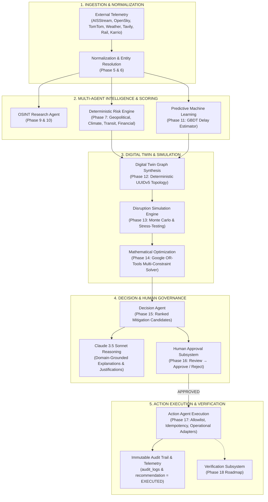

# RiskWise 2.0

> **Enterprise Autonomous Supply Chain Risk Intelligence, Digital Twin Simulation & Governed Action Platform**
> 
> *Multi-tenant resilience engine integrating live external telemetry, deterministic composite risk scoring, hybrid RAG, multi-agent LangGraph orchestration with AWS Bedrock / Claude 3.5 Sonnet, predictive machine learning, graph digital twin synthesis, mathematical optimization, and human-in-the-loop operational action governance.*

---

## Complete End-to-End WOW Flow



---

## Roadmap & Implementation Status

| Phase | Subsystem | Scope & Capabilities | Status | Test Coverage |
| :---: | :--- | :--- | :---: | :---: |
| **01** | **Foundation** | Monorepo layout, Pydantic V2 settings, async context, logging | **COMPLETE** | 100% |
| **02** | **Database** | 34 SQLAlchemy 2.0 models, 26 domain PostgreSQL enums, Alembic | **COMPLETE** | 100% (32 tests) |
| **03** | **Google Authentication** | OAuth2 token exchange, secure HTTP-only cookies, multi-tenancy, RBAC | **COMPLETE** | 100% |
| **04** | **Core Domain APIs** | Clean Architecture repositories, services, and 66 REST endpoints | **COMPLETE** | 100% (48 tests) |
| **05** | **External Ingestion** | 7 telemetry connectors: AISStream, OpenSky, TomTom, Weather, Tavily, Rail, Karrio | **COMPLETE** | 100% |
| **06** | **Normalization** | Canonical event transformations, identifier resolution (IMO, MMSI, ICAO) | **COMPLETE** | 100% |
| **07** | **Risk Engine** | Multi-factor deterministic risk scoring, evidence weighting, threshold alerting | **COMPLETE** | 100% (515 tests) |
| **08** | **Hybrid RAG** | Document chunking, Bedrock Titan embeddings, BM25 + cosine vector search | **COMPLETE** | 100% (221 tests) |
| **09** | **LangGraph Orchestration** | 6 specialized agents, immutable state contracts, deterministic routing edges | **COMPLETE** | 100% (1,284 tests) |
| **10** | **Bedrock + Claude** | Claude 3.5 Sonnet reasoning, structured output validation, security scrubbing | **COMPLETE** | 100% (942 tests) |
| **11** | **Predictive ML** | Feature engineering, GBDT shipment delay regression, model registry & rollback | **COMPLETE** | 100% (161 tests) |
| **12** | **Digital Twin** | Graph synthesis, RFC 4122 UUIDv5 identities, bounded BFS pathfinding | **COMPLETE** | 100% (161 tests) |
| **13** | **Simulation Engine** | Multi-scenario perturbation, temporal propagation, cascade loss metrics | **COMPLETE** | 100% (56 tests) |
| **14** | **Optimization Solver** | Google OR-Tools linear solver, capacity/budget constraints, Pareto frontier | **COMPLETE** | 100% (36 tests) |
| **15** | **Decision Agent** | Multi-criteria mitigation evaluation, confidence scoring, Claude synthesis | **COMPLETE** | 100% (57 tests) |
| **16** | **Human Approval** | Mandatory sign-off perimeter, cryptographic fingerprinting, tamper prevention | **COMPLETE** | 100% (29 tests) |
| **17** | **Action Agent** | Governed execution, strict allowlist, idempotency caching, operational adapters | **COMPLETE** | 100% (69 tests) |
| *18* | *Verification* | Post-action operational outcome verification & SLA reconciliation | *ROADMAP* | — |
| *19* | *Control Tower UI* | Real-time global dashboard, digital twin canvas, approval center | *ROADMAP* | — |
| *20* | *Evaluation* | Continuous multi-agent benchmark & regression evaluation harness | *ROADMAP* | — |
| *21* | *Production Hardening* | Production infrastructure hardening, VPC peering, KMS encryption | *ROADMAP* | — |

---

## Monorepo Architecture & Directory Structure

```
riskwise/
├── .env.example                               # Environment template with required credentials and settings
├── .gitignore                                 # Git ignore patterns for Python, Node, caches, and artifacts
├── AGENTS.md                                  # Agent development guidelines and framework rules
├── CLAUDE.md                                  # Claude code assistant workspace context
├── README.md                                  # Master project documentation and directory overview
├── credentials.json                           # Google OAuth2 client secrets template
│
├── apps/                                      # Monorepo application packages
│   ├── api/                                   # Backend API Service (FastAPI, Python 3.12 / 3.13)
│   │   ├── alembic/                           # Database schema migration environment
│   │   ├── pyproject.toml                     # Dependencies, pytest config, tools & packaging metadata
│   │   ├── requirements.txt                   # Frozen runtime Python dependencies
│   │   │
│   │   ├── app/                               # Core backend application package
│   │   │   ├── main.py                        # FastAPI entrypoint, middleware, and router mounting
│   │   │   │
│   │   │   ├── agents/                        # Multi-Agent LangGraph Subsystem (Phases 9, 10, 15, 16, 17)
│   │   │   │   ├── contracts.py               # Frozen Pydantic agent state & transition schemas
│   │   │   │   ├── edges.py                   # Conditional routing edges between agent nodes
│   │   │   │   ├── graph.py                   # Compiled LangGraph workflow state machine
│   │   │   │   ├── nodes.py                   # Node wrapper functions with state transitions
│   │   │   │   ├── observability.py           # Structured telemetry, timing, and agent logging
│   │   │   │   ├── recovery.py                # Fallback, retry, and node-level recovery policies
│   │   │   │   ├── security.py                # Agent action RBAC scopes and authorization guards
│   │   │   │   ├── validator.py               # State boundary and contract invariant validator
│   │   │   │   │
│   │   │   │   ├── action/                    # Phase 17: Operational Action Agent & Adapters
│   │   │   │   │   ├── agent.py               # Core ActionAgent orchestrator
│   │   │   │   │   ├── contract.py            # ActionCommand, ActionResult, enums & fingerprinting
│   │   │   │   │   ├── errors.py              # Strongly-typed action domain error hierarchy
│   │   │   │   │   ├── executors.py           # Operational domain executors (Reroute, Reallocate, etc.)
│   │   │   │   │   ├── node.py                # LangGraph node execution function (AgentStage.ACTION)
│   │   │   │   │   ├── persistence.py         # Transactional persistence & recommendation status update
│   │   │   │   │   └── policy.py              # Safety allowlist, role checks & approval binding
│   │   │   │   │
│   │   │   │   ├── approval/                  # Phase 16: Human Approval Governance Agent
│   │   │   │   │   ├── agent.py               # Approval agent verification workflow
│   │   │   │   │   ├── contract.py            # Approval request, sign-off, and review contracts
│   │   │   │   │   ├── node.py                # LangGraph node execution function
│   │   │   │   │   └── persistence.py         # Transactional persistence for approvals table
│   │   │   │   │
│   │   │   │   ├── decision/                  # Phase 15: Mitigation Decision Agent
│   │   │   │   │   ├── agent.py               # Candidate option ranking & multi-criteria evaluation
│   │   │   │   │   ├── claude_service.py      # LLM reasoning integration for decision analysis
│   │   │   │   │   ├── contract.py            # Decision action & mitigation candidate schemas
│   │   │   │   │   ├── node.py                # LangGraph node execution function
│   │   │   │   │   ├── persistence.py         # Transactional persistence for recommendations
│   │   │   │   │   └── policy.py              # Business rules and feasibility constraints
│   │   │   │   │
│   │   │   │   ├── prediction/                # Delay Forecasting Agent (Phase 9 & 11)
│   │   │   │   ├── research/                  # OSINT Intelligence & News Research Agent (Phase 9)
│   │   │   │   ├── risk/                      # Real-Time Composite Risk Evaluation Agent (Phase 9)
│   │   │   │   └── scenario/                  # What-If Disruption Scenario Agent (Phase 9)
│   │   │   │
│   │   │   ├── api/                           # REST API Layer (66 Endpoints across 102 Operations)
│   │   │   │   ├── deps.py                    # Dependencies (DB session, current user, RBAC guards)
│   │   │   │   └── v1/
│   │   │   │       ├── router.py              # Consolidated v1 APIRouter registering 22 controllers
│   │   │   │       └── endpoints/             # Domain REST controllers
│   │   │   │           ├── actions.py         # POST /actions/execute, GET /actions, GET /actions/{id}
│   │   │   │           ├── approvals.py       # POST /approvals, GET /approvals/{id}
│   │   │   │           ├── audit_logs.py      # GET /audit-logs
│   │   │   │           ├── auth.py            # Google OAuth2 login, callback, session verification
│   │   │   │           ├── carriers.py        # Logistics carrier profiles and reliability ratings
│   │   │   │           ├── decisions.py       # POST /decisions/evaluate, GET /decisions/{id}
│   │   │   │           ├── digital_twin.py    # POST /digital-twin/sync, POST /digital-twin/query
│   │   │   │           ├── factories.py       # Manufacturing plants and operational throughput
│   │   │   │           ├── health.py          # Liveness and database connectivity probes
│   │   │   │           ├── incidents.py       # Disruption event reporting and resolution
│   │   │   │           ├── inventory.py       # Real-time stock levels and safety buffer metrics
│   │   │   │           ├── notifications.py   # Multi-channel alert dispatch and delivery
│   │   │   │           ├── optimization.py    # POST /optimization/solve, GET /optimization/history
│   │   │   │           ├── ports.py           # Maritime container terminals and dwell times
│   │   │   │           ├── products.py        # SKU catalog, bills of materials, and criticality
│   │   │   │           ├── recommendations.py # Mitigation options and recommendation review
│   │   │   │           ├── risk_assessments.py# Multi-factor risk evaluations and scores
│   │   │   │           ├── routes.py          # Multi-modal transport corridors and lanes
│   │   │   │           ├── shipments.py       # Consignment lifecycle, ETA calculation, and delays
│   │   │   │           ├── simulation.py      # POST /simulation/run, GET /simulation/scenarios
│   │   │   │           ├── suppliers.py       # Tier-1/2/3 vendor organizational profiles
│   │   │   │           └── warehouses.py      # Regional distribution centers and hubs
│   │   │   │
│   │   │   ├── digital_twin/                  # Phase 12: Digital Twin Graph Subsystem
│   │   │   │   ├── builder.py                 # Deterministic multi-tenant graph synthesis from DB
│   │   │   │   ├── contracts.py               # Frozen Pydantic snapshot, node, edge, and query schemas
│   │   │   │   ├── fingerprints.py            # Deterministic RFC 4122 UUIDv5 & SHA-256 canonical hashing
│   │   │   │   ├── query.py                   # Read-only bounded BFS traversal and pathfinding service
│   │   │   │   └── service.py                 # Unified DigitalTwinService coordinator
│   │   │   │
│   │   │   ├── simulation/                    # Phase 13: Disruption Simulation Engine
│   │   │   │   ├── engine.py                  # Monte Carlo & deterministic disruption simulation
│   │   │   │   ├── contracts.py               # Simulation scenario, perturbation, and result schemas
│   │   │   │   ├── metrics.py                 # Resilience, cost-impact, and delay propagation metrics
│   │   │   │   └── service.py                 # Simulation execution and persistence coordinator
│   │   │   │
│   │   │   ├── optimization/                  # Phase 14: Mathematical Optimization Subsystem
│   │   │   │   ├── solver.py                  # Google OR-Tools linear programming solver
│   │   │   │   ├── contracts.py               # Optimization problem, constraint, and solution schemas
│   │   │   │   ├── objective.py               # Multi-objective cost, time, and risk penalty functions
│   │   │   │   └── service.py                 # Optimization workflow execution service
│   │   │   │
│   │   │   ├── integrations/                  # Phase 5: External Ingestion Connectors (7 Providers)
│   │   │   ├── normalization/                 # Phase 6: Telemetry Normalization & Entity Correlation
│   │   │   ├── risk_engine/                   # Phase 7: Deterministic Multi-Factor Risk Engine
│   │   │   ├── rag/                           # Phase 8: Hybrid RAG Knowledge Engine & Vector Search
│   │   │   ├── llm/                           # Phase 10: AWS Bedrock & Claude 3.5 Sonnet Integration
│   │   │   ├── ml/                            # Phase 11: Machine Learning Shipment Delay Regression
│   │   │   │
│   │   │   ├── models/                        # SQLAlchemy 2.0 ORM Models (Strictly 34 Tables)
│   │   │   │   ├── agents.py                  # agent_runs, agent_tasks, agent_tool_calls
│   │   │   │   ├── digital_twin.py            # twin_nodes, twin_edges
│   │   │   │   ├── governance.py              # audit_logs, recommendations, approvals, actions, verifications
│   │   │   │   ├── knowledge.py               # knowledge_documents, document_chunks
│   │   │   │   ├── logistics.py               # shipments, shipment_events, inventory, inventory_movements
│   │   │   │   ├── network.py                 # suppliers, supplier_sites, factories, warehouses, ports, carriers, routes, products
│   │   │   │   ├── risk.py                    # risks, risk_factors, risk_assessments, incidents
│   │   │   │   ├── simulation.py              # simulation_scenarios, simulation_runs, simulation_results
│   │   │   │   └── tenancy.py                 # organizations, users, user_sessions, api_keys
│   │   │   │
│   │   │   └── repositories/                  # Clean Architecture Data Access Layer
│   │   │
│   │   └── tests/                             # Comprehensive Backend Test Suite (4,470 tests)
│   │
│   └── web/                                   # Frontend Control Tower Web Application (Next.js 14+)
│
└── docs/                                      # Full Architecture & Subsystem Documentation Index
    ├── RiskWise_2.0_Technical_Project_Spec.md
    ├── database-schema-inventory.md           # Authoritative 34-table database schema inventory
    ├── authentication-architecture.md         # Google OAuth2 and RBAC governance
    ├── phase5-canonical-event-model.md        # Telemetry ingestion connectors specification
    ├── phase6-normalization-architecture.md   # Event normalization and entity resolution
    ├── phase7-risk-engine-architecture.md     # Deterministic multi-factor risk scoring
    ├── phase8-rag-architecture-contracts.md   # Hybrid RAG and vector storage architecture
    ├── phase9-langgraph-agent-state-contract.md # LangGraph multi-agent state contracts
    ├── phase10-bedrock-claude.md              # AWS Bedrock Claude 3.5 Sonnet integration
    ├── phase11-ml.md                          # Predictive machine learning delay estimator
    ├── phase12-digital-twin.md                # Digital Twin graph synthesis and query engine
    ├── phase13-simulation.md                  # Disruption simulation and scenario engine
    ├── phase14-optimization.md                # OR-Tools mathematical optimization solver
    ├── phase15-decision-agent.md              # Mitigation decision agent and option ranking
    ├── phase16-human-approval.md              # Human governance and approval subsystem
    └── phase17-action-agent.md                # Operational action agent and execution adapters
```

---

## Core System Invariants & Safety Discipline

1. **Source of Truth Authority**: Operational database tables (`suppliers`, `shipments`, `inventory`, `ports`, `factories`) are the singular authoritative source of truth. Analytics, Digital Twin graphs, simulation runs, and ML models read deterministically without mutating source records.
2. **Zero Drift Guarantee**: Exactly **34 database tables** are maintained across all roadmap phases with zero uncoordinated migrations or schema drift.
3. **Multi-Tenant Isolation**: Every database query, API route, Digital Twin snapshot, simulation run, agent execution, and operational action is strictly scoped by `organization_id`. Cross-tenant execution is completely prohibited and fails closed.
4. **Human Approval Perimeter**: No operational action can execute without an authentic, unexpired `ApprovalResult` in `APPROVED` status signed by an authorized human role (`RiskManager` or `Admin`). Flags like `skip_approval=True` are strictly prohibited.
5. **Action Binding & Fingerprinting**: Actions are cryptographically and deterministically bound to approvals via canonical SHA-256 fingerprints over tenant, decision ID, candidate ID, target entity, parameters, and policy version (`1.0`). If parameters mutate after approval, the execution is rejected.
6. **Strict Idempotency**: All execution commands support deterministic UUIDv5 identifiers and deduplication. Identical replays return cached results without mutating target entities twice (`IdempotencyResult.REPLAY_CACHED`). Changed payloads return HTTP 409 Conflict.
7. **SSRF & RCE Neutralization**: Zero user-supplied URLs are accepted for execution. Zero code execution (`eval()`, `exec()`, shell commands) is permitted. Only pre-configured, allowlisted operational adapters may execute.
8. **Phase Boundary Distinction**:
   - **Phase 15 (Decision Agent)**: Recommends what should happen.
   - **Phase 16 (Human Approval)**: Determines whether the proposed action is approved.
   - **Phase 17 (Action Agent)**: Executes ONLY the approved action and returns [`ActionResult`](file:///c:/Users/sugud/OneDrive/Documents/riskwise/api/app/agents/action/contract.py).
   - **Phase 18 (Verification)**: Asynchronously determines whether physical real-world outcomes occurred.

---

## Supported Operational Actions (Phase 17 Allowlist)

| Action Type | Target Entity | Required Parameters | Execution Adapter | Operational State Mutation |
| :--- | :---: | :--- | :--- | :--- |
| `SHIPMENT_REROUTE` | `shipment` | `route_id` | `ShipmentRerouteExecutor` | Updates `Shipment.current_route_id` |
| `CARRIER_REALLOCATION` | `carrier` | `reallocated_capacity` | `CarrierReallocationExecutor` | Updates `Carrier.reallocated_capacity` |
| `FACILITY_REALLOCATION` | `facility` | `reallocated_capacity` | `FacilityReallocationExecutor` | Updates `Facility.reallocated_capacity` |
| `EXPEDITE_SHIPMENT` | `shipment` | `target_delivery_date` | `ShipmentExpediteExecutor` | Updates `Shipment.estimated_delivery` |
| `HOLD_SHIPMENT` | `shipment` | `hold_reason` | `ShipmentHoldExecutor` | Sets `Shipment.status = "HELD"` |
| `MONITOR` | `incident` | *(none)* | `MonitorExecutor` | Activates continuous telemetry tracking |

---

## Getting Started

### 1. Prerequisites
- **Python**: `3.12` or `3.13` (Virtual environment recommended)
- **Node.js**: `v20.x` or later (LTS)
- **npm**: `v10.x` or later
- **PostgreSQL**: `v15` or later (or SQLite for local test execution)
- **Git**

### 2. Environment Setup
```bash
cp .env.example .env
```
Configure environment variables in `.env`. Sensitive credentials (Google OAuth secrets, AWS Bedrock credentials, integration API keys) are never committed to source control.

### 3. Backend Development (`api`)
```bash
cd api

# Activate virtual environment:
# Linux/macOS:
source .venv/bin/activate
# Windows PowerShell:
.venv\Scripts\activate

# Start FastAPI development server:
uvicorn app.main:app --reload --port 8000
```

#### API Endpoints & Interactive Documentation:
- **API v1 Liveness Probe**: [http://localhost:8000/api/v1/health](http://localhost:8000/api/v1/health)
- **Database Readiness Probe**: [http://localhost:8000/api/v1/health/db](http://localhost:8000/api/v1/health/db)
- **Interactive Swagger UI**: [http://localhost:8000/docs](http://localhost:8000/docs)
- **OpenAPI 3.1 JSON Specification**: [http://localhost:8000/openapi.json](http://localhost:8000/openapi.json)

### 4. Frontend Development (`web`)
```bash
cd web
npm install
npm run dev
```
The Next.js web application runs at [http://localhost:3000](http://localhost:3000).

---

## Verification & Automated Testing

RiskWise 2.0 maintains a 100% passing automated test suite with **4,470 automated backend tests** running across all completed roadmap phases.

```
================================================================================
Backend Test Suite Results: 4,470 passed, 0 failed, 0 skipped, 0 errors (100%)
================================================================================
```

### Run Full Regression Suite
```bash
cd api
pytest -q
```

### Run Subsystem-Specific Test Suites
```bash
cd api

# Phase 17: Operational Action Agent (69 tests)
pytest tests/test_phase17_*.py -v

# Phase 16: Human Governance & Approval Subsystem (29 tests)
pytest tests/test_phase16_*.py -v

# Phase 15: Mitigation Decision Agent (57 tests)
pytest tests/test_phase15_*.py -v

# Phase 14: Mathematical Optimization & OR-Tools (36 tests)
pytest tests/test_phase14_*.py -v

# Phase 13: Disruption Simulation Engine (56 tests)
pytest tests/test_phase13_*.py -v

# Phase 12: Digital Twin Graph Subsystem (161 tests)
pytest tests/test_phase12_*.py -v

# Phase 11: Machine Learning Delay Prediction (161 tests)
pytest tests/test_phase11_*.py -v

# Phase 10: AWS Bedrock & Claude 3.5 Sonnet (942 tests)
pytest tests/test_phase10_*.py -v

# Phase 09: Multi-Agent LangGraph Orchestration (1,284 tests)
pytest tests/test_phase9_*.py -v

# Phase 08: Hybrid RAG Knowledge Engine (221 tests)
pytest tests/test_phase8_*.py -v

# Phase 07: Deterministic Risk Engine (515 tests)
pytest tests/test_phase7_*.py -v

# Phase 02: Database & Model Validation (32 tests)
pytest tests/test_database_validation.py -v
```

---

## Complete Documentation Index

Explore the comprehensive architecture and operational specifications in [`docs/`](docs/):

- [`docs/RiskWise_2.0_Technical_Project_Spec.md`](docs/RiskWise_2.0_Technical_Project_Spec.md) — Master technical architecture specification
- [`docs/database-schema-inventory.md`](docs/database-schema-inventory.md) — Complete 34-table relational database inventory
- [`docs/authentication-architecture.md`](docs/authentication-architecture.md) — Google OAuth2, multi-tenancy & RBAC governance
- [`docs/phase5-canonical-event-model.md`](docs/phase5-canonical-event-model.md) — Telemetry ingestion connectors specification
- [`docs/phase6-normalization-architecture.md`](docs/phase6-normalization-architecture.md) — Telemetry normalization & entity resolution
- [`docs/phase7-risk-engine-architecture.md`](docs/phase7-risk-engine-architecture.md) — Deterministic multi-factor risk scoring engine
- [`docs/phase8-rag-architecture-contracts.md`](docs/phase8-rag-architecture-contracts.md) — Hybrid RAG and vector storage architecture
- [`docs/phase9-langgraph-agent-state-contract.md`](docs/phase9-langgraph-agent-state-contract.md) — LangGraph multi-agent state machine contracts
- [`docs/phase10-bedrock-claude.md`](docs/phase10-bedrock-claude.md) — AWS Bedrock & Claude 3.5 Sonnet integration
- [`docs/phase11-ml.md`](docs/phase11-ml.md) — Predictive machine learning delay forecasting
- [`docs/phase12-digital-twin.md`](docs/phase12-digital-twin.md) — Digital Twin graph synthesis and query engine
- [`docs/phase13-simulation.md`](docs/phase13-simulation.md) — Disruption simulation & scenario engine
- [`docs/phase14-optimization.md`](docs/phase14-optimization.md) — Google OR-Tools mathematical optimization solver
- [`docs/phase15-decision-agent.md`](docs/phase15-decision-agent.md) — Mitigation decision agent and option ranking
- [`docs/phase16-human-approval.md`](docs/phase16-human-approval.md) — Human governance and approval subsystem
- [`docs/phase17-action-agent.md`](docs/phase17-action-agent.md) — Operational action agent and execution adapters

---

## License & Operational Notice

RiskWise 2.0 is proprietary and confidential enterprise software. All rights reserved.
The Action Agent executes only approved mitigation operations within strict allowlisted boundaries and does not perform unverified business outcome assertions.
