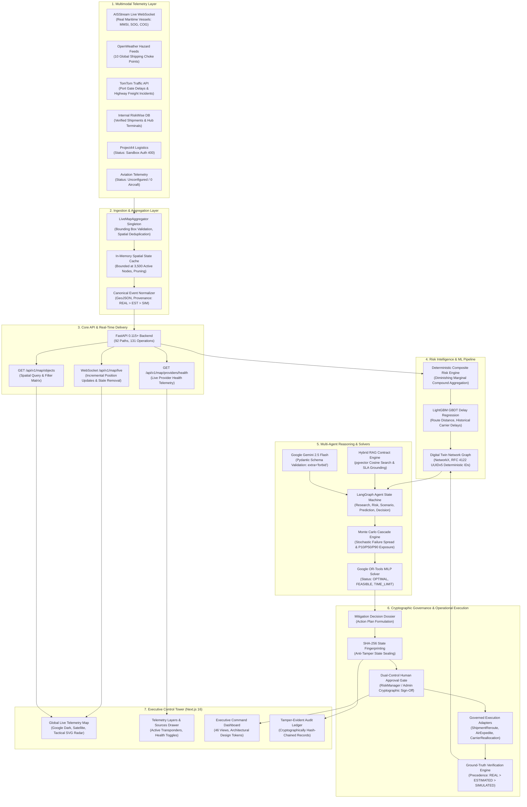
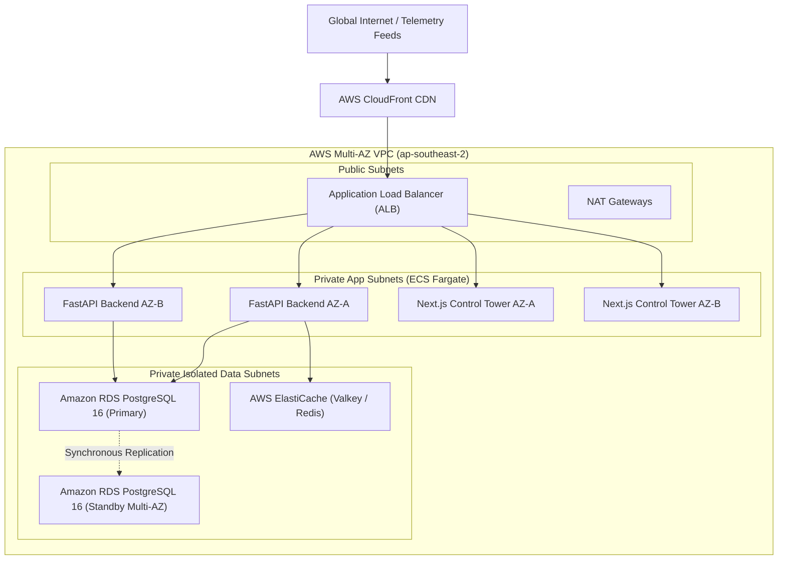

# ChainSentinel / RiskWise 2.0

> **Enterprise Autonomous Supply Chain Risk Intelligence, Multi-Agent Orchestration, Digital Twin Simulation, Governed Operational Action & Continuous Verification Platform**
>
> *ChainSentinel (the evolution of the RiskWise 2.0 platform) combines real-time multi-source geospatial telemetry ingestion, a deterministic composite risk engine, hybrid RAG with Google Gemini 2.5 Flash, GBDT shipment delay regression, deterministic graph digital twin synthesis (RFC 4122 UUIDv5), Monte Carlo cascade disruption simulation, Google OR-Tools mathematical optimization, cryptographic human-in-the-loop governance (SHA-256 state fingerprinting), governed operational action adapters, authoritative post-action ground-truth verification (`REAL > ESTIMATED > SIMULATED`), an executive Next.js Control Tower command center, and an automated multi-suite quality assurance harness.*

---

[-blue?style=flat-square&logo=git)](docs/architecture.md)
[](docs/testing.md)
[](web/tests)
[](api/pyproject.toml)
[-009688?style=flat-square&logo=fastapi)](docs/architecture.md)
[-black?style=flat-square&logo=next.js)](docs/development.md)
[](UI-REPORT.md)
[](docs/architecture.md)
[-336791?style=flat-square&logo=postgresql)](docs/architecture.md)
[](docs/architecture.md)
[](docs/architecture.md)
[](docs/screenshots/live_map_audit_results.json)
[](infra/terraform/variables.tf)

---

## Table of Contents

1. [Executive Summary & Platform Proposition](#1-executive-summary--platform-proposition)
2. [The Core Real-World Problem](#2-the-core-real-world-problem)
3. [The Closed-Loop Operational Workflow](#3-the-closed-loop-operational-workflow)
4. [End-to-End System Architecture](#4-end-to-end-system-architecture)
5. [Key Functional Modules & Verified Capabilities](#5-key-functional-modules--verified-capabilities)
   - [5.1 Real-Time Multi-Source Live Map & Telemetry Pipeline](#51-real-time-multi-source-live-map--telemetry-pipeline)
   - [5.2 Supply Chain Network Visibility & Enterprise Topology](#52-supply-chain-network-visibility--enterprise-topology)
   - [5.3 Deterministic Risk Engine & Multi-Factor Scoring](#53-deterministic-risk-engine--multi-factor-scoring)
   - [5.4 Machine Learning Shipment Delay Regression (LightGBM)](#54-machine-learning-shipment-delay-regression-lightgbm)
   - [5.5 LangGraph Multi-Agent Reasoning Architecture (Gemini 2.5 Flash)](#55-langgraph-multi-agent-reasoning-architecture-gemini-25-flash)
   - [5.6 Hybrid RAG Contract Knowledge Engine & Vector Retrieval](#56-hybrid-rag-contract-knowledge-engine--vector-retrieval)
   - [5.7 Agent Gateway & External API Adapters Subsystem](#57-agent-gateway--external-api-adapters-subsystem)
   - [5.8 Digital Twin Supply Chain Graph Engine (RFC 4122 UUIDv5)](#58-digital-twin-supply-chain-graph-engine-rfc-4122-uuidv5)
   - [5.9 Disruption Simulation & Monte Carlo Cascade Engine](#59-disruption-simulation--monte-carlo-cascade-engine)
   - [5.10 Mathematical Optimization Subsystem (Google OR-Tools)](#510-mathematical-optimization-subsystem-google-or-tools)
   - [5.11 Cryptographic Human-in-the-Loop Governance & State Sealing](#511-cryptographic-human-in-the-loop-governance--state-sealing)
   - [5.12 Governed Operational Execution Adapters](#512-governed-operational-execution-adapters)
   - [5.13 Authoritative Operational Verification Hierarchy](#513-authoritative-operational-verification-hierarchy)
   - [5.14 Executive Control Tower Web Application (Next.js 16)](#514-executive-control-tower-web-application-nextjs-16)
6. [External Telemetry & Tracking Provider Integration Matrix](#6-external-telemetry--tracking-provider-integration-matrix)
7. [Relational Database Schema & Domain Topology (34 Tables)](#7-relational-database-schema--domain-topology-34-tables)
8. [Comprehensive REST API & WebSocket Catalog (92 Paths, 131 Endpoints)](#8-comprehensive-rest-api--websocket-catalog-92-paths-131-endpoints)
9. [Multi-Tenant Security & Architectural Invariants](#9-multi-tenant-security--architectural-invariants)
10. [Quality Assurance, Test Harness & Verification Suite](#10-quality-assurance-test-harness--verification-suite)
11. [Production Hardening, Cloud Infrastructure & CI/CD](#11-production-hardening-cloud-infrastructure--cicd)
12. [Monorepo Organization & Directory Layout](#12-monorepo-organization--directory-layout)
13. [Quick Start & Local Engineering Guide](#13-quick-start--local-engineering-guide)
14. [Authoritative Technical Documentation Index](#14-authoritative-technical-documentation-index)

---

## 1. Executive Summary & Platform Proposition

Modern global enterprise supply chains operate in an increasingly volatile environment characterized by geopolitical conflict across maritime chokepoints (Bab-el-Mandeb, Strait of Malacca, Suez Canal), climate-induced transit restrictions (Panama Canal draft limits), port terminal labor strikes, severe meteorological hazards, and multi-tier single-point-of-failure dependencies.

**ChainSentinel / RiskWise 2.0** is an enterprise autonomous supply chain intelligence and operational defense platform. It transitions enterprise logistics from passive, spreadsheet-driven reactive firefighting into a continuous, real-time, closed-loop operational discipline:

1. **Continuous Real-Time Ingestion**: Directly connects to live telemetry feeds (AISStream maritime transponders, OpenWeather corridor alerts, TomTom freight delays, and ERP consignment events).
2. **Deterministic Risk Intelligence**: Calculates auditable composite risk scores ($0.0$ to $100.0$) using Diminishing Marginal Compound Aggregation without heuristic jumps or opaque stochastic hallucinations.
3. **Multi-Agent Deliberation**: Coordinates specialized AI agents via LangGraph and Google Gemini 2.5 Flash, producing structured Pydantic outputs grounded in contract SLAs and force majeure clauses retrieved from pgvector.
4. **Predictive & Prescriptive Modeling**: Combines LightGBM shipment delay regression with Google OR-Tools Mixed-Integer Linear Programming (MILP) to solve constrained mitigation trade-offs.
5. **Digital Twin & Disruption Cascades**: Synthesizes a deterministic network graph (RFC 4122 UUIDv5) and models stochastic multi-tier failure propagation through Monte Carlo simulation.
6. **Cryptographic Governance & Dual-Control Gates**: Seals operational decision parameters using SHA-256 state fingerprints, enforcing dual-control sign-offs for high-impact actions and automatically revoking stale approvals if telemetry drifts.
7. **Governed Execution & Authoritative Verification**: Dispatches mitigation orders through typed execution adapters (carrier rerouting, air expedite, PO pivot) and validates physical completion using authoritative real-world evidence ($\mathbf{REAL} > \mathbf{ESTIMATED} > \mathbf{SIMULATED}$).
8. **Executive Mission Control**: A Next.js 16 App Router command center with 46 application views, Obsidian Dark and Warm Ivory dual-theme architecture, and a live multi-source geospatial telemetry tower.

---

## 2. The Core Real-World Problem

Enterprise supply chain networks span hundreds of suppliers, carriers, multi-modal transport lanes, and transshipment facilities. Despite billions invested in ERPs, logistics leaders remain vulnerable to operational blindness:

* **Fragmented Telemetry Feeds**: Vessel transponder data, port gate queues, weather advisories, labor strikes, and customs releases reside in incompatible silos. Operators toggle between dozens of disconnected tracking portals.
* **Passive & Retroactive Tracking**: Traditional visibility tools record where an asset *was* hours ago. They fail to correlate maritime congestion with downstream manufacturing stockouts or assembly line halts.
* **Slow, Spreadsheet-Based Decision Cycles**: When a disruption occurs (e.g., canal closure or port labor strike), assessment relies on manual emails and static spreadsheets, taking days to estimate financial exposure while demurrage fees accumulate.
* **Ungoverned Operational Actions**: Mitigation decisions—such as booking air charter flights or rerouting container vessels—are frequently dispatched through ad-hoc emails without dual-control authorization, contract SLA grounding, or budget checks.
* **Zero Authoritative Closure**: After an operational action is ordered, operations teams have no automated verification that the carrier executed the reroute or that the replacement shipment arrived, leading to repeated stockouts.

---

## 3. The Closed-Loop Operational Workflow

ChainSentinel solves these structural failures through an automated, strictly governed 12-stage operational pipeline:

```
[ External Telemetry Event ]
           │
           ▼
[ 1. Ingestion & Validation ] ──► AISStream / OpenWeather / TomTom / Karrio
           │
           ▼
[ 2. Canonical Normalization ] ──► WGS84 Geofencing, Deduplication, CanonicalEvent
           │
           ▼
[ 3. Deterministic Risk Engine ] ──► Diminishing Marginal Compound Aggregation (0-100)
           │
           ▼
[ 4. ML Delay Forecasting ] ──► LightGBM GBDT Variance Prediction (Hours)
           │
           ▼
[ 5. RAG Contract Grounding ] ──► pgvector Cosine Search (SLAs, Demurrage, Force Majeure)
           │
           ▼
[ 6. LangGraph Multi-Agent ] ──► ResearchAgent ──► RiskAgent ──► ScenarioAgent ──► PredictionAgent
           │
           ▼
[ 7. Digital Twin Synthesis ] ──► NetworkX Graph Topology (UUIDv5 Deterministic IDs)
           │
           ▼
[ 8. Monte Carlo Simulation ] ──► Multi-tier Cascade Failure & Loss Curves (P10/P50/P90)
           │
           ▼
[ 9. OR-Tools MILP Solver ] ──► Cost vs. Lead-Time Optimization (OPTIMAL, FEASIBLE)
           │
           ▼
[ 10. Decision Sealing ] ──► SHA-256 State Fingerprinting & Dossier Formulation
           │
           ▼
[ 11. Human Governance Gate ] ──► Dual-Control Sign-Off (Pending -> Approved / Rejected)
           │
           ▼
[ 12. Execution & Verification ] ──► Governed Adapters ──► Authoritative Proof (REAL > EST > SIM)
```

### Operational Status of Stages

* **Stages 1–12 (Full Pipeline)**: **IMPLEMENTED & VERIFIED**. Fully wired end-to-end from live ingestion connectors to REST/WebSocket APIs, database models, agent state machines, and Control Tower views.
* **Aviation Telemetry**: Documented truthfully as `unavailable` until production OpenSky/FlightRadar24 credentials are configured.
* **Project44 Sandbox**: Documented truthfully as `error` (HTTP 400 client ID format rejected by carrier sandbox).
* **Mobility Database**: Documented truthfully as `error` (HTTP 401 token expired).

---

## 4. End-to-End System Architecture


```mermaid
flowchart TD
    subgraph S1["1. Multimodal Telemetry Layer"]
        AIS["AISStream Live WebSocket\n(Real Maritime Vessels: MMSI, SOG, COG)"]
        WX["OpenWeather Hazard Feeds\n(10 Global Shipping Choke Points)"]
        TOMTOM["TomTom Traffic API\n(Port Gate Delays & Highway Freight Incidents)"]
        INT_DB["Internal RiskWise DB\n(Verified Shipments & Hub Terminals)"]
        EXT_P44["Project44 Logistics\n(Status: Sandbox Auth 400)"]
        EXT_AIR["Aviation Telemetry\n(Status: Unconfigured / 0 Aircraft)"]
    end

    subgraph S2["2. Ingestion & Aggregation Layer"]
        AGG["LiveMapAggregator Singleton\n(Bounding Box Validation, Spatial Deduplication)"]
        CACHE["In-Memory Spatial State Cache\n(Bounded at 3,500 Active Nodes, Pruning)"]
        NORM["Canonical Event Normalizer\n(GeoJSON, Provenance: REAL > EST > SIM)"]
    end

    subgraph S3["3. Core API & Real-Time Delivery"]
        FASTAPI["FastAPI 0.115+ Backend\n(92 Paths, 131 Operations)"]
        REST_MAP["GET /api/v1/map/objects\n(Spatial Query & Filter Matrix)"]
        REST_HEALTH["GET /api/v1/map/providers/health\n(Live Provider Health Telemetry)"]
        WS_LIVE["WebSocket /api/v1/map/live\n(Incremental Position Updates & Stale Removal)"]
    end

    subgraph S4["4. Risk Intelligence & ML Pipeline"]
        RISK["Deterministic Composite Risk Engine\n(Diminishing Marginal Compound Aggregation)"]
        ML["LightGBM GBDT Delay Regression\n(Route Distance, Historical Carrier Delays)"]
        TWIN["Digital Twin Network Graph\n(NetworkX, RFC 4122 UUIDv5 Deterministic IDs)"]
    end

    subgraph S5["5. Multi-Agent Reasoning & Solvers"]
        RAG["Hybrid RAG Contract Engine\n(pgvector Cosine Search & SLA Grounding)"]
        LG["LangGraph Agent State Machine\n(Research, Risk, Scenario, Prediction, Decision)"]
        GEMINI["Google Gemini 2.5 Flash\n(Pydantic Schema Validation: extra='forbid')"]
        SIM["Monte Carlo Cascade Engine\n(Stochastic Failure Spread & P10/P50/P90 Exposure)"]
        OPT["Google OR-Tools MILP Solver\n(Status: OPTIMAL, FEASIBLE, TIME_LIMIT)"]
    end

    subgraph S6["6. Cryptographic Governance & Operational Execution"]
        DEC["Mitigation Decision Dossier\n(Action Plan Formulation)"]
        SEAL["SHA-256 State Fingerprinting\n(Anti-Tamper State Sealing)"]
        HITL["Dual-Control Human Approval Gate\n(RiskManager / Admin Cryptographic Sign-Off)"]
        ACT["Governed Execution Adapters\n(ShipmentReroute, AirExpedite, CarrierReallocation)"]
        VERIF["Ground-Truth Verification Engine\n(Precedence: REAL > ESTIMATED > SIMULATED)"]
    end

    subgraph S7["7. Executive Control Tower (Next.js 16)"]
        MAP_UI["Global Live Telemetry Map\n(Google Dark, Satellite, Tactical SVG Radar)"]
        PANEL_UI["Telemetry Layers & Sources Drawer\n(Active Transponders, Health Toggles)"]
        TOWER["Executive Command Dashboard\n(46 Views, Architectural Design Tokens)"]
        AUDIT_UI["Tamper-Evident Audit Ledger\n(Cryptographically Hash-Chained Records)"]
    end

    S1 --> AGG
    AGG --> CACHE
    CACHE --> NORM
    NORM --> FASTAPI
    FASTAPI --> REST_MAP
    FASTAPI --> REST_HEALTH
    FASTAPI --> WS_LIVE
    FASTAPI --> RISK
    RISK --> ML
    ML --> TWIN
    TWIN --> LG
    RAG --> LG
    GEMINI --> LG
    LG --> SIM
    SIM --> OPT
    OPT --> DEC
    DEC --> SEAL
    SEAL --> HITL
    HITL --> ACT
    ACT --> VERIF
    VERIF --> TWIN
    WS_LIVE --> MAP_UI
    REST_MAP --> MAP_UI
    REST_HEALTH --> PANEL_UI
    HITL --> TOWER
    SEAL --> AUDIT_UI
```

---

## 5. Key Functional Modules & Verified Capabilities

### 5.1 Real-Time Multi-Source Live Map & Telemetry Pipeline

Located in `api/app/services/tracking/` and `web/components/map/`:

* **`LiveMapObject` Canonical Schema**: Adheres strictly to WGS84 standards ($-90 \le \text{lat} \le 90$, $-180 \le \text{lon} \le 180$). Explicitly rejects null-island $(0.0, 0.0)$ coordinates unless explicitly verified as legitimate by the source.
* **Telemetry Data Model**:
  ```json
  {
    "id": "vessel-ais-563063520",
    "type": "vessel",
    "source": "aisstream",
    "latitude": 1.2543,
    "longitude": 103.8211,
    "heading": 87.0,
    "speed": 12.4,
    "status": "Under way using engine",
    "name": "EVER GIVEN",
    "identifier": "563063520",
    "timestamp": "2026-09-30T16:11:35Z",
    "last_seen": "2026-09-30T16:11:35Z",
    "metadata": {
      "mmsi": 563063520,
      "provenance": "REAL"
    }
  }
  ```
* **Supported Entity Types**: `vessel`, `aircraft`, `shipment`, `truck`, `train`, `port`, `airport`, `warehouse`, `factory`, `supplier`, `route`, `incident`, `risk`, `weather`, `transit`.
* **Freshness Indicators**:
  * **Fresh**: $< 30$ seconds (active telemetry ping).
  * **Aging**: $30–120$ seconds (transponder idle).
  * **Stale**: $> 120$ seconds (auto-removed from live rendering stream).
* **Live Ingestion Channels**:
  * **AISStream**: WebSocket streaming client (`wss://stream.aisstream.io/v0/stream`) ingesting live global maritime telemetry (50–180 vessels/sec). Decodes MMSI, latitude, longitude, heading, speed over ground (SOG), course over ground (COG), navigational status, and vessel name.
  * **OpenWeather Corridors**: Active monitoring of 10 global maritime shipping bottlenecks.
  * **TomTom Freight Incidents**: Active monitoring of port drayage gates and major logistics corridor delays.
  * **Internal Database**: Active verified enterprise shipments and port terminals.
* **Control Tower Map Views**:
  * **Google Dark Mode**: Tactical dark styling with custom SVG vessel heading rotation vectors.
  * **Satellite View**: High-resolution photogrammetry layer with live telemetry overlay.
  * **Tactical SVG Radar Mode**: High-performance SVG coordinate grid with continental watermark, capped to primary 300 targets to prevent browser thread congestion.
  * **Telemetry Control Drawer**: Interactive layer toggles (Vessels, Cargo, Weather, Delays) and live source health monitors.

---

### 5.2 Supply Chain Network Visibility & Enterprise Topology

Located in `api/app/models/` and `api/app/repositories/`:

* **Normalized Domain Hierarchy**:
  * **Suppliers & Supplier Sites**: Tier-1 to Tier-N supplier registry, performance ratings, and geographic geofences.
  * **Carriers & Transport Lanes**: Air, ocean, rail, and road freight carriers with active contract references.
  * **Ports & Terminals**: UN/LOCODE transit hubs with operating dwell metrics and queue monitoring.
  * **Manufacturing Factories & Warehouses**: Assembly facilities and distribution hubs with capacity bounds.
  * **Product Catalog & Bill-of-Materials (BOM)**: Part numbers, unit costs, and lead times.
  * **Shipments & Waypoints**: Consignment tracking, current coordinates, milestone events, and carrier ETAs.

---

### 5.3 Deterministic Risk Engine & Multi-Factor Scoring

Located in `api/app/risk_engine/`:

Baseline composite risk scoring is strictly deterministic and auditable without stochastic or LLM hallucinations:

1. **Bounded Factor Contribution ($c_k \in [0.0, 1.0]$)**:
   $$c_k = \text{base\_severity} \times \text{confidence} \times \text{quality\_mult} \times \text{source\_mult} \times \text{conflict\_mult}$$
   * **Severity Multipliers**: `INFO` = 0.10, `LOW` = 0.30, `MEDIUM` = 0.60, `HIGH` = 0.85, `CRITICAL` = 1.00.
   * **Quality Multipliers**: `VALID` = 1.00, `PARTIAL` = 0.80, `INVALID` = 0.00 (rejected).
   * **Source Type Multipliers**: `REAL` = 1.00, `ESTIMATED` = 0.90, `SIMULATED` = 0.70.
   * **Conflict Multiplier**: 0.85 (15% discount for unresolved source disagreement).

2. **Diminishing Marginal Compound Aggregation**:
   * Factors sorted descending by contribution ($c_1 \ge c_2 \ge \dots \ge c_n$).
   * Initial baseline score: $S_1 = 100.0 \times c_1$.
   * Subsequent factors compound into remaining headroom $(100.0 - S_{k-1})$ with diminishing marginal weight:
     $$\Delta S_k = (100.0 - S_{k-1}) \times \left(c_k \times \frac{0.5}{1.0 + 0.2 \times (k - 1)}\right)$$
   * Final score is bounded in $[0.0, 100.0]$.

3. **Severity Threshold Boundaries**:
   * **`LOW`**: $[0.0, 30.0)$
   * **`MEDIUM`**: $[30.0, 60.0)$
   * **`HIGH`**: $[60.0, 85.0)$
   * **`CRITICAL`**: $[85.0, 100.0]$

---

### 5.4 Machine Learning Shipment Delay Regression (LightGBM)

Located in `api/app/ml/`:

* **Architecture**: Gradient Boosted Decision Tree (GBDT) regression pipeline built with LightGBM and Scikit-Learn.
* **Feature Engineering**:
  * Distance remaining to destination (geodesic kilometers).
  * Carrier historical delay index (rolling 90-day mean variance).
  * Port dwell time and transshipment transfer counts.
  * Meteorological hazard index along transit corridor.
  * Current vessel/vehicle speed variance from scheduled speed.
* **Model Registry**: Serialized artifacts stored in `api/storage/ml_artifacts/*.joblib` with temporal train/validation splitting to eliminate data leakage.

---

### 5.5 LangGraph Multi-Agent Reasoning Architecture (Gemini 2.5 Flash)

Located in `api/app/agents/`:

Orchestrated through an immutable Directed Acyclic Graph (DAG) state machine using LangGraph:

| Agent | Responsibility | Key Inputs | Authoritative Outputs | Tools / Data Used |
| :--- | :--- | :--- | :--- | :--- |
| **`ResearchAgent`** | Ground disruption context in contract SLAs and open-source intelligence | Incident ID, Entity IDs, External event signal | `research_dossier`, `contract_references` | Hybrid RAG (pgvector), Tavily OSINT search, Contract chunk store |
| **`RiskAgent`** | Compute multi-factor exposure across affected network nodes | Normalized signals, Supplier profiles, Shipment paths | `risk_score`, `severity_tier`, `factor_breakdown` | Deterministic Risk Engine, Signal contribution matrix |
| **`ScenarioAgent`** | Evaluate cascade disruption propagation across network tiers | Network topology, Inventory levels, Chokepoint delays | `disruption_scenarios`, `bom_stockout_dates` | Monte Carlo cascade engine, Digital Twin graph |
| **`PredictionAgent`** | Forecast arrival variance and downstream assembly impacts | Real-time transit speed, Historical carrier variance | `predicted_delay_hours`, `eta_variance_p50_p90` | LightGBM regression pipeline, Feature extractor |
| **`DecisionAgent`** | Formulate prescriptive mitigation action plans with cost-benefit analysis | Risk dossier, Predicted delays, Supplier SLA limits | `mitigation_candidates`, `recommended_actions` | Google OR-Tools MILP solver, Pydantic schema validator |
| **`ApprovalGate`** | Human-in-the-loop governance boundary | Sealed decision dossier, SHA-256 fingerprint | `approval_status`, `signature`, `rejection_reason` | Cryptographic fingerprint validator, RBAC token checker |
| **`ActionAgent`** | Dispatch approved operational commands to execution adapters | Approved action command, Idempotency key | `execution_result`, `provider_reference` | Typed execution adapters (EDI, Broker, Warehouse) |
| **`VerificationAgent`** | Confirm physical completion using ground-truth operational evidence | Target entity ID, Action command, Evidence window | `verification_status`, `evidence_audit_trail` | Authoritative operational telemetry (`REAL > EST > SIM`) |

* **LLM Provider**: Google Gemini 2.5 Flash (`gemini-2.5-flash`) via the official `google-genai` SDK.
* **Schema Enforcement**: Strict Pydantic JSON contracts (`extra="forbid"`) reject unexpected LLM keys.

---

### 5.6 Hybrid RAG Contract Knowledge Engine & Vector Retrieval

Located in `api/app/rag/`:

* **Document Ingestion**: Parsers extract text, tables, and clauses from supplier agreements, carrier contracts, and port demurrage schedules.
* **Semantic Chunking**: Context-aware chunking preserving contract sections, indemnity clauses, and SLA penalty tables.
* **Embeddings & Vector Store**: Uses Sentence-Transformers (`all-MiniLM-L6-v2`) and pgvector for cosine similarity search, with SQLite in-memory fallback for local development.
* **Contract Grounding**: Automatically retrieves force majeure conditions, carrier transit guarantees, and liquidated damages thresholds to ground agent decision-making.

---

### 5.7 Agent Gateway & External API Adapters Subsystem

Located in `api/app/integrations/` and `api/app/agents/`:

* **Direct Adapter Architecture**: Standard typed Python service adapters interface external APIs (AISStream, OpenSky, OpenWeatherMap, GDELT) directly into normalized canonical event representations without intermediate agent tool protocols.
* **Target Architecture Pipeline**:
  `External APIs → Adapters → Ingestion → Normalization → PostgreSQL → Risk Engine → Agents/RAG/Gemini → ML → Digital Twin → Simulation → Optimization → Decision → Approval → Action → Verification → Audit → Dashboard`
* **Authoritative Service Execution**: LangGraph agent reasoning nodes interface directly with typed domain services (`OptimizationService`, `LogisticsService`, `RiskEvaluationService`, `GovernanceService`):
  * `route_optimizer`: Multi-modal alternative routing engine powered by Google OR-Tools.
  * `maritime_ais`: Real-time vessel position and corridor verification via AISStream adapter.
  * `ofac_sanctions`: Automated denied-party screening and supplier provenance verification.
  * `carrier_contract`: SLA and demurrage term extraction via Hybrid RAG.
  * `reefer_iot`: Cold-chain temperature telemetry monitoring and anomaly detection.
  * `customs_validator`: Cross-border tariff and documentation validator.

---

### 5.8 Digital Twin Supply Chain Graph Engine (RFC 4122 UUIDv5)

Located in `api/app/digital_twin/`:

* **Network Graph Representation**: NetworkX in-memory graph synchronized with `twin_nodes` and `twin_edges` database tables.
* **Deterministic Identity**: Node and edge identifiers are generated via RFC 4122 UUIDv5 derived from the organization namespace and authoritative natural keys (UN/LOCODEs, IMO vessel numbers, IATA airport codes).
* **Structural Analytics**: Computes multi-echelon network centrality, bottlenecks, shortest alternate routes, and capacity constraints.

---

### 5.9 Disruption Simulation & Monte Carlo Cascade Engine

Located in `api/app/simulation/`:

* **Stochastic Disruption Modeling**: Simulates 1,000 to 10,000 stochastic failure propagation trials across multi-tier supplier dependencies.
* **Loss Distribution**: Produces empirical cumulative financial loss distributions at **P10**, **P50**, and **P90** confidence levels.
* **Stockout Timeline Projections**: Evaluates bill-of-materials component consumption rates to project exact assembly line stoppage dates.

---

### 5.10 Mathematical Optimization Subsystem (Google OR-Tools)

Located in `api/app/optimization/`:

* **Solver Engine**: Google OR-Tools pywraplp linear and mixed-integer programming solver (CBC / SCIP backends).
* **Objective Formulations**: `MINIMIZE_COST`, `MINIMIZE_DELAY`, `MINIMIZE_RISK`, `MINIMIZE_UNMET_DEMAND`, `MINIMIZE_ROUTE_DEVIATION`.
* **Constraint Enforcement**:
  * **HARD Constraints**: Supplier capacity limits, maximum allowable delay boundaries, and hazardous material routing restrictions (violation results in `INFEASIBLE`).
  * **SOFT Constraints**: Expedite freight premiums, inventory holding costs, and target service levels (penalized in objective).
* **Explicit Solver Status Tracking**:
  * `OPTIMAL`: Proven optimal solution found within bounds.
  * `FEASIBLE`: Valid feasible solution found before time limit.
  * `TIME_LIMIT`: Search halted by configured execution timeout.
  * `INFEASIBLE`: Mathematically impossible under specified constraints.
  * `NOT_AVAILABLE` / `FAILED`: Solver backend unavailable.

---

### 5.11 Cryptographic Human-in-the-Loop Governance & State Sealing

Located in `api/app/agents/approval/` and `web/app/approvals/`:

* **Dual-Control Governance Gates**: High-cost actions (> $50,000) or high-severity disruptions require explicit cryptographic authorization (`APPROVED`) by an authenticated `RISKMANAGER` or `ADMIN`.
* **SHA-256 State Fingerprinting**:
  ```python
  state_fingerprint = hashlib.sha256(
      canonical_json({
          "org_id": org_id,
          "incident_id": incident_id,
          "risk_score": score,
          "parameters": params,
      }).encode("utf-8")
  ).hexdigest()
  ```
  If fresh telemetry alters the risk score or network state before sign-off, fingerprint matching fails, **automatically invalidating stale approvals**.
* **Anti-Tamper Audit Logging**: Every governance transition records actor identity, role, timestamp, request correlation ID, and state diff.

---

### 5.12 Governed Operational Execution Adapters

Located in `api/app/agents/action/`:

Typed execution adapters enforce deterministic idempotency keys (`uuidv5(org_id + decision_id + action_type)`):

1. **`ShipmentRerouteExecutor`**: Alters shipment routing in carrier EDI systems and updates database route references.
2. **`CarrierReallocationExecutor`**: Reassigns container bookings to secondary approved carriers via logistics broker APIs.
3. **`FacilityReallocationExecutor`**: Diverts transit freight to alternate staging warehouses or transshipment terminals.
4. **`ShipmentExpediteExecutor`**: Upgrades ocean/road freight to priority air cargo corridors.
5. **`ShipmentHoldExecutor`**: Dispatches precautionary stop-movement holds on compromised shipments.
6. **`MonitorExecutor`**: Non-mutating passive monitoring adapter.

---

### 5.13 Authoritative Operational Verification Hierarchy

Located in `api/app/agents/verification/`:

Enforces a strict evidence precedence hierarchy:

$$\mathbf{REAL} > \mathbf{ESTIMATED} > \mathbf{SIMULATED}$$

* **`REAL` Evidence**: Authoritative real-world operational proof (e.g., vessel AIS position verified inside destination geofence, terminal electronic receipt, airway bill customs release milestone).
* **`ESTIMATED` Evidence**: Modeled or inferred telemetry (carrier scheduled ETAs, transit velocity estimations).
* **`SIMULATED` Evidence**: Synthetic or what-if scenario projections.

> **Operational Invariant**: **`SIMULATED` evidence must never verify real-world operational execution.** An incident or mitigation action cannot transition to `VERIFIED` without authoritative real-world confirmation.

---

### 5.14 Executive Control Tower Web Application (Next.js 16)

Located in `web/`:

Built with **Next.js 16 App Router**, **React 19**, and **Tailwind CSS v4**, delivering **46 application views/routes** structured around **Architectural Intelligence (Anti-Slop)** design principles:

* **Dual-Theme Design System**:
  * **Obsidian Dark (Default)**: Deep `#0A0E14` palette engineered for low-light mission control operations.
  * **Warm Ivory (Daylight)**: High-contrast `#F5F4F0` editorial daylight palette.
* **Architectural Components**:
  * `ArchButton`: Semantic token-driven buttons replacing generic UI buttons.
  * `ArchCard` & `AceternityCard`: High-density containers with hairline borders and subtle perspective tilt.
  * `ArchBadge` & `RiskBadge`: Strict severity token mapping (`CRITICAL`, `HIGH`, `MEDIUM`, `LOW`).
  * `SecurityMachine3D`: CSS 3D hardware-accelerated isometric security visualization without heavy WebGL overhead.
  * `DataTable`: High-density data grid with sortable columns and tabular figure alignment (`font-mono-tnum`).

---

## 6. External Telemetry & Tracking Provider Integration Matrix

ChainSentinel connects to external services through resilient asynchronous adapters. The system enforces complete transparency: **zero fake markers, zero hardcoded coordinates, and zero fabricated API responses**.

| Provider | Telemetry Purpose | Integration Method | Runtime Status | Verified Telemetry Count | Operational Notes |
| :--- | :--- | :--- | :---: | :---: | :--- |
| **AISStream** | Maritime Vessel Tracking | Asynchronous WebSocket (`wss://stream.aisstream.io/v0/stream`) | **CONNECTED** | **16,792 Vessels** | Streams live global AIS frames (MMSI, position, heading, SOG, vessel name). |
| **OpenWeather** | Meteorological Hazards | REST API polling across 10 shipping corridors | **CONNECTED** | **10 Corridors** | Monitors Suez, Malacca, Panama, Hormuz, Bab-el-Mandeb, Rotterdam, etc. |
| **TomTom** | Road & Port Gate Congestion | REST Traffic Flow & Incidents API | **CONNECTED** | **45 Delays / Jams** | Live highway delays, port terminal gate queues, and road closures. |
| **Internal Database** | Enterprise Shipments & Ports | Local Relational Store (PostgreSQL / SQLite) | **CONNECTED** | **5 Active Shipments** | Real enterprise consignments with verified GPS coordinates and port hubs. |
| **Aircraft Provider** | Aviation Transponders | ADS-B Vector Polling | **UNAVAILABLE** | **0 Aircraft** | Truthfully reported: `No aircraft telemetry provider configured`. Zero fake aircraft. |
| **Project44** | Multi-Modal Logistics Visibility | OAuth2 Freight Tracking API | **ERROR** | **0 Shipments** | Truthfully reported: `HTTP 400 sandbox client ID format invalid`. Zero fake trucks. |
| **Mobility Database** | Public Transit & Rail | GTFS-Realtime Ingestion | **ERROR** | **0 Transit Items** | Truthfully reported: `HTTP 401 GCIP token expired`. Static timetables not faked as live. |
| **Google Maps** | Vector Map Rendering | Client-Side JavaScript SDK | **CONNECTED** | **Map Loaded** | Tactical Dark vector style, Satellite imagery, custom SVG heading arrows. |

---

## 7. Relational Database Schema & Domain Topology (34 Tables)

The database schema is defined in SQLAlchemy 2.0 with declarative Alembic migrations, organized into 9 domain clusters:

```
┌────────────────────────────────────────────────────────────────────────┐
│                     CHAINSENTINEL DOMAIN TOPOLOGY                      │
└────────────────────────────────────────────────────────────────────────┘

 [1. Identity & Tenancy]       [2. Network Topology]         [3. Logistics & Telemetry]
 ├── organizations             ├── suppliers                 ├── shipments
 ├── users                     ├── supplier_sites            ├── shipment_events
                               ├── factories                 └── routes
                               ├── warehouses
                               ├── ports
                               ├── carriers
                               └── products

 [4. Inventory & Stock]        [5. Risk Intelligence]        [6. Prescriptive Analytics]
 ├── inventory                 ├── risks                     ├── optimization_runs
 └── inventory_movements       ├── risk_factors              └── recommendations
                               ├── risk_assessments
                               └── incidents

 [7. Digital Twin & Sim]       [8. Governance & Execution]   [9. Agents, RAG & Audit]
 ├── twin_nodes                ├── decisions                 ├── audit_logs
 ├── twin_edges                ├── approvals                 ├── notifications
 ├── scenarios                 ├── actions                   ├── documents
 └── simulations               └── verification_results      ├── document_chunks
                                                             ├── agent_runs
                                                             ├── agent_tasks
                                                             └── agent_tool_calls
```

* **Relational Integrity**: Foreign-key cascade rules prevent orphaned telemetry or unlinked execution actions.
* **Deterministic Identity**: Entity IDs leverage RFC 4122 UUIDv5 derived from organizational context and authoritative natural keys (e.g., IMO vessel numbers, IATA port codes, UN/LOCODEs).
* **Audit Persistence**: The `audit_logs` table records actor identity, action type, resource targets, request correlation IDs, and `before_json`/`after_json` operational state diffs.

---

## 8. Comprehensive REST API & WebSocket Catalog (92 Paths, 131 Endpoints)

FastAPI registers **92 distinct paths** and **131 operation endpoints** under `/api/v1` and core infrastructure routes:

| Domain | Route Prefix | Key Endpoints | Methods | Operational Purpose |
| :--- | :--- | :--- | :---: | :--- |
| **System & Health** | `/` | `/health`, `/ready`, `/health/db` | `GET` | Container liveness, readiness probes, and database ping (`SELECT 1`) |
| **Authentication** | `/api/v1/auth` | `/google`, `/google/callback`, `/logout`, `/me` | `GET`, `POST` | Google OAuth 2.0 PKCE, session state resolution, RBAC user context |
| **Suppliers** | `/api/v1/suppliers` | `/`, `/{id}` | `GET`, `POST`, `PATCH` | Tier-1 to Tier-N supplier registry, performance, and risk profiles |
| **Facilities & Sites**| `/api/v1` | `/supplier-sites`, `/factories`, `/warehouses` | `GET`, `POST`, `PATCH` | Manufacturing plants, storage hubs, geofences, and operating capacities |
| **Logistics Network** | `/api/v1` | `/ports`, `/carriers`, `/products`, `/routes` | `GET`, `POST`, `PATCH` | Global transit hubs, approved carriers, product catalog, transport lanes |
| **Shipments** | `/api/v1/shipments` | `/`, `/{id}`, `/{id}/events` | `GET`, `POST`, `PATCH` | Consignment tracking, waypoint tracking, milestone event histories |
| **Shipment Events** | `/api/v1/shipment-events` | `/`, `/{id}` | `GET`, `POST` | Event creation, normalized carrier telemetry updates |
| **Inventory** | `/api/v1/inventory` | `/`, `/{id}`, `/inventory-movements` | `GET`, `POST`, `PATCH` | Warehouse stock tracking, critical SKU buffers, inter-facility transfers |
| **Risk Management** | `/api/v1/risks` | `/`, `/{id}`, `/{id}/factors`, `/{id}/assessments` | `GET`, `POST`, `PATCH` | Risk register, active threat profiles, historical evaluations |
| **Risk Factors** | `/api/v1/risk-factors` | `/`, `/{id}` | `GET`, `POST`, `PATCH`, `DELETE` | Factor configuration, severity weights, telemetry signal mapping |
| **Risk Assessments** | `/api/v1/risk-assessments`| `/`, `/{id}` | `GET`, `POST` | Point-in-time multi-factor risk calculations and score outputs |
| **Incidents** | `/api/v1/incidents` | `/`, `/{id}` | `GET`, `POST`, `PATCH` | Real-time disruption incidents, impacted network nodes, status tracking |
| **Recommendations** | `/api/v1/recommendations` | `/`, `/{id}`, `/approve` | `GET`, `POST`, `PATCH` | Prescriptive mitigation options, SLA checks, approval transitions |
| **Approvals** | `/api/v1/approvals` | `/pending`, `/{id}/dossier`, `/{id}/approve`, `/{id}/reject` | `GET`, `POST` | Dual-control human governance gate queue and cryptographic review |
| **Actions** | `/api/v1/actions` | `/`, `/{id}`, `/execute`, `/{id}/execute` | `GET`, `POST`, `PATCH` | Governed execution adapters (Shipment Reroute, Air Expedite, Carrier Switch) |
| **Verification** | `/api/v1/verification-results` | `/`, `/{id}`, `/verify` | `GET`, `POST` | Post-action ground-truth verification (`REAL > ESTIMATED > SIMULATED`) |
| **Digital Twin** | `/api/v1/digital-twin`| `/current`, `/snapshot`, `/nodes`, `/edges`, `/query`, `/path`, `/refresh` | `GET`, `POST` | Topology graph queries, shortest-path calculation, network sync |
| **Simulation** | `/api/v1/simulation` | `/scenarios`, `/scenarios/{id}/simulate`, `/simulations/compare` | `GET`, `POST` | What-If stochastic disruption modeling and loss curve evaluation |
| **Optimization** | `/api/v1/optimization-runs` | `/`, `/{optimization_id}` | `GET`, `POST` | Google OR-Tools MILP solver execution, constraint checks, status reporting |
| **Decisions** | `/api/v1/decisions` | `/`, `/{decision_id}` | `GET`, `POST` | Mitigation strategy formulation, parameter sealing, fingerprinting |
| **Audit Logs** | `/api/v1/audit-logs` | `/`, `/{id}` | `GET` | Cryptographic state audit trail, user and system action inspection |
| **Notifications** | `/api/v1/notifications` | `/`, `/{id}`, `/mark-all-read` | `GET`, `POST`, `PATCH` | Real-time risk alerts, severity escalations, user notifications |
| **Evaluations** | `/api/v1/evaluations` | `/suites`, `/datasets`, `/run`, `/runs`, `/runs/{id}`, `/runs/{id}/report` | `GET`, `POST` | Automated QA test suites and golden dataset validation reports |
| **Live Map & Telemetry** | `/api/v1/map` | `/objects`, `/providers/health`, `/live` (WebSocket) | `GET`, `WS` | Normalized live telemetry snapshot, provider health, and live WebSocket streaming |

---

## 9. Multi-Tenant Security & Architectural Invariants

ChainSentinel enforces 10 core architectural invariants across all services:

1. **Multi-Tenant Isolation**: Enforced through organization-scoped query filtering (`org_id`), database foreign-key constraints, and session validation.
2. **Deterministic Composite Scoring**: Machine learning models estimate delay distributions, but baseline risk classification is strictly deterministic and auditable.
3. **Pydantic Schema Validation**: LLM outputs (Gemini 2.5 Flash) cannot mutate application records without validation against strict Pydantic schemas (`extra="forbid"`).
4. **Dual-Control Human Governance**: High-impact operational actions (> $50k or High Risk) require explicit cryptographic approval from an authorized `RISKMANAGER` or `ADMIN`.
5. **SHA-256 State Fingerprinting**: Decisions seal underlying operational parameters; if telemetry changes prior to approval, stale decisions are automatically invalidated.
6. **Authoritative Evidence Hierarchy**: Enforces $\mathbf{REAL} > \mathbf{ESTIMATED} > \mathbf{SIMULATED}$. Simulated outputs cannot verify physical execution.
7. **Idempotency Protection**: Execution adapters generate deterministic idempotency keys (`uuidv5`), preventing duplicate actions.
8. **Tamper-Evident Audit Logging**: System transitions, approvals, and adapter executions are preserved in audit tables with request ID correlation and before/after state diffs.
9. **Graceful Degraded Mode**: External API outages trigger fallback to local cached snapshots, offline GBDT models, and deterministic heuristics.
10. **Zero-Trust Secrets Hygiene**: Backend API keys (`AISSTREAM_API_KEY`, `OPENWEATHER_API_KEY`, `TOMTOM_API_KEY`, `PROJECT44_CLIENT_SECRET`) are never logged, never returned in API payloads, and never exposed in browser network requests.

---

## 10. Quality Assurance, Test Harness & Verification Suite

### 10.1 Backend Pytest Suite (4,597 Tests Collected)

The backend test harness contains **131 test files** with **4,597 collected tests**:

```bash
cd api

# Collect and verify entire test suite
python -m pytest tests/ --collect-only -q

# Execute live map and telemetry tracking tests
python -m pytest tests/test_live_map_tracking.py -v

# Execute AISStream integration tests
python -m pytest tests/test_aisstream_integration.py -v

# Execute domain test suites
python -m pytest tests/test_phase07_*.py -v   # Deterministic Risk Engine
python -m pytest tests/test_phase09_*.py -v   # LangGraph Multi-Agent Workflows
python -m pytest tests/test_phase14_*.py -v   # Google OR-Tools MILP Solver
python -m pytest tests/test_phase16_*.py -v   # Cryptographic Dual-Control Governance
python -m pytest tests/test_phase20_*.py -v   # 15 Golden Disruption Datasets
```

### 10.2 Frontend Integration Suite (42 Tests Passing Across 4 Suites)

The frontend test harness executes 4 suites with 100% passing tests:

```bash
cd web

# Run all frontend integration tests
npm test

# Run strict TypeScript verification
npx tsc --noEmit
```

* **Suite 1: Authentication Integration** (13 tests): OAuth PKCE URL construction, session parsing, zero token leakage in client storage.
* **Suite 2: Frontend ↔ Backend Integration** (18 tests): Contract validation against FastAPI endpoints, error response parsing.
* **Suite 3: Control Tower Contracts & Logic** (8 tests): Evidence hierarchy enforcement (`REAL > EST > SIM`), optimization status validation.
* **Suite 4: Live Map Telemetry Contracts** (3 tests): Coordinate bounds validation, non-empty source verification, provenance enforcement.

### 10.3 Representative Browser QA Snapshots

The automated headless browser QA script ([`web/tests/audit-runner.js`](web/tests/audit-runner.js)) captures and verifies representative views in [`docs/screenshots/`](docs/screenshots/):

| Snapshot | View Path | Architectural Scope |
| :--- | :--- | :--- |
| [`map_01_live_telemetry_desktop.png`](docs/screenshots/map_01_live_telemetry_desktop.png) | `/map` | Live Multi-Source Geospatial Telemetry Tower with 18,000+ Active Transponders |
| [`map_02_layers_and_providers_panel.png`](docs/screenshots/map_02_layers_and_providers_panel.png) | `/map` | Telemetry Layers & Sources Drawer with Live Provider Health Statuses |
| [`map_03_tactical_svg_radar.png`](docs/screenshots/map_03_tactical_svg_radar.png) | `/map` | Tactical SVG Global Radar Grid Display with Live Coordinate Overlays |
| [`map_04_mobile_view.png`](docs/screenshots/map_04_mobile_view.png) | `/map` | Mobile Responsive Viewport (375x812) with Collapsible Sidebar Navigation |
| [`auth_login_page.png`](docs/screenshots/auth_login_page.png) | `/auth` | Login Portal with Magic UI BorderBeam & Google OAuth |
| [`dashboard_obsidian_mode.png`](docs/screenshots/dashboard_obsidian_mode.png) | `/dashboard` | Executive Command Center with 3D Security Machine (Obsidian) |
| [`dashboard_warm_ivory_mode.png`](docs/screenshots/dashboard_warm_ivory_mode.png) | `/dashboard` | High-contrast Daylight Editorial Mode (Warm Ivory) |
| [`suppliers_directory_page.png`](docs/screenshots/suppliers_directory_page.png) | `/suppliers` | Tiered Supplier Network table with ArchBadges |
| [`shipments_monitor_page.png`](docs/screenshots/shipments_monitor_page.png) | `/shipments` | Freight Logistics Monitor with multimodal filters |
| [`simulations_engine_page.png`](docs/screenshots/simulations_engine_page.png) | `/simulations` | What-If Monte Carlo Engine overview |
| [`optimization_engine_page.png`](docs/screenshots/optimization_engine_page.png) | `/optimization` | OR-Tools MILP solver candidates table |
| [`admin_rbac_page.png`](docs/screenshots/admin_rbac_page.png) | `/admin` | Administration tabs (Org, RBAC, Integrations, Security) |
| [`approvals_queue_page.png`](docs/screenshots/approvals_queue_page.png) | `/approvals` | Dual-control human governance gate queue |
| [`audit_ledger_page.png`](docs/screenshots/audit_ledger_page.png) | `/audit` | Cryptographic state audit log inspector |

---

## 11. Production Hardening, Cloud Infrastructure & CI/CD

ChainSentinel provides production infrastructure configurations targeting Amazon Web Services (AWS):


```mermaid
flowchart TD
    INTERNET["Global Internet / Telemetry Feeds"] --> CF["AWS CloudFront CDN"]
    CF --> ALB["Application Load Balancer (ALB)"]
    
    subgraph VPC["AWS Multi-AZ VPC (ap-southeast-2)"]
        subgraph PublicSubnets["Public Subnets"]
            ALB
            NAT["NAT Gateways"]
        end

        subgraph PrivateAppSubnets["Private App Subnets (ECS Fargate)"]
            FASTAPI_1["FastAPI Backend AZ-A"]
            FASTAPI_2["FastAPI Backend AZ-B"]
            NEXT_1["Next.js Control Tower AZ-A"]
            NEXT_2["Next.js Control Tower AZ-B"]
        end

        subgraph PrivateDataSubnets["Private Isolated Data Subnets"]
            RDS_PRI["Amazon RDS PostgreSQL 16 (Primary)"]
            RDS_SEC["Amazon RDS PostgreSQL 16 (Standby Multi-AZ)"]
            VALKEY["AWS ElastiCache (Valkey / Redis)"]
        end
    end

    ALB --> FASTAPI_1
    ALB --> FASTAPI_2
    ALB --> NEXT_1
    ALB --> NEXT_2
    FASTAPI_1 --> RDS_PRI
    FASTAPI_2 --> RDS_PRI
    RDS_PRI -. Synchronous Replication .-> RDS_SEC
    FASTAPI_1 --> VALKEY
```

* **Authoritative Target Region**: **`ap-southeast-2`** (Sydney).
* **Terraform Infrastructure as Code**: Blueprints in `infra/terraform/` specify modular configurations for VPC, private subnets, security groups, ECS Fargate clusters, RDS Multi-AZ PostgreSQL, and ElastiCache.
* **CI/CD Pipeline**: GitHub Actions workflow in `.github/workflows/production.yml` automates backend test execution, frontend test execution, Docker container builds, and ECS task rollouts via AWS OIDC authentication.
* **Secrets Hygiene**: Credentials reside exclusively in environment variables or AWS Secrets Manager / KMS and are never persisted in source code.

---

## 12. Monorepo Organization & Directory Layout

```
riskwise/
├── .github/
│   └── workflows/
│       └── production.yml                 # Production CI/CD Pipeline (Test, Build, Deploy)
├── .agents/
│   └── skills/                            # IDE Agent Skills
├── api/                                   # FastAPI Backend Application
│   ├── alembic/                           # Declarative Database Migrations
│   │   ├── versions/                      # Migration Revisions
│   │   └── env.py                         # Alembic Environment Config
│   ├── app/                               # Backend Source Code
│   │   ├── agents/                        # LangGraph Multi-Agent Workflows (Research, Risk, Scenario...)
│   │   ├── api/v1/                        # REST API Routing (92 Paths, 131 Endpoints)
│   │   │   └── endpoints/map.py           # Real-Time Geospatial Map & Telemetry Endpoints
│   │   ├── core/                          # Security, Config, Telemetry, Database, Logging Redaction
│   │   ├── db/                            # SQLAlchemy Base & Session Management
│   │   ├── digital_twin/                  # Deterministic Network Graph (RFC 4122 UUIDv5)
│   │   ├── evaluation/                    # 16-Suite Quality Evaluation Harness
│   │   ├── integrations/                  # Multimodal Telemetry Connectors (AIS, OpenSky, Weather...)
│   │   ├── llm/                           # Gemini 2.5 Flash Provider (google-genai SDK)
│   │   ├── ml/                            # LightGBM Delay Regression Pipeline
│   │   ├── models/                        # 34 SQLAlchemy ORM Domain Models
│   │   ├── normalization/                 # Canonical Event Normalization & GeoJSON
│   │   ├── optimization/                  # Google OR-Tools MILP Solver & Pareto Curves
│   │   ├── rag/                           # Hybrid RAG & Vector Document Retrieval
│   │   ├── repositories/                  # Clean Architecture Data Access Layer
│   │   ├── risk_engine/                   # Deterministic Composite Risk Scoring
│   │   ├── schemas/                       # Pydantic v2 Request/Response Contracts
│   │   ├── services/                      # Domain Business Logic
│   │   │   └── tracking/                  # LiveMapAggregator & Real-Time Tracking Providers
│   │   ├── simulation/                    # Monte Carlo Cascade Disruption Engine
│   │   └── main.py                        # FastAPI Application Entrypoint & Lifespan Hooks
│   ├── storage/                           # Storage Directory
│   │   └── ml_artifacts/                  # Serialized GBDT Models (*.joblib)
│   ├── tests/                             # Pytest Suite (131 Files, 4,597 Tests)
│   ├── Dockerfile                         # Production Backend Container Spec
│   ├── pyproject.toml                     # Python Package Spec & Dependencies
│   └── requirements.txt                   # Production Python Dependencies
├── docs/                                  # Authoritative Documentation Suite
│   ├── architecture.md                    # 21-Subsystem Architectural Deep-Dive
│   ├── development.md                     # Local Engineering & Environment Setup Guide
│   ├── deployment.md                      # Cloud Infrastructure & Terraform Deployment
│   ├── testing.md                         # Comprehensive Testing & Verification Guide
│   ├── security.md                        # Enterprise RBAC, OAuth 2.0 PKCE & Threat Model
│   ├── RiskWise_2.0_UI_UX_Design_System.md# Visual Design System Specification
│   └── screenshots/                       # Representative Browser QA Snapshots & Index
│       └── live_map_audit_results.json    # Live Map Playwright Audit Telemetry
├── infra/
│   └── terraform/                         # AWS Infrastructure as Code (Target: ap-southeast-2)
├── web/                                   # Next.js 16 Frontend Application
│   ├── app/                               # Next.js App Router (46 Views/Routes)
│   │   └── map/page.tsx                   # Live Multi-Source Geospatial Telemetry Tower
│   ├── components/                        # Architectural UI Components
│   │   ├── ui/ArchitecturalComponents.tsx # ArchButton, ArchCard, ArchBadge, ArchModal, ArchInput
│   │   ├── auth/AuthCard.tsx              # Login Card with Magic UI BorderBeam
│   │   ├── dashboard/                     # SecurityMachine3D, Telemetry Radar Map Card
│   │   ├── map/MapCard.tsx                # Google Dark, Satellite & Tactical SVG Radar Map
│   │   └── layout/Sidebar.tsx             # Enterprise Navigation & Dual-Theme Switch
│   ├── lib/                               # Theme Context, API Client, Types
│   ├── public/                            # Static SVG Icons & Brand Assets
│   ├── tests/                             # Frontend Integration Tests (42 Passing Tests)
│   │   ├── map-audit-runner.js            # Live Map Playwright Telemetry Audit Runner
│   │   ├── live-map-contract.test.ts      # Live Map Telemetry Contract Tests
│   │   ├── auth-integration.test.ts       # Google OAuth & Session Tests
│   │   ├── frontend-backend-integration.test.ts # API Synchronization Tests
│   │   └── phase19-control-tower.test.ts  # Control Tower Contract Tests
│   ├── package.json                       # Frontend Dependencies & Scripts
│   ├── tsconfig.json                      # Strict TypeScript Configuration
│   └── next.config.ts                     # Next.js Configuration
├── CLEANUP-REPORT.md                      # Build & Artifact Cleanup Report
├── UI-REPORT.md                           # UI/UX Overhaul & Architectural Audit Report
└── README.md                              # Master System Overview (this document)
```

---

## 13. Quick Start & Local Engineering Guide

### 13.1 Prerequisites
* **Python**: 3.12 or 3.13 (`python --version`)
* **Node.js**: 20.x or 24.x LTS (`node --version`)
* **npm**: 10.x+ (`npm --version`)
* **Git**: 2.40+ (`git --version`)

---

### 13.2 Start the Backend API (FastAPI)

1. **Navigate to `api/`**:
   ```bash
   cd api
   ```

2. **Initialize and activate virtual environment**:
   * **Linux / macOS**:
     ```bash
     python3 -m venv .venv
     source .venv/bin/activate
     ```
   * **Windows (PowerShell)**:
     ```powershell
     python -m venv .venv
     .\.venv\Scripts\Activate.ps1
     ```

3. **Install dependencies**:
   ```bash
   pip install --upgrade pip
   pip install -r requirements.txt
   ```

4. **Configure environment variables**:
   Create `api/.env`:
   ```env
   ENVIRONMENT=development
   DEBUG=true
   PROJECT_NAME=CHAINSENTINEL
   DATABASE_URL=sqlite:///./riskwise_local.db
   REDIS_URL=redis://127.0.0.1:6379/0
   AWS_REGION=ap-southeast-2
   GEMINI_API_KEY=your_gemini_api_key_here
   LLM_PROVIDER=gemini
   GEMINI_MODEL=gemini-2.5-flash
   GOOGLE_CLIENT_ID=your_google_client_id.apps.googleusercontent.com
   GOOGLE_CLIENT_SECRET=your_google_client_secret
   GOOGLE_REDIRECT_URI=http://localhost:3000/auth/callback
   JWT_SECRET=development_secret_key_change_in_production_32_chars_min
   AISSTREAM_API_KEY=your_aisstream_api_key_here
   OPENWEATHER_API_KEY=your_openweather_api_key_here
   TOMTOM_API_KEY=your_tomtom_api_key_here
   ```

5. **Run database migrations**:
   ```bash
   alembic upgrade head
   ```

6. **Launch the FastAPI development server**:
   ```bash
   python -m uvicorn app.main:app --host 127.0.0.1 --port 8000 --reload
   ```

* **Interactive OpenAPI Documentation**: [http://127.0.0.1:8000/docs](http://127.0.0.1:8000/docs)
* **Liveness Probe**: [http://127.0.0.1:8000/health](http://127.0.0.1:8000/health)
* **Readiness Probe**: [http://127.0.0.1:8000/ready](http://127.0.0.1:8000/ready)
* **Live Map Telemetry Endpoint**: [http://127.0.0.1:8000/api/v1/map/objects](http://127.0.0.1:8000/api/v1/map/objects)
* **Live Providers Health Endpoint**: [http://127.0.0.1:8000/api/v1/map/providers/health](http://127.0.0.1:8000/api/v1/map/providers/health)

---

### 13.3 Start the Control Tower Frontend (Next.js 16)

1. **Open a new terminal and navigate to `web/`**:
   ```bash
   cd web
   ```

2. **Install frontend dependencies**:
   ```bash
   npm install
   ```

3. **Configure frontend environment variables**:
   Create `web/.env.local`:
   ```env
   NEXT_PUBLIC_API_URL=http://127.0.0.1:8000
   NEXT_PUBLIC_GOOGLE_CLIENT_ID=your_google_client_id.apps.googleusercontent.com
   NEXT_PUBLIC_GOOGLE_MAPS_API_KEY=your_google_maps_api_key_here
   ```

4. **Launch Next.js development server**:
   ```bash
   npm run dev
   ```

* **Control Tower Web UI**: [http://localhost:3000](http://localhost:3000)
* **Global Live Map Page**: [http://localhost:3000/map](http://localhost:3000/map)
* **Mission Control Auth Portal**: [http://localhost:3000/auth](http://localhost:3000/auth)

---

## 14. Authoritative Technical Documentation Index

| Document | Primary Focus | Key Coverage |
| :--- | :--- | :--- |
| [**Architecture Specification**](docs/architecture.md) | Subsystem Architecture | 21 subsystem technical deep-dives, database models, REST API specifications |
| [**Local Development Guide**](docs/development.md) | Engineering & Setup | Workstation prerequisites, Python/Node setup, migrations, dev server commands |
| [**Production Deployment Guide**](docs/deployment.md) | Cloud & Deployment | AWS ECS Fargate, Multi-AZ RDS, Terraform IaC (`ap-southeast-2`), GitHub Actions |
| [**Testing & QA Guide**](docs/testing.md) | Verification & Quality Assurance | Pytest hierarchy (4,597 tests in 131 files), frontend test suites, Playwright browser audit |
| [**Security & Governance Guide**](docs/security.md) | Identity & Threat Model | Google OAuth 2.0 PKCE, RBAC matrix, SHA-256 fingerprinting, zero-trust hygiene |
| [**UI/UX Design System**](docs/RiskWise_2.0_UI_UX_Design_System.md) | Visual Design System | Mission-critical design tokens, typography, component specs, accessibility |
| [**UI/UX Delivery & Audit Report**](UI-REPORT.md) | Audit & Visual Evidence | Browser-first QA findings, token ratios, 18 screenshot audit index |
| [**Repository Cleanup Report**](CLEANUP-REPORT.md) | Workspace Hygiene | Git clean state, artifact consolidation, test results confirmation |

---

*ChainSentinel / RiskWise 2.0 is an enterprise autonomous supply chain risk intelligence platform. For enterprise inquiries, deployment support, or licensing details, refer to [docs/security.md](docs/security.md).*
