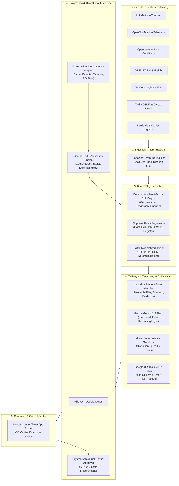

# RiskWise 2.0

> **Enterprise Autonomous Supply Chain Risk Intelligence, Multi-Agent Orchestration, Digital Twin Simulation, Governed Operational Action & Quality Assurance Platform**
> 
> *A high-resilience, production-grade enterprise platform integrating real-time multimodal telemetry, deterministic composite risk scoring, hybrid RAG with Google Gemini 2.5 Flash, GBDT delay regression, deterministic graph digital twin synthesis (RFC 4122 UUIDv5), Monte Carlo disruption cascade simulation, Google OR-Tools multi-constraint optimization, cryptographic human-in-the-loop governance (SHA-256 state fingerprinting), governed operational execution adapters, authoritative post-action ground-truth verification (`REAL > ESTIMATED > SIMULATED`), an executive Next.js Control Tower command center (36 views), and an automated 16-suite evaluation and quality assurance harness.*

---

[-emerald?style=flat-square&logo=git)](docs/architecture.md)
[](docs/testing.md)
[](api/pyproject.toml)
[-009688?style=flat-square&logo=fastapi)](docs/architecture.md)
[-black?style=flat-square&logo=next.js)](docs/development.md)
[](docs/architecture.md)
[-336791?style=flat-square&logo=postgresql)](docs/architecture.md)
[](docs/architecture.md)
[](docs/architecture.md)
[](docs/security.md)

---

## Table of Contents

1. [Executive Summary & Platform Value Proposition](#1-executive-summary--platform-value-proposition)
2. [End-to-End Operational Architecture](#2-end-to-end-operational-architecture)
3. [Authoritative Technical Documentation](#3-authoritative-technical-documentation)
4. [Master Roadmap & Subsystem Directory (Phases 1–21)](#4-master-roadmap--subsystem-directory-phases-121)
5. [Authoritative Monorepo Layout](#5-authoritative-monorepo-layout)
6. [Quick Start Guide](#6-quick-start-guide)
7. [The 10 Core Architectural Invariants & Safety Discipline](#7-the-10-core-architectural-invariants--safety-discipline)

---

## 1. Executive Summary & Platform Value Proposition

Modern global supply chains operate in an era of persistent volatility characterized by geopolitical choke points, maritime interdictions, severe meteorological anomalies, and brittle multi-tier dependencies. 

Traditional enterprise supply chain visibility systems suffer from three fundamental limitations:
1. **Passive Telemetry**: They display shipment positions on maps without evaluating multi-factor risk exposure or predicting cascading impacts.
2. **Disconnected Reasoning**: Disruption assessment relies on siloed manual spreadsheets and fragmented communication channels.
3. **Ungoverned Execution**: Mitigation actions are executed manually across disparate carrier portals and ERPs without cryptographic governance or physical ground-truth verification.

**RiskWise 2.0** solves this paradigm through a closed-loop autonomous supply chain operating system:
- **Continuous Ingestion**: Live telemetry across maritime (AIS), aviation (OpenSky), rail (GTFS-RT), weather (OpenWeather), road congestion (TomTom), OSINT news (Tavily), and parcel logistics (Karrio).
- **Predictive Intelligence**: Deterministic composite risk scoring and Machine Learning delay regression (GBDT).
- **Multi-Agent Reasoning**: LangGraph orchestration with Google Gemini 2.5 Flash for root-cause synthesis and mitigation trade-off analysis.
- **Mathematical Optimization**: Google OR-Tools Mixed-Integer Linear Programming (MILP) solving cost vs. lead-time Pareto frontiers.
- **Cryptographic Governance**: Dual-control human approvals with SHA-256 state fingerprinting.
- **Closed-Loop Verification**: Authoritative physical verification ensuring actions completed in the real world (`REAL > ESTIMATED > SIMULATED`).

---

## 2. End-to-End Operational Architecture


```mermaid
flowchart TD
    subgraph Feeds["1. Multimodal Real-Time Telemetry"]
        AIS["AIS Maritime Tracking"]
        ADS["OpenSky Aviation Telemetry"]
        WX["OpenWeather Live Conditions"]
        RAIL["GTFS-RT Rail & Freight"]
        TRAF["TomTom Logistics Flow"]
        NEWS["Tavily OSINT & Global News"]
        CARR["Karrio Multi-Carrier Logistics"]
    end

    subgraph Processing["2. Ingestion & Normalization"]
        NORM["Canonical Event Normalizer\n(GeoJSON, Deduplication, TTL)"]
    end

    subgraph Intelligence["3. Risk Intelligence & ML"]
        RISK["Deterministic Multi-Factor Risk Engine\n(Geo, Weather, Congestion, Financial)"]
        ML["Shipment Delay Regression\n(LightGBM / GBDT Model Registry)"]
        TWIN["Digital Twin Network Graph\n(RFC 4122 UUIDv5 Deterministic IDs)"]
    end

    subgraph Agents["4. Multi-Agent Reasoning & Optimization"]
        LG["LangGraph Agent State Machine\n(Research, Risk, Scenario, Prediction)"]
        GEMINI["Google Gemini 2.5 Flash\n(Structured JSON Reasoning Layer)"]
        SIM["Monte Carlo Cascade Simulator\n(Disruption Spread & Exposure)"]
        OPT["Google OR-Tools MILP Solver\n(Multi-Objective Cost & Risk Tradeoff)"]
    end

    subgraph Governance["5. Governance & Operational Execution"]
        DEC["Mitigation Decision Agent"]
        HITL["Cryptographic Dual-Control Approval\n(SHA-256 State Fingerprinting)"]
        ACT["Governed Action Execution Adapters\n(Carrier Reroute, Expedite, PO Pivot)"]
        VERIF["Ground-Truth Verification Engine\n(Authoritative Physical State Telemetry)"]
    end

    subgraph Command["6. Command & Control Center"]
        TOWER["Next.js Control Tower App Router\n(36 Verified Enterprise Views)"]
    end

    Feeds --> Processing
    Processing --> Intelligence
    Intelligence --> Agents
    Agents --> Governance
    Governance --> Command
    Command --> HITL
    ACT --> VERIF
    VERIF --> Intelligence
```

---

## 3. Authoritative Technical Documentation

All detailed specifications, architecture diagrams, APIs, and operational runbooks are organized in the `docs/` directory:

| Document | Primary Focus | Key Content |
| :--- | :--- | :--- |
| [**Architecture Specification**](docs/architecture.md) | System & Subsystem Architecture | 21 subsystem technical deep-dives, database models, REST API specifications, invariants |
| [**Local Development Guide**](docs/development.md) | Engineering & Setup | Prerequisites, local frontend/backend setup, environment configuration, database migrations |
| [**Production Deployment Guide**](docs/deployment.md) | Infrastructure & Operations | AWS Terraform IAC, container specs, ECS Fargate, CI/CD pipeline, zero-downtime rolling updates |
| [**Testing & QA Guide**](docs/testing.md) | Verification & Quality Assurance | Pytest suites (4,532 tests), frontend testing, automated 36-route browser audit harness |
| [**Security & Governance Guide**](docs/security.md) | Identity & Threat Model | Google OAuth 2.0 PKCE, RBAC matrix, multi-tenant isolation, SHA-256 state fingerprinting |
| [**UI/UX Design System**](docs/RiskWise_2.0_UI_UX_Design_System.md) | Visual System & Components | Mission-critical design tokens, typography, component specifications, high-density layouts |

---

## 4. Master Roadmap & Subsystem Directory (Phases 1–21)

| Phase | Subsystem | Core Technology | Operational Status |
| :---: | :--- | :--- | :---: |
| **01** | Core Foundation & Framework Architecture | FastAPI, Pydantic v2, Clean Arch | **COMPLETED** |
| **02** | Relational Database Schema & Domain Integrity | PostgreSQL 16 RDS, Alembic, SQLite | **COMPLETED** |
| **03** | Google Authentication & Enterprise RBAC Governance | Google OAuth 2.0 PKCE, Valkey/Redis | **COMPLETED** |
| **04** | Core Domain REST APIs & Clean Architecture | OpenAPI 3.1, Service-Repository Pattern | **COMPLETED** |
| **05** | External Multimodal Telemetry Ingestion Connectors | AISStream, OpenSky, OpenWeather, Rail, TomTom | **COMPLETED** |
| **06** | Event Normalization, Deduplication & Entity Resolution | Canonical Event Model, GeoJSON, Sliding Dedupe | **COMPLETED** |
| **07** | Deterministic Multi-Factor Risk Scoring Engine | Multi-Factor Composite Scoring (0–100) | **COMPLETED** |
| **08** | Hybrid RAG Knowledge Engine & Vector Search | Vector Embeddings, Semantic Document Chunking | **COMPLETED** |
| **09** | LangGraph Multi-Agent Orchestration Framework | Directed Acyclic Graph Agent State Machine | **COMPLETED** |
| **10** | Google Gemini 2.5 Flash Reasoning Layer | Google GenAI SDK, Structured JSON Schemas | **COMPLETED** |
| **11** | Machine Learning Shipment Delay Regression | LightGBM / GBDT, Feature Engineering Pipeline | **COMPLETED** |
| **12** | Digital Twin Supply Chain Graph Engine | RFC 4122 UUIDv5 Deterministic Graph Topology | **COMPLETED** |
| **13** | Disruption Simulation & Monte Carlo Cascade Engine | Stochastic Disruption Spread & P10/P50/P90 | **COMPLETED** |
| **14** | Mathematical Optimization Subsystem | Google OR-Tools MILP, Pareto Frontier Solver | **COMPLETED** |
| **15** | Mitigation Decision Agent & Strategy Synthesis | Prescriptive Strategy Synthesis & Trade-offs | **COMPLETED** |
| **16** | Human Governance & Dual-Control Approval Subsystem | SHA-256 State Fingerprinting & Cryptographic Sign-Off | **COMPLETED** |
| **17** | Operational Action Agent & Governed Execution Adapters | Carrier Reroute, Air Expedite, PO Pivot Adapters | **COMPLETED** |
| **18** | Operational Verification Agent & Ground-Truth Evidence | Authoritative Telemetry (`REAL > ESTIMATED > SIM`) | **COMPLETED** |
| **19** | Control Tower Web Application | Next.js 16 App Router, Tailwind CSS, Recharts | **COMPLETED** |
| **20** | Comprehensive Evaluation & Quality Assurance Framework | 16 Automated Suites & 15 Golden Datasets | **COMPLETED** |
| **21** | Production Hardening, High Availability & Deployment | AWS ECS Fargate, Multi-AZ RDS, CI/CD with OIDC | **COMPLETED** |

---

## 5. Authoritative Monorepo Layout

```
riskwise/
├── .github/workflows/production.yml       # Production CI/CD Pipeline
├── .agents/skills/                        # IDE Agent Skills
├── api/                                   # FastAPI Backend Application
│   ├── alembic/                           # Database Migrations
│   ├── app/                               # Backend Source Code (Agents, Core, Models, Services)
│   ├── storage/ml_artifacts/              # ML Model Registry (*.joblib)
│   ├── tests/                             # 124 Test Files (4,532 Passing Tests)
│   ├── Dockerfile                         # Production Backend Container
│   └── requirements.txt                   # Production Python Dependencies
├── docs/                                  # Consolidated Documentation Suite
│   ├── architecture.md                    # Architecture & Subsystem Specification
│   ├── development.md                     # Engineering & Setup Guide
│   ├── deployment.md                      # Infrastructure, Terraform & CI/CD
│   ├── testing.md                         # Testing Strategy & Quality Assurance
│   ├── security.md                        # Security, RBAC & Governance
│   ├── RiskWise_2.0_UI_UX_Design_System.md# Design System
│   └── screenshots/                       # Verified Browser QA Snapshots & WebP Walkthrough
├── CLEANUP-REPORT.md                      # Build & Artifact Cleanup Report
├── UI-REPORT.md                           # Production UI/UX Overhaul & Architectural Intelligence Report
├── infra/terraform/                       # AWS Infrastructure as Code (VPC, ECS, RDS)
└── web/                                   # Next.js 16 Frontend Application
    ├── app/                               # Next.js App Router (38 Enterprise Views)
    ├── components/                        # UI Components (SecurityMachine3D, AceternityCard, Magic, Arch)
    ├── lib/                               # Theme Engine, API Client, Types, Contexts
    ├── tests/                             # Frontend Integration Tests
    ├── package.json                       # Frontend Dependencies
    └── tsconfig.json                      # TypeScript Configuration
```

---

## 6. Quick Start Guide

### Start the Backend
```bash
cd api
python -m venv .venv
source .venv/bin/activate       # On Windows: .\.venv\Scripts\Activate.ps1
pip install -r requirements.txt
alembic upgrade head
python -m uvicorn app.main:app --host 127.0.0.1 --port 8000 --reload
```

### Start the Frontend
```bash
cd web
npm install
npm run dev
```
Open [http://localhost:3000](http://localhost:3000) to access the Executive Control Tower.

---

## 7. The 10 Core Architectural Invariants & Safety Discipline

1. **Multi-Tenant Isolation**: Strict `tenant_id` partitioning across all database queries, cache keys, and agent states.
2. **Deterministic Composite Scoring**: Machine learning estimates delay variance; baseline risk classification is strictly deterministic and auditable.
3. **No Unauthenticated LLM Actions**: LLM outputs (Gemini 2.5 Flash) cannot mutate database state without Pydantic schema validation.
4. **Dual-Control Human-in-the-Loop Governance**: High-impact operational actions require cryptographic sign-off (`APPROVED`) by an authorized `RISKMANAGER`.
5. **State Fingerprinting**: Operational decisions seal the system state with SHA-256 fingerprints. Any telemetry shift before approval revokes the decision.
6. **Authoritative Verification Ground-Truth**: Follows the strict hierarchy `REAL > ESTIMATED > SIMULATED`. Actions are only verified when physical sensors confirm state transition.
7. **Idempotency & Replay Protection**: Operational actions use deterministic idempotency keys (`uuidv5(tenant_id + decision_id + action_type)`).
8. **Immutable Audit Ledger**: All transitions and approvals are preserved in a write-only, cryptographically verifiable ledger.
9. **Graceful Degraded Mode**: External API outages trigger fallback to local cached snapshots, deterministic heuristics, and offline ML models.
10. **Zero-Trust Secrets Hygiene**: Credentials reside exclusively in environment variables/KMS and are never committed to source control.
