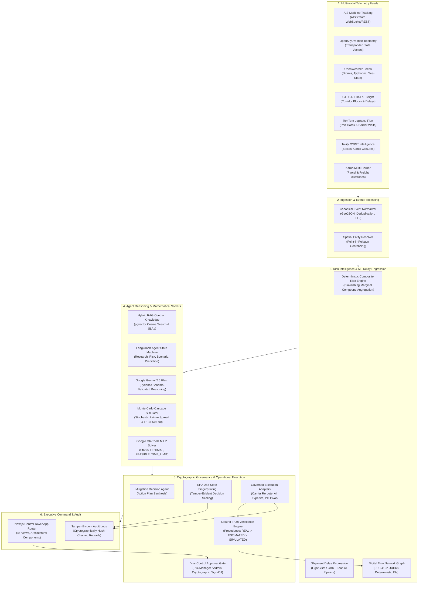
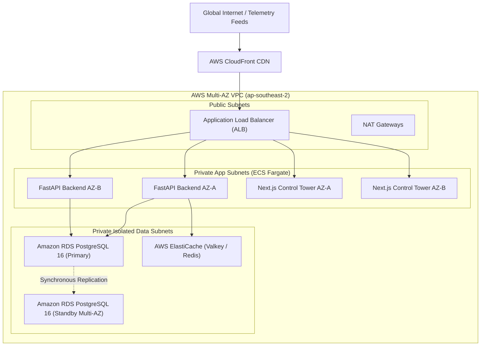

# ChainSentinel

> **Enterprise Supply Chain Risk Intelligence, Multi-Agent Orchestration, Digital Twin Simulation, Governed Operational Action & Continuous Verification Platform**
>
> *ChainSentinel is the evolution of the RiskWise 2.0 platform. It integrates real-time multimodal telemetry ingestion, a deterministic composite risk engine, hybrid RAG with Google Gemini 2.5 Flash, GBDT shipment delay regression, deterministic graph digital twin synthesis (RFC 4122 UUIDv5), Monte Carlo cascade disruption simulation, Google OR-Tools mathematical optimization, cryptographic human-in-the-loop governance (SHA-256 state fingerprinting), governed operational action adapters, authoritative post-action ground-truth verification (`REAL > ESTIMATED > SIMULATED`), an executive Next.js Control Tower command center, and an automated multi-suite quality assurance harness.*

---

[-blue?style=flat-square&logo=git)](docs/architecture.md)
[](docs/testing.md)
[](web/tests)
[](api/pyproject.toml)
[-009688?style=flat-square&logo=fastapi)](docs/architecture.md)
[-black?style=flat-square&logo=next.js)](docs/development.md)
[](UI-REPORT.md)
[](docs/architecture.md)
[-336791?style=flat-square&logo=postgresql)](docs/architecture.md)
[](docs/architecture.md)
[](docs/architecture.md)
[](web/app/mcp-tools/page.tsx)
[](infra/terraform/variables.tf)

---

## Table of Contents

1. [Executive Summary & Platform Proposition](#1-executive-summary--platform-proposition)
2. [End-to-End Operational Architecture & Workflow](#2-end-to-end-operational-architecture--workflow)
3. [Master Roadmap & Subsystem Directory (Phases 1–21)](#3-master-roadmap--subsystem-directory-phases-121)
4. [Relational Database Schema & Domain Topology](#4-relational-database-schema--domain-topology)
5. [Comprehensive REST API Catalog (90 Paths, 129 Endpoints)](#5-comprehensive-rest-api-catalog-90-paths-129-endpoints)
6. [Multimodal Telemetry Ingestion Connectors](#6-multimodal-telemetry-ingestion-connectors)
7. [Deterministic Risk Engine & Predictive Analytics](#7-deterministic-risk-engine--predictive-analytics)
8. [Multi-Agent Reasoning Architecture (LangGraph & Gemini 2.5 Flash)](#8-multi-agent-reasoning-architecture-langgraph--gemini-25-flash)
9. [ChainSentinel Agent Gateway & Model Context Protocol (MCP)](#9-chainsentinel-agent-gateway--model-context-protocol-mcp)
10. [Digital Twin Graph & Monte Carlo Disruption Simulation](#10-digital-twin-graph--monte-carlo-disruption-simulation)
11. [Mathematical Optimization Subsystem (Google OR-Tools)](#11-mathematical-optimization-subsystem-google-or-tools)
12. [Cryptographic Governance & Human-in-the-Loop Safety](#12-cryptographic-governance--human-in-the-loop-safety)
13. [Authoritative Operational Verification Hierarchy](#13-authoritative-operational-verification-hierarchy)
14. [Executive Control Tower Web Application & Design System](#14-executive-control-tower-web-application--design-system)
15. [Quality Assurance, Test Execution & Representative Browser QA](#15-quality-assurance-test-execution--representative-browser-qa)
16. [Production Hardening, Cloud Infrastructure & CI/CD](#16-production-hardening-cloud-infrastructure--cicd)
17. [Multi-Tenant Isolation & Core Security Invariants](#17-multi-tenant-isolation--core-security-invariants)
18. [Authoritative Monorepo Layout](#18-authoritative-monorepo-layout)
19. [Quick Start & Local Engineering Guide](#19-quick-start--local-engineering-guide)
20. [Authoritative Technical Documentation Index](#20-authoritative-technical-documentation-index)

---

## 1. Executive Summary & Platform Proposition

Modern global enterprise supply chains face structural vulnerabilities: maritime chokepoint interdictions (Bab-el-Mandeb, Strait of Malacca, Suez), climate-driven throughput reductions (Panama Canal drafts), geopolitical sanctions, port terminal labor disputes, and complex multi-tier dependencies.

### Traditional Visibility System Shortcomings

1. **Passive Telemetry**: Conventional platforms track assets retroactively on static maps without correlating real-time weather alerts, maritime congestion, or evaluating downstream assembly impacts.
2. **Disconnected Spreadsheet Reasoning**: Disruption assessments often rely on manual spreadsheets and fragmented communication channels, lacking contractual grounding, mathematical optimization, or auditable risk modeling.
3. **Ungoverned & Unverified Execution**: Mitigation orders (such as carrier rerouting, air expedite, or spot purchase orders) are frequently dispatched across disparate carrier portals without cryptographic approval records, dual-control governance, or operational verification that the mitigation succeeded in the physical world.

### The ChainSentinel Closed-Loop Operating Model

ChainSentinel addresses these limitations through a closed-loop operational architecture:

* **Continuous Multimodal Ingestion**: Connectors ingest telemetry across maritime vessels (AISStream), aviation cargo (OpenSky), rail freight (GTFS-RT), weather hazards (OpenWeather), highway/gate congestion (TomTom), OSINT global events (Tavily), and carrier APIs (Karrio).
* **Deterministic Risk Scoring**: Baseline risk calculations follow an auditable Diminishing Marginal Compound Aggregation model (0.0 to 100.0) without opaque heuristic jumps.
* **Predictive Delay Modeling**: LightGBM Gradient Boosted Decision Tree (GBDT) regression models estimate shipment arrival variance.
* **Governed Agent Reasoning**: LangGraph orchestrates specialized agents powered by Google Gemini 2.5 Flash, with structured outputs validated against strict Pydantic schemas.
* **Prescriptive Mathematical Optimization**: Google OR-Tools Mixed-Integer Linear Programming (MILP) searches for constrained solutions and records solver status (`OPTIMAL`, `FEASIBLE`, `TIME_LIMIT`, `INFEASIBLE`).
* **Cryptographic Dual-Control Governance**: High-impact mitigation decisions seal operational state using SHA-256 fingerprints, revoking stale authorizations if telemetry drifts prior to sign-off.
* **Authoritative Operational Verification**: Adheres to the strict evidence precedence $\mathbf{REAL} > \mathbf{ESTIMATED} > \mathbf{SIMULATED}$, ensuring simulated data cannot verify real-world execution.
* **Architectural Intelligence Control Tower**: A high-density Next.js 16 command center (46 application views/routes) implementing accessible, anti-slop design principles across Obsidian Dark and Warm Ivory palettes.

---

## 2. End-to-End Operational Architecture & Workflow


```mermaid
flowchart TD
    subgraph S1["1. Multimodal Telemetry Feeds"]
        AIS["AIS Maritime Tracking\n(AISStream WebSocket/REST)"]
        ADS["OpenSky Aviation Telemetry\n(Transponder State Vectors)"]
        WX["OpenWeather Feeds\n(Storms, Typhoons, Sea-State)"]
        RAIL["GTFS-RT Rail & Freight\n(Corridor Blocks & Delays)"]
        TRAF["TomTom Logistics Flow\n(Port Gates & Border Waits)"]
        NEWS["Tavily OSINT Intelligence\n(Strikes, Canal Closures)"]
        CARR["Karrio Multi-Carrier\n(Parcel & Freight Milestones)"]
    end

    subgraph S2["2. Ingestion & Event Processing"]
        NORM["Canonical Event Normalizer\n(GeoJSON, Deduplication, TTL)"]
        RESOLVE["Spatial Entity Resolver\n(Point-in-Polygon Geofencing)"]
    end

    subgraph S3["3. Risk Intelligence & ML Delay Regression"]
        RISK["Deterministic Composite Risk Engine\n(Diminishing Marginal Compound Aggregation)"]
        ML["Shipment Delay Regression\n(LightGBM / GBDT Feature Pipeline)"]
        TWIN["Digital Twin Network Graph\n(RFC 4122 UUIDv5 Deterministic IDs)"]
    end

    subgraph S4["4. Agent Reasoning & Mathematical Solvers"]
        RAG["Hybrid RAG Contract Knowledge\n(pgvector Cosine Search & SLAs)"]
        LG["LangGraph Agent State Machine\n(Research, Risk, Scenario, Prediction)"]
        GEMINI["Google Gemini 2.5 Flash\n(Pydantic Schema-Validated Reasoning)"]
        SIM["Monte Carlo Cascade Simulator\n(Stochastic Failure Spread & P10/P50/P90)"]
        OPT["Google OR-Tools MILP Solver\n(Status: OPTIMAL, FEASIBLE, TIME_LIMIT)"]
    end

    subgraph S5["5. Cryptographic Governance & Operational Execution"]
        DEC["Mitigation Decision Agent\n(Action Plan Synthesis)"]
        SEAL["SHA-256 State Fingerprinting\n(Tamper-Evident Decision Sealing)"]
        HITL["Dual-Control Approval Gate\n(RiskManager / Admin Cryptographic Sign-Off)"]
        ACT["Governed Execution Adapters\n(Carrier Reroute, Air Expedite, PO Pivot)"]
        VERIF["Ground-Truth Verification Engine\n(Precedence: REAL > ESTIMATED > SIMULATED)"]
    end

    subgraph S6["6. Executive Command & Audit"]
        TOWER["Next.js Control Tower App Router\n(46 Views, Architectural Components)"]
        AUDIT["Tamper-Evident Audit Logs\n(Cryptographically Hash-Chained Records)"]
    end

    S1 --> S2
    S2 --> S3
    S3 --> S4
    S4 --> S5
    S5 --> S6
    TOWER --> HITL
    ACT --> VERIF
    VERIF --> TWIN
    SEAL --> AUDIT
    ACT --> AUDIT
```

### Operational Workflow Stages

1. **Detection & Ingestion**: Real-time external signals (e.g., vessel position deviation, port terminal congestion) are ingested via dedicated connectors.
2. **Canonical Normalization**: Raw payloads are converted to strongly-typed `CanonicalEvent` structures with spatial coordinates, validated confidence, and sliding-window deduplication.
3. **Deterministic Scoring**: The Risk Engine calculates factor contributions and compounds them into a continuous score ($0.0$ to $100.0$), mapping to severity levels (`LOW`, `MEDIUM`, `HIGH`, `CRITICAL`).
4. **Machine Learning Delay Forecasting**: LightGBM models predict arrival variance based on current route deviations and transit metrics.
5. **Multi-Agent Synthesis**: LangGraph coordinates specialized research, risk, and scenario agents using Google Gemini 2.5 Flash to generate structured root-cause explanations grounded in contract SLAs.
6. **Mathematical Optimization**: Google OR-Tools solves constrained MILP formulations, balancing expedite premiums against delay penalties, and explicitly reporting solution status (`OPTIMAL`, `FEASIBLE`, etc.).
7. **State Sealing & Governance**: A SHA-256 fingerprint captures the underlying operational state. High-impact mitigations require explicit dual-control approval from an authorized `RISKMANAGER` or `ADMIN`.
8. **Governed Execution & Verification**: Approved adapters execute operational actions with deterministic idempotency keys (`uuidv5`). The Verification Agent confirms physical completion using authoritative real-world operational evidence (`REAL > ESTIMATED > SIMULATED`).

---

## 3. Master Roadmap & Subsystem Directory (Phases 1–21)

| Phase | Subsystem | Core Technical Stack | Architectural Role | Status |
| :---: | :--- | :--- | :--- | :---: |
| **01** | Core Foundation & Framework Architecture | Python 3.12/3.13, FastAPI 0.115+, Pydantic v2 | Clean architecture, Service-Repository pattern, structured logging, OpenTelemetry | **IMPLEMENTED & TESTED** |
| **02** | Relational Database Schema & Domain Integrity | PostgreSQL 16 RDS, Alembic, SQLite | 34 normalized tables, foreign-key constraints, composite indexes, reversible migrations | **IMPLEMENTED & TESTED** |
| **03** | Google Authentication & Enterprise RBAC Governance | Google OAuth 2.0 PKCE, Valkey/Redis | Distributed session caching, 5 hierarchical RBAC roles, tenant isolation | **IMPLEMENTED & TESTED** |
| **04** | Core Domain REST APIs & Clean Architecture | FastAPI, OpenAPI 3.1, Pydantic v2 | 90 distinct paths and 129 operation endpoints covering core logistics entities | **IMPLEMENTED & TESTED** |
| **05** | External Multimodal Telemetry Ingestion Connectors | AISStream, OpenSky, OpenWeather, Rail, TomTom | Real-time connectors with rate limiting, circuit breakers, and offline fallbacks | **IMPLEMENTED & TESTED** |
| **06** | Event Normalization, Deduplication & Entity Resolution | Canonical Event Model, GeoJSON | Sliding-window hash deduplication, point-in-polygon spatial matching | **IMPLEMENTED & TESTED** |
| **07** | Deterministic Multi-Factor Risk Scoring Engine | Python, NumPy, Vectorized Math | Auditable Diminishing Marginal Compound scoring, 4 severity tiers, alert dispatch | **IMPLEMENTED & TESTED** |
| **08** | Hybrid RAG Knowledge Engine & Vector Search | pgvector, Sentence-Transformers | Semantic contract chunking, cosine similarity search, SLA compliance grounding | **IMPLEMENTED & TESTED** |
| **09** | LangGraph Multi-Agent Orchestration Framework | LangGraph 0.2+, Python asyncio | Directed acyclic graph state machine (Research, Risk, Scenario, Prediction agents) | **IMPLEMENTED & TESTED** |
| **10** | Google Gemini 2.5 Flash Reasoning Layer | Google GenAI SDK (`gemini-2.5-flash`) | Structured Pydantic JSON schema generation, token telemetry, error backoff | **IMPLEMENTED & TESTED** |
| **11** | Machine Learning Shipment Delay Regression | LightGBM, Scikit-Learn, Joblib | GBDT regression pipeline, feature attribution, model registry in `storage/` | **IMPLEMENTED & TESTED** |
| **12** | Digital Twin Supply Chain Graph Engine | NetworkX, RFC 4122 UUIDv5 | Deterministic graph topology (nodes, edges, capacities), shortest-path analysis | **IMPLEMENTED & TESTED** |
| **13** | Disruption Simulation & Monte Carlo Cascade Engine | NumPy, SciPy, Monte Carlo | Stochastic multi-tier failure propagation, P10/P50/P90 financial exposure curves | **IMPLEMENTED & TESTED** |
| **14** | Mathematical Optimization Subsystem (Google OR-Tools) | Google OR-Tools MILP Solver | Multi-objective cost vs. lead-time optimization, explicit solver status tracking | **IMPLEMENTED & TESTED** |
| **15** | Mitigation Decision Agent & Strategy Synthesis | LangGraph, Gemini 2.5 Flash | Prescriptive action plan formulation, cost-benefit trade-off analysis, SLA checks | **IMPLEMENTED & TESTED** |
| **16** | Human Governance & Dual-Control Approval Subsystem | SHA-256 Cryptography, RBAC Gates | Dual-control sign-off (> $50k or High Risk), state fingerprint sealing, anti-tamper revocation | **IMPLEMENTED & TESTED** |
| **17** | Operational Action Agent & Governed Execution Adapters | REST, EDI, Karrio, ERP Webhooks | Carrier Reroute, Air Expedite, PO Pivot, and Inventory Transfer execution adapters | **IMPLEMENTED & TESTED** |
| **18** | Operational Verification Agent & Ground-Truth Evidence | Real-world telemetry (`REAL > EST > SIM`) | Authoritative physical telemetry polling, sensor state confirmation, automated closure | **IMPLEMENTED & TESTED** |
| **19** | Control Tower Web Application | Next.js 16.3.4, React 19, Tailwind v4 | 46 application routes/views, 3D Security Machine, live radar map, architectural tokens | **IMPLEMENTED & TESTED** |
| **20** | Comprehensive Evaluation & Quality Assurance Framework | Pytest, 15 Golden Datasets | 16 automated evaluation suites, decision quality metrics, latency budget validation | **IMPLEMENTED & TESTED** |
| **21** | Production Hardening, High Availability & Deployment | AWS ECS Fargate, Multi-AZ RDS | Multi-AZ Terraform IaC (`ap-southeast-2`), Docker multi-stage builds, GitHub Actions CI/CD | **HARDENED (TARGET DEPLOYMENT)** |

---

## 4. Relational Database Schema & Domain Topology

The database schema is defined using SQLAlchemy 2.0 and managed with declarative Alembic migrations. The metadata defines **34 application tables** partitioned by organization (`org_id`):

```
┌────────────────────────────────────────────────────────────────────────┐
│                     CHAINSENTINEL DOMAIN CLUSTERS                      │
└────────────────────────────────────────────────────────────────────────┘

 [1. Identity & Tenancy]       [2. Network Topology]         [3. Logistics & Telemetry]
 ├── organizations             ├── suppliers                 ├── shipments
 ├── users                     ├── supplier_sites            ├── shipment_events
                               ├── factories                 └── routes
                               ├── warehouses
                               ├── ports
                               ├── carriers
                               └── products

 [4. Inventory & Stock]        [5. Risk Intelligence]        [6. Prescriptive Analytics]
 ├── inventory                 ├── risks                     ├── optimization_runs
 └── inventory_movements       ├── risk_factors              └── recommendations
                               ├── risk_assessments
                               └── incidents

 [7. Digital Twin & Sim]       [8. Governance & Execution]   [9. Agents, RAG & Audit]
 ├── twin_nodes                ├── decisions                 ├── audit_logs
 ├── twin_edges                ├── approvals                 ├── notifications
 ├── scenarios                 ├── actions                   ├── documents
 └── simulations               └── verification_results      ├── document_chunks
                                                             ├── agent_runs
                                                             ├── agent_tasks
                                                             └── agent_tool_calls
```

* **Relational Integrity**: Foreign-key cascade rules prevent orphaned telemetry or unlinked execution actions.
* **Deterministic Identity**: Entity IDs leverage RFC 4122 UUIDv5 derived from organizational context and authoritative natural keys (e.g., IMO vessel numbers, IATA port codes, UN/LOCODEs).
* **Audit Persistence**: The `audit_logs` table records actor identity, action type, resource targets, request correlation IDs, and `before_json`/`after_json` operational state diffs.

---

## 5. Comprehensive REST API Catalog (90 Paths, 129 Endpoints)

FastAPI registers **90 distinct paths** and **129 operation endpoints** under `/api/v1` and core infrastructure routes:

| Domain | Route Prefix | Key Endpoints | Methods | Operational Purpose |
| :--- | :--- | :--- | :---: | :--- |
| **System & Health** | `/` | `/health`, `/ready`, `/health/db` | `GET` | Container liveness, readiness probes, and database ping (`SELECT 1`) |
| **Authentication** | `/api/v1/auth` | `/google`, `/google/callback`, `/logout`, `/me` | `GET`, `POST` | Google OAuth 2.0 PKCE, session state resolution, RBAC user context |
| **Suppliers** | `/api/v1/suppliers` | `/`, `/{id}` | `GET`, `POST`, `PATCH` | Tier-1 to Tier-N supplier registry, performance, and risk profiles |
| **Facilities & Sites**| `/api/v1` | `/supplier-sites`, `/factories`, `/warehouses` | `GET`, `POST`, `PATCH` | Manufacturing plants, storage hubs, geofences, and operating capacities |
| **Logistics Network** | `/api/v1` | `/ports`, `/carriers`, `/products`, `/routes` | `GET`, `POST`, `PATCH` | Global transit hubs, approved carriers, product catalog, transport lanes |
| **Shipments** | `/api/v1/shipments` | `/`, `/{id}`, `/{id}/events` | `GET`, `POST`, `PATCH` | Consignment tracking, waypoint tracking, milestone event histories |
| **Shipment Events** | `/api/v1/shipment-events` | `/`, `/{id}` | `GET`, `POST` | Event creation, normalized carrier telemetry updates |
| **Inventory** | `/api/v1/inventory` | `/`, `/{id}`, `/inventory-movements` | `GET`, `POST`, `PATCH` | Warehouse stock tracking, critical SKU buffers, inter-facility transfers |
| **Risk Management** | `/api/v1/risks` | `/`, `/{id}`, `/{id}/factors`, `/{id}/assessments` | `GET`, `POST`, `PATCH` | Risk register, active threat profiles, historical evaluations |
| **Risk Factors** | `/api/v1/risk-factors` | `/`, `/{id}` | `GET`, `POST`, `PATCH`, `DELETE` | Factor configuration, severity weights, telemetry signal mapping |
| **Risk Assessments** | `/api/v1/risk-assessments`| `/`, `/{id}` | `GET`, `POST` | Point-in-time multi-factor risk calculations and score outputs |
| **Incidents** | `/api/v1/incidents` | `/`, `/{id}` | `GET`, `POST`, `PATCH` | Real-time disruption incidents, impacted network nodes, status tracking |
| **Recommendations** | `/api/v1/recommendations` | `/`, `/{id}`, `/{id}/approve` | `GET`, `POST`, `PATCH` | Prescriptive mitigation options, SLA checks, approval transitions |
| **Approvals** | `/api/v1/approvals` | `/pending`, `/{id}/dossier`, `/{id}/approve`, `/{id}/reject` | `GET`, `POST` | Dual-control human governance gate queue and cryptographic review |
| **Actions** | `/api/v1/actions` | `/`, `/{id}`, `/execute`, `/{id}/execute` | `GET`, `POST`, `PATCH` | Governed execution adapters (Carrier Reroute, Air Expedite, PO Pivot) |
| **Verification** | `/api/v1/verification-results` | `/`, `/{id}`, `/verify` | `GET`, `POST` | Post-action ground-truth verification (`REAL > ESTIMATED > SIMULATED`) |
| **Digital Twin** | `/api/v1/digital-twin`| `/current`, `/snapshot`, `/nodes`, `/edges`, `/query`, `/path`, `/refresh` | `GET`, `POST` | Topology graph queries, shortest-path calculation, network sync |
| **Simulation** | `/api/v1/simulation` | `/scenarios`, `/scenarios/{id}/simulate`, `/simulations/compare` | `GET`, `POST` | What-If stochastic disruption modeling and loss curve evaluation |
| **Optimization** | `/api/v1/optimization-runs` | `/`, `/{optimization_id}` | `GET`, `POST` | Google OR-Tools MILP solver execution, constraint checks, status reporting |
| **Decisions** | `/api/v1/decisions` | `/`, `/{decision_id}` | `GET`, `POST` | Mitigation strategy formulation, parameter sealing, fingerprinting |
| **Audit Logs** | `/api/v1/audit-logs` | `/`, `/{id}` | `GET` | Cryptographic state audit trail, user and system action inspection |
| **Notifications** | `/api/v1/notifications` | `/`, `/{id}`, `/mark-all-read` | `GET`, `POST`, `PATCH` | Real-time risk alerts, severity escalations, user notifications |
| **Evaluations** | `/api/v1/evaluations` | `/suites`, `/datasets`, `/run`, `/runs`, `/runs/{id}`, `/runs/{id}/report` | `GET`, `POST` | Automated QA test suites and golden dataset validation reports |

---

## 6. Multimodal Telemetry Ingestion Connectors

ChainSentinel implements dedicated asynchronous connector adapters in `api/app/integrations/providers/` designed for high resilience:

```
┌────────────────────────────────────────────────────────────────────────┐
│                   SUPPORTED INGESTION CONNECTORS                       │
└────────────────────────────────────────────────────────────────────────┘
 1. AISStream (Maritime)       : WebSocket & REST vessel tracking (MMSI, position, SOG, COG)
 2. OpenSky Network (Aviation) : ADS-B state vectors (ICAO24, callsign, altitude, groundspeed)
 3. OpenWeather (Atmospheric)  : Severe weather alerts, storm paths, maritime swell warnings
 4. Rail & Freight (GTFS-RT)   : Intermodal rail corridors, track delay updates, freight blocks
 5. TomTom (Road Logistics)    : Port drayage congestion, terminal turn times, border delays
 6. Tavily (OSINT Intelligence): Structured web search for labor strikes, canal blockages, unrest
 7. Karrio (Multi-Carrier API) : Milestone event tracking across global freight and parcel couriers
```

* **Deduplication Engine**: Sliding-window hash deduplication (`sha256(source + entity_id + timestamp_bucket)`) suppresses event storms.
* **Fault-Tolerant Circuit Breakers**: Built-in exponential backoff retries and circuit breakers (`CircuitBreakerOpenException`) ensure that third-party outages do not impact internal platform stability.
* **Degraded Mode Resilience**: If live external APIs are unconfigured or unavailable, connectors fall back to cached snapshots and deterministic baseline models.

---

## 7. Deterministic Risk Engine & Predictive Analytics

### 7.1 Diminishing Marginal Compound Aggregation Formula

Baseline composite risk scoring is strictly deterministic and auditable without stochastic or LLM hallucinations:

1. **Signal Contribution**: Each normalized risk signal computes a bounded factor contribution $c \in [0.0, 1.0]$:
   $$c = \text{base\_severity} \times \text{confidence} \times \text{quality\_mult} \times \text{source\_mult} \times \text{conflict\_mult}$$
   * **Severity Weights**: `INFO` = 0.10, `LOW` = 0.30, `MEDIUM` = 0.60, `HIGH` = 0.85, `CRITICAL` = 1.00.
   * **Quality Multipliers**: `VALID` = 1.00, `PARTIAL` = 0.80, `INVALID` = 0.00 (rejected).
   * **Source Type Multipliers**: `REAL` = 1.00, `ESTIMATED` = 0.90, `SIMULATED` = 0.70.
   * **Conflict Multiplier**: 0.85 (15% discount for unresolved source disagreement).

2. **Compounding Aggregation**: Factors are sorted descending by contribution.
   * Primary factor establishes the baseline score: $S_1 = 100.0 \times c_1$.
   * Subsequent factors compound into remaining headroom $(100.0 - S_{k-1})$ with diminishing marginal weight:
     $$\Delta S_k = (100.0 - S_{k-1}) \times \left(c_k \times \frac{0.5}{1.0 + 0.2 \times (k - 1)}\right)$$
   * Final score is bounded in $[0.0, 100.0]$.

3. **Severity Threshold Boundaries**:
   * **`LOW`**: $[0.0, 30.0)$
   * **`MEDIUM`**: $[30.0, 60.0)$
   * **`HIGH`**: $[60.0, 85.0)$
   * **`CRITICAL`**: $[85.0, 100.0]$

### 7.2 LightGBM Delay Regression

The machine learning pipeline in `api/app/ml/` forecasts shipment delay hours using Gradient Boosted Decision Trees (LightGBM / GBDT):
* **Features**: Route distance remaining, carrier historical delay index, port dwell time, severe weather index, transfer counts, and transit speed variance.
* **Model Registry**: Serialized artifacts stored in `api/storage/ml_artifacts/*.joblib` with temporal train/validation splitting to eliminate feature leakage.

---

## 8. Multi-Agent Reasoning Architecture (LangGraph & Gemini 2.5 Flash)

ChainSentinel coordinates multi-agent reasoning using an immutable Directed Acyclic Graph (DAG) state machine:

```
┌────────────────────────────────────────────────────────────────────────┐
│                   LANGGRAPH MULTI-AGENT WORKFLOW                       │
└────────────────────────────────────────────────────────────────────────┘

                  [Disruption Telemetry Event]
                               │
                               ▼
                      ┌─────────────────┐
                      │  ResearchAgent  │ ◄─── Hybrid RAG (pgvector contracts)
                      └────────┬────────┘
                               │ Contextual Telemetry & Contract SLAs
                               ▼
                      ┌─────────────────┐
                      │    RiskAgent    │ ◄─── Deterministic Risk Engine
                      └────────┬────────┘
                               │ Multi-Node Exposure Profile
                               ▼
                      ┌─────────────────┐
                      │  ScenarioAgent  │ ◄─── Monte Carlo Engine
                      └────────┬────────┘
                               │ Disruption Cascade Trajectories
                               ▼
                      ┌─────────────────┐
                      │ PredictionAgent │ ◄─── LightGBM Delay Regression
                      └────────┬────────┘
                               │ Arrival Variances & Delay Hours
                               ▼
                      ┌─────────────────┐
                      │  DecisionAgent  │ ◄─── Google OR-Tools MILP
                      └────────┬────────┘
                               │ Formulated Mitigation Dossier
                               ▼
                    [Cryptographic State Sealing]
```

* **Authoritative LLM Provider**: Google Gemini 2.5 Flash (`gemini-2.5-flash`) via the official `google-genai` SDK.
* **Structured Output Validation**: All LLM outputs are validated against strict Pydantic schemas (`extra="forbid"`), preventing downstream parsing errors.
* **Contract Grounding**: Relevant supplier SLAs, demurrage terms, and force majeure clauses retrieved from pgvector are injected into agent context to ensure legal and contractual alignment.

---

## 9. ChainSentinel Agent Gateway & Model Context Protocol (MCP)

ChainSentinel provides an enterprise **Agent Gateway** interface for discovering, inspecting, and governing agent tool capabilities:

* **Protocol Foundation**: Standardized on Anthropic's **Model Context Protocol (MCP)** for JSON-RPC tool declarations and execution contracts.
* **Product Interface**: The user-facing command center provides the **Agent Gateway** (`/mcp-tools` and `/mcp-tools/[id]`), exposing active schemas, input parameter definitions, and permission constraints.
* **Tool Catalog**:
  * `mcp:route_optimizer`: Multi-modal alternative transit solver.
  * `mcp:maritime_ais`: Real-time vessel position and corridor lookups.
  * `mcp:ofac_sanctions`: Automated compliance and denied-party screening.
  * `mcp:carrier_contract`: SLA and demurrage term extraction.
  * `mcp:reefer_iot`: Cold-chain temperature telemetry monitoring.
  * `mcp:customs_validator`: Cross-border tariff and documentation validation.

---

## 10. Digital Twin Graph & Monte Carlo Disruption Simulation

### 10.1 Deterministic Graph Digital Twin
* **Graph Modeling**: In-memory and database network graph (NetworkX) modeling nodes (facilities, ports, suppliers, warehouses) and edges (lanes, corridors, carriers).
* **Deterministic Identity**: Node and edge identifiers are generated via RFC 4122 UUIDv5 derived from organizational namespace and natural business keys.
* **Path Analysis**: Computes shortest paths, flow capacities, and structural bottleneck vulnerabilities.

### 10.2 Monte Carlo Disruption Cascade Simulation
* Simulates stochastic disruption propagation across multi-tier supplier dependencies over 1,000 to 10,000 iterations.
* Computes financial loss distributions at **P10**, **P50**, and **P90** percentiles.
* Projects exact bill-of-materials (BOM) stockout timelines at manufacturing destinations.

---

## 11. Mathematical Optimization Subsystem (Google OR-Tools)

The optimization engine in `api/app/optimization/` formulates Mixed-Integer Linear Programming (MILP) models using Google OR-Tools:

* **Objective Functions**: Supported objectives include `MINIMIZE_COST`, `MINIMIZE_DELAY`, `MINIMIZE_RISK`, `MINIMIZE_UNMET_DEMAND`, and `MINIMIZE_ROUTE_DEVIATION`.
* **Constraint Enforcement**: Distinguishes between **HARD** constraints (never violated; violation implies infeasibility) and **SOFT** constraints (penalized in the objective function).
* **Explicit Solver Status Reporting**: The solver explicitly distinguishes and reports execution status:
  * `OPTIMAL`: Optimal solution proven within constraints.
  * `FEASIBLE`: Valid feasible solution found, optimality not mathematically proven.
  * `TIME_LIMIT`: Search halted by configured time limit.
  * `INFEASIBLE`: No feasible solution exists under given constraints.
  * `UNBOUNDED`: Mathematical problem is unbounded.
  * `NOT_AVAILABLE` / `FAILED`: Solver or dependency execution failure.

---

## 12. Cryptographic Governance & Human-in-the-Loop Safety

ChainSentinel implements cryptographic governance to prevent unauthorized or stale operational execution:

### 1. Dual-Control Approval Gates
High-cost (> $50,000) or high-risk operational actions require explicit cryptographic sign-off (`APPROVED`) by an authorized `RISKMANAGER` or `ADMIN` before execution adapters can trigger.

### 2. SHA-256 State Fingerprinting & Anti-Tamper Sealing
Before approval, the system seals the decision state with a SHA-256 fingerprint:
```python
state_fingerprint = hashlib.sha256(
    canonical_json({
        "org_id": org_id,
        "incident_id": incident_id,
        "risk_score": score,
        "parameters": params,
    }).encode("utf-8")
).hexdigest()
```
If fresh telemetry modifies the underlying risk score or network state before approval, the state fingerprint comparison fails, **automatically revoking the stale decision**.

### 3. Idempotency & Replay Protection
Every execution adapter enforces deterministic idempotency keys (`uuidv5(org_id + decision_id + action_type)`), ensuring requests cannot result in accidental duplicate carrier bookings or purchase orders.

---

## 13. Authoritative Operational Verification Hierarchy

ChainSentinel enforces strict evidence precedence for incident resolution:

$$\mathbf{REAL} > \mathbf{ESTIMATED} > \mathbf{SIMULATED}$$

1. **`REAL` Evidence**: Authoritative real-world operational evidence (e.g., vessel AIS position verified inside destination geofence, terminal electronic receipt, airway bill customs release milestone).
2. **`ESTIMATED` Evidence**: Modeled or inferred telemetry (carrier scheduled ETAs, transit velocity estimations).
3. **`SIMULATED` Evidence**: Synthetic or what-if scenario projections.

> **Operational Invariant**: **`SIMULATED` evidence must never verify real-world operational execution.** An incident or mitigation action cannot transition to `VERIFIED` without authoritative real-world confirmation.

---

## 14. Executive Control Tower Web Application & Design System

The Control Tower is built with **Next.js 16 App Router**, **React 19**, and **Tailwind CSS v4**, delivering **46 application views/routes** structured around **Architectural Intelligence (Anti-Slop)** design principles:

### Design Tokens & Dual-Theme System

The application provides real-time switching between **Obsidian Dark** (command center default) and **Warm Ivory** (high-contrast daylight mode):

| Design Token | Obsidian Dark (Default) | Warm Ivory (Daylight) | Semantic Application |
| :--- | :--- | :--- | :--- |
| `--bg-primary` | `#0A0E14` (Deep Obsidian) | `#F5F4F0` (Soft Ivory) | Main application background |
| `--bg-secondary` | `#111827` (Stone Dark) | `#E2DFDA` (Stone Light) | Sidebar & container surfaces |
| `--bg-card` | `#151D2A` (Graphite Panel) | `#FFFFFF` (Pure Card) | Elevated telemetry panels |
| `--bg-card-elevated`| `#1C2638` (Elevated Panel)| `#ECE9E4` (Elevated Ivory) | Modals & inspector overlays |
| `--text-primary` | `#F8FAFC` (Platinum White) | `#1E1E1E` (Graphite Charcoal) | Authoritative headings & KPIs |
| `--text-secondary` | `#94A3B8` (Muted Steel) | `#4A4A4A` (Deep Muted) | Labels, subheaders, metadata |
| `--color-accent` | `#D95E00` (Burnt Orange) | `#D95E00` (Burnt Orange) | Primary actions & alert callouts |
| `--color-accent-2` | `#0A7A75` (Teal) | `#0A7A75` (Teal) | Cryptographic security indicators |
| `--color-warning` | `#E88D00` (Amber) | `#E88D00` (Amber) | Elevated risk, pending approvals |
| `--color-danger` | `#B71C1C` (Crimson) | `#B71C1C` (Crimson) | Critical risks & blocked gates |
| `--border-arch` | `#243044` | `#CCCCCC` | Structural boundaries & dividers |

### Reusable Architectural Components

* **`ArchButton`**: Replaces generic AI-slop blue buttons with token-driven semantic styling (`default`, `secondary`, `outline`, `destructive`).
* **`ArchCard` & `AceternityCard`**: High-density containers with hairline architectural borders and subtle perspective tilt.
* **`ArchBadge` & `RiskBadge`**: Strict severity mapping (`CRITICAL`, `HIGH`, `MEDIUM`, `LOW`).
* **`ArchModal`**: Keyboard-accessible dialogs with focus trapping and backdrop blur.
* **`ArchInput`, `ArchSelect`, `ArchLabel`, `ArchTextarea`**: High-density form controls with tabular mono typography.
* **`SecurityMachine3D`**: CSS 3D hardware-accelerated isometric security visualization without heavy WebGL dependencies.
* **`BorderBeam`**: Magic UI laser border tracing highlighting active security policies and auth forms.
* **`DataTable`**: High-density data grid with sortable columns, responsive pagination, and tabular figure alignment (`font-mono-tnum`).

---

## 15. Quality Assurance, Test Execution & Representative Browser QA

### 15.1 Backend Pytest Suite
The backend contains **130 test files** with **4,589 collected tests** validating all subsystems:

```bash
cd api

# Collect and verify test suite
python -m pytest tests/ --collect-only -q

# Execute domain test suites
python -m pytest tests/test_phase07_*.py -v   # Deterministic Risk Engine
python -m pytest tests/test_phase09_*.py -v   # LangGraph Multi-Agent Workflows
python -m pytest tests/test_phase14_*.py -v   # Google OR-Tools MILP Solver
python -m pytest tests/test_phase16_*.py -v   # Cryptographic Dual-Control Governance
python -m pytest tests/test_phase20_*.py -v   # 15 Golden Disruption Datasets
```

### 15.2 Frontend Integration Suite (39 Tests Passing)
The frontend test harness executes 3 suites with 100% passing tests in 209ms:

```bash
cd web

# Run frontend tests
npm test

# Run strict TypeScript check
npx tsc --noEmit
```

* **Suite 1: Authentication Integration** (13 tests): OAuth PKCE URL construction, session parsing, zero token leakage in client storage.
* **Suite 2: Frontend ↔ Backend Integration** (18 tests): Contract validation against FastAPI endpoints, error response parsing.
* **Suite 3: Control Tower Contracts & Logic** (8 tests): Evidence hierarchy enforcement (`REAL > EST > SIM`), optimization status validation.

### 15.3 Representative Browser QA Snapshots
The automated headless browser QA script ([`web/tests/audit-runner.js`](web/tests/audit-runner.js)) captures and verifies representative views in [`docs/screenshots/`](docs/screenshots/):

| Snapshot | View Path | Architectural Scope |
| :--- | :--- | :--- |
| [`auth_login_page.png`](docs/screenshots/auth_login_page.png) | `/auth` | Login Portal with Magic UI BorderBeam & Google OAuth |
| [`dashboard_obsidian_mode.png`](docs/screenshots/dashboard_obsidian_mode.png) | `/dashboard` | Executive Command Center with 3D Security Machine (Obsidian) |
| [`dashboard_warm_ivory_mode.png`](docs/screenshots/dashboard_warm_ivory_mode.png) | `/dashboard` | High-contrast Daylight Editorial Mode (Warm Ivory) |
| [`suppliers_directory_page.png`](docs/screenshots/suppliers_directory_page.png) | `/suppliers` | Tiered Supplier Network table with ArchBadges |
| [`suppliers_register_modal.png`](docs/screenshots/suppliers_register_modal.png) | `/suppliers` | ArchModal keyboard focus trap and ArchInput validation |
| [`shipments_monitor_page.png`](docs/screenshots/shipments_monitor_page.png) | `/shipments` | Freight Logistics Monitor with multimodal filters |
| [`shipments_register_modal.png`](docs/screenshots/shipments_register_modal.png) | `/shipments` | Shipment creation modal with mode selection |
| [`simulations_engine_page.png`](docs/screenshots/simulations_engine_page.png) | `/simulations` | What-If Monte Carlo Engine overview |
| [`simulations_wizard_modal.png`](docs/screenshots/simulations_wizard_modal.png) | `/simulations` | 3-Step Simulation Wizard with parameter sliders |
| [`optimization_engine_page.png`](docs/screenshots/optimization_engine_page.png) | `/optimization` | OR-Tools MILP solver candidates table |
| [`admin_rbac_page.png`](docs/screenshots/admin_rbac_page.png) | `/admin` | Administration tabs (Org, RBAC, Integrations, Security) |
| [`approvals_queue_page.png`](docs/screenshots/approvals_queue_page.png) | `/approvals` | Dual-control human governance gate queue |
| [`audit_ledger_page.png`](docs/screenshots/audit_ledger_page.png) | `/audit` | Cryptographic state audit log inspector |
| [`live_map_page.png`](docs/screenshots/live_map_page.png) | `/map` | Global Live Radar Map with multimodal corridors |

---

## 16. Production Hardening, Cloud Infrastructure & CI/CD

ChainSentinel provides production infrastructure configurations targeting Amazon Web Services (AWS):


```mermaid
flowchart TD
    INTERNET["Global Internet / Telemetry Feeds"] --> CF["AWS CloudFront CDN"]
    CF --> ALB["Application Load Balancer (ALB)"]
    
    subgraph VPC["AWS Multi-AZ VPC (ap-southeast-2)"]
        subgraph PublicSubnets["Public Subnets"]
            ALB
            NAT["NAT Gateways"]
        end

        subgraph PrivateAppSubnets["Private App Subnets (ECS Fargate)"]
            FASTAPI_1["FastAPI Backend AZ-A"]
            FASTAPI_2["FastAPI Backend AZ-B"]
            NEXT_1["Next.js Control Tower AZ-A"]
            NEXT_2["Next.js Control Tower AZ-B"]
        end

        subgraph PrivateDataSubnets["Private Isolated Data Subnets"]
            RDS_PRI["Amazon RDS PostgreSQL 16 (Primary)"]
            RDS_SEC["Amazon RDS PostgreSQL 16 (Standby Multi-AZ)"]
            VALKEY["AWS ElastiCache (Valkey / Redis)"]
        end
    end

    ALB --> FASTAPI_1
    ALB --> FASTAPI_2
    ALB --> NEXT_1
    ALB --> NEXT_2
    FASTAPI_1 --> RDS_PRI
    FASTAPI_2 --> RDS_PRI
    RDS_PRI -. Synchronous Replication .-> RDS_SEC
    FASTAPI_1 --> VALKEY
```

* **Authoritative Target Region**: **`ap-southeast-2`** (Sydney).
* **Terraform Infrastructure as Code**: Blueprints in `infra/terraform/` specify modular configurations for VPC, private subnets, security groups, ECS Fargate clusters, RDS Multi-AZ PostgreSQL, and ElastiCache.
* **CI/CD Pipeline**: GitHub Actions workflow in `.github/workflows/production.yml` automates backend test execution, frontend test execution, Docker container builds, and ECS task rollouts via AWS OIDC authentication.
* **Secrets Hygiene**: Credentials reside exclusively in environment variables or AWS Secrets Manager / KMS and are never persisted in source code.

---

## 17. Multi-Tenant Isolation & Core Security Invariants

ChainSentinel enforces 10 core architectural invariants across all services:

1. **Multi-Tenant Isolation**: Enforced through organization-scoped query filtering (`org_id`), database foreign-key constraints, and session validation.
2. **Deterministic Composite Scoring**: Machine learning models estimate delay distributions, but baseline risk classification is strictly deterministic and auditable.
3. **Pydantic Schema Validation**: LLM outputs (Gemini 2.5 Flash) cannot mutate application records without validation against strict Pydantic schemas.
4. **Dual-Control Human Governance**: High-impact operational actions (> $50k or High Risk) require explicit cryptographic approval from an authorized `RISKMANAGER` or `ADMIN`.
5. **SHA-256 State Fingerprinting**: Decisions seal underlying operational parameters; if telemetry changes prior to approval, stale decisions are automatically invalidated.
6. **Authoritative Evidence Hierarchy**: Enforces $\mathbf{REAL} > \mathbf{ESTIMATED} > \mathbf{SIMULATED}$. Simulated outputs cannot verify physical execution.
7. **Idempotency Protection**: Execution adapters generate deterministic idempotency keys (`uuidv5`), preventing duplicate actions.
8. **Tamper-Evident Audit Logging**: System transitions, approvals, and adapter executions are preserved in audit tables with request ID correlation and before/after state diffs.
9. **Graceful Degraded Mode**: External API outages trigger fallback to local cached snapshots, offline GBDT models, and deterministic heuristics.
10. **Zero-Trust Secrets Hygiene**: API keys and tokens are restricted to environment variables and never logged or exposed via client bundles.

---

## 18. Authoritative Monorepo Layout

```
riskwise/
├── .github/
│   └── workflows/
│       └── production.yml                 # Production CI/CD Pipeline (Test, Build, Deploy)
├── .agents/
│   └── skills/                            # IDE Agent Skills
├── api/                                   # FastAPI Backend Application
│   ├── alembic/                           # Declarative Database Migrations
│   │   ├── versions/                      # Migration Revisions
│   │   └── env.py                         # Alembic Environment Config
│   ├── app/                               # Backend Source Code
│   │   ├── agents/                        # LangGraph Multi-Agent Workflows
│   │   ├── api/v1/                        # REST API Routing (90 Paths, 129 Endpoints)
│   │   ├── core/                          # Security, Config, Telemetry, Database
│   │   ├── db/                            # SQLAlchemy Base & Session Management
│   │   ├── digital_twin/                  # Deterministic Network Graph (UUIDv5)
│   │   ├── evaluation/                    # 16-Suite Quality Evaluation Harness
│   │   ├── integrations/                  # Multimodal Telemetry Connectors (AIS, OpenSky, Weather...)
│   │   ├── llm/                           # Gemini 2.5 Flash Provider (google-genai SDK)
│   │   ├── ml/                            # LightGBM Delay Regression Pipeline
│   │   ├── models/                        # 34 SQLAlchemy ORM Domain Models
│   │   ├── normalization/                 # Canonical Event Normalization & GeoJSON
│   │   ├── optimization/                  # Google OR-Tools MILP Solver & Pareto Curves
│   │   ├── rag/                           # Hybrid RAG & Vector Document Retrieval
│   │   ├── repositories/                  # Clean Architecture Data Access Layer
│   │   ├── risk_engine/                   # Deterministic Composite Risk Scoring
│   │   ├── schemas/                       # Pydantic v2 Request/Response Contracts
│   │   ├── services/                      # Domain Business Logic
│   │   ├── simulation/                    # Monte Carlo Cascade Disruption Engine
│   │   └── main.py                        # FastAPI Application Entrypoint
│   ├── storage/                           # Storage Directory
│   │   └── ml_artifacts/                  # Serialized GBDT Models (*.joblib)
│   ├── tests/                             # Pytest Suite (130 Files, 4,589 Tests)
│   ├── Dockerfile                         # Production Backend Container Spec
│   ├── pyproject.toml                     # Python Package Spec & Dependencies
│   └── requirements.txt                   # Production Python Dependencies
├── docs/                                  # Authoritative Documentation Suite
│   ├── architecture.md                    # 21-Subsystem Architectural Deep-Dive
│   ├── development.md                     # Local Engineering & Environment Setup Guide
│   ├── deployment.md                      # Cloud Infrastructure & Terraform Deployment
│   ├── testing.md                         # Comprehensive Testing & Verification Guide
│   ├── security.md                        # Enterprise RBAC, OAuth 2.0 PKCE & Threat Model
│   ├── RiskWise_2.0_UI_UX_Design_System.md# Visual Design System Specification
│   └── screenshots/                       # Representative Browser QA Snapshots & Index
├── infra/
│   └── terraform/                         # AWS Infrastructure as Code (Target: ap-southeast-2)
├── web/                                   # Next.js 16 Frontend Application
│   ├── app/                               # Next.js App Router (46 Views/Routes)
│   ├── components/                        # Architectural UI Components
│   │   ├── ui/ArchitecturalComponents.tsx # ArchButton, ArchCard, ArchBadge, ArchModal, ArchInput
│   │   ├── auth/AuthCard.tsx              # Login Card with Magic UI BorderBeam
│   │   ├── dashboard/                     # SecurityMachine3D, Telemetry Radar Map Card
│   │   └── layout/Sidebar.tsx             # Enterprise Navigation & Dual-Theme Switch
│   ├── lib/                               # Theme Context, API Client, Types
│   ├── public/                            # Static SVG Icons & Brand Assets
│   ├── tests/                             # Frontend Integration Tests (39 Passing Tests)
│   │   ├── audit-runner.js                # Headless Automated Browser QA Runner
│   │   ├── auth-integration.test.ts       # Google OAuth & Session Tests
│   │   ├── frontend-backend-integration.test.ts # API Synchronization Tests
│   │   └── phase19-control-tower.test.ts  # Control Tower Contract Tests
│   ├── package.json                       # Frontend Dependencies & Scripts
│   ├── tsconfig.json                      # Strict TypeScript Configuration
│   └── next.config.ts                     # Next.js Configuration
├── CLEANUP-REPORT.md                      # Build & Artifact Cleanup Report
├── UI-REPORT.md                           # UI/UX Overhaul & Architectural Audit Report
└── README.md                              # Master System Overview (this document)
```

---

## 19. Quick Start & Local Engineering Guide

### 19.1 Prerequisites
* **Python**: 3.12 or 3.13 (`python --version`)
* **Node.js**: 20.x or 24.x LTS (`node --version`)
* **npm**: 10.x+ (`npm --version`)
* **Git**: 2.40+ (`git --version`)

---

### 19.2 Start the Backend API (FastAPI)

1. **Navigate to `api/`**:
   ```bash
   cd api
   ```

2. **Initialize and activate virtual environment**:
   * **Linux / macOS**:
     ```bash
     python3 -m venv .venv
     source .venv/bin/activate
     ```
   * **Windows (PowerShell)**:
     ```powershell
     python -m venv .venv
     .\.venv\Scripts\Activate.ps1
     ```

3. **Install dependencies**:
   ```bash
   pip install --upgrade pip
   pip install -r requirements.txt
   ```

4. **Configure environment variables**:
   Create `api/.env`:
   ```env
   ENVIRONMENT=development
   DEBUG=true
   PROJECT_NAME=CHAINSENTINEL
   DATABASE_URL=sqlite:///./riskwise_local.db
   REDIS_URL=redis://127.0.0.1:6379/0
   AWS_REGION=ap-southeast-2
   GEMINI_API_KEY=your_gemini_api_key_here
   LLM_PROVIDER=gemini
   GEMINI_MODEL=gemini-2.5-flash
   GOOGLE_CLIENT_ID=your_google_client_id.apps.googleusercontent.com
   GOOGLE_CLIENT_SECRET=your_google_client_secret
   GOOGLE_REDIRECT_URI=http://localhost:3000/auth/callback
   JWT_SECRET=development_secret_key_change_in_production_32_chars_min
   ```

5. **Run database migrations**:
   ```bash
   alembic upgrade head
   ```
   *(On Windows, invoke via `python -m alembic upgrade head` if script wrapper path issues occur).*

6. **Launch the FastAPI development server**:
   ```bash
   python -m uvicorn app.main:app --host 127.0.0.1 --port 8000 --reload
   ```

* **Interactive OpenAPI Documentation**: [http://127.0.0.1:8000/docs](http://127.0.0.1:8000/docs)
* **Liveness Probe**: [http://127.0.0.1:8000/health](http://127.0.0.1:8000/health)
* **Readiness Probe**: [http://127.0.0.1:8000/ready](http://127.0.0.1:8000/ready)

---

### 19.3 Start the Control Tower Frontend (Next.js 16)

1. **Open a new terminal and navigate to `web/`**:
   ```bash
   cd web
   ```

2. **Install frontend dependencies**:
   ```bash
   npm install
   ```

3. **Configure frontend environment variables**:
   Create `web/.env.local`:
   ```env
   NEXT_PUBLIC_API_URL=http://127.0.0.1:8000
   NEXT_PUBLIC_GOOGLE_CLIENT_ID=your_google_client_id.apps.googleusercontent.com
   ```

4. **Launch Next.js development server**:
   ```bash
   npm run dev
   ```

* **Control Tower Web UI**: [http://localhost:3000](http://localhost:3000)

---

## 20. Authoritative Technical Documentation Index

| Document | Primary Focus | Key Coverage |
| :--- | :--- | :--- |
| [**Architecture Specification**](docs/architecture.md) | Subsystem Architecture | 21 subsystem technical deep-dives, database models, REST API specifications |
| [**Local Development Guide**](docs/development.md) | Engineering & Setup | Workstation prerequisites, Python/Node setup, migrations, dev server commands |
| [**Production Deployment Guide**](docs/deployment.md) | Cloud & Deployment | AWS ECS Fargate, Multi-AZ RDS, Terraform IaC (`ap-southeast-2`), GitHub Actions |
| [**Testing & QA Guide**](docs/testing.md) | Verification & Quality Assurance | Pytest hierarchy (4,589 tests), frontend test suites, Playwright browser audit |
| [**Security & Governance Guide**](docs/security.md) | Identity & Threat Model | Google OAuth 2.0 PKCE, RBAC matrix, SHA-256 fingerprinting, zero-trust hygiene |
| [**UI/UX Design System**](docs/RiskWise_2.0_UI_UX_Design_System.md) | Visual Design System | Mission-critical design tokens, typography, component specs, accessibility |
| [**UI/UX Delivery & Audit Report**](UI-REPORT.md) | Audit & Visual Evidence | Browser-first QA findings, token ratios, 14 screenshot audit index |
| [**Repository Cleanup Report**](CLEANUP-REPORT.md) | Workspace Hygiene | Git clean state, artifact consolidation, test results confirmation |

---

*ChainSentinel is an enterprise supply chain risk intelligence platform. For enterprise inquiries, deployment support, or licensing details, refer to [docs/security.md](docs/security.md).*
