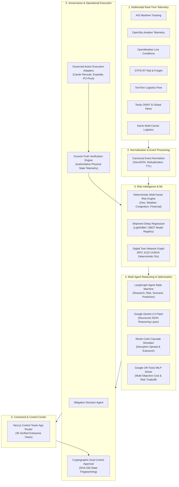

# RiskWise 2.0 — Architecture & System Specification

## 1. Executive System Overview

RiskWise 2.0 is an enterprise-grade autonomous supply chain risk intelligence, multi-agent orchestration, digital twin simulation, and governed operational action platform. It provides end-to-end continuous monitoring, predictive risk modeling, mathematical optimization, cryptographic human-in-the-loop governance, and closed-loop ground-truth physical verification across global supply chain networks.

### High-Level Architectural Flow

---

## 2. Core Architectural Invariants & Safety Discipline

RiskWise 2.0 enforces 10 non-negotiable architectural invariants:

1. **Multi-Tenant Isolation**: Every database entity, query, cache entry, agent state, and API payload is scoped to `tenant_id`. Cross-tenant data leakage is structurally impossible.
2. **Deterministic Composite Scoring**: Machine learning provides delay distributions and confidence intervals, but baseline risk classification is strictly deterministic and auditable.
3. **No Unauthenticated LLM Actions**: LLM outputs (Gemini 2.5 Flash) cannot directly mutate database records, issue carrier orders, or trigger external APIs without validation against strict Pydantic schemas.
4. **Dual-Control Human-in-the-Loop Governance**: Any operational action exceeding risk thresholds requires explicit cryptographic sign-off (`APPROVED` status with role-verified actor) before execution.
5. **State Fingerprinting**: Operational decisions seal the state with SHA-256 fingerprints of the risk score, simulation variance, and optimization parameters. If state changes prior to approval, the decision is invalidated.
6. **Authoritative Verification Ground-Truth**: Verification follows the strict hierarchy `REAL > ESTIMATED > SIMULATED`. No action is verified until authoritative physical sensor/telemetry feeds confirm state transition.
7. **Idempotency & Replay Protection**: Every action execution adapter implements deterministic idempotency keys (`uuidv5(tenant_id + decision_id + action_type)`).
8. **Immutable Audit Ledger**: All state transitions, approvals, rejections, agent steps, and executions are recorded in write-only audit tables with cryptographic hash chaining.
9. **Graceful Degraded Mode**: If external APIs (AIS, OpenSky, Gemini) experience outages, the platform falls back to cached snapshots, local heuristics, and offline ML models without downtime.
10. **Strict Zero-Trust Secrets Hygiene**: Credentials, API keys, and private keys reside exclusively in KMS/environment variables and are never persisted in source control or exposed via APIs.

---

## 3. Subsystem Architecture (Phases 1–21)

### Phase 01: Core Foundation & Framework Architecture
- **Backend Stack**: Python 3.12/3.13, FastAPI 0.115+, Pydantic v2 Settings.
- **Service-Repository Pattern**: Clean separation of business logic (`app/services`), data access (`app/repositories`), and protocol transport (`app/api/v1`).
- **Telemetry & Logging**: Structured JSON logging with correlation IDs, OpenTelemetry integration, and standardized error response models (`ErrorResponse`).

### Phase 02: Relational Database Schema & Domain Integrity
- **Database Engine**: PostgreSQL 16 RDS (with SQLite local compatibility for zero-dependency development).
- **Core Entities**: 34 normalized relational tables with full foreign-key constraints, cascading rules, and composite indexes covering Tenants, Users, Suppliers, Facilities, Shipments, Routes, Risks, Incidents, Simulations, Optimizations, Decisions, Approvals, and Audit Logs.
- **Migration Engine**: Alembic migration scripts ensuring declarative, reversible schema management.

### Phase 03: Google Authentication & Enterprise RBAC Governance
- **Authentication Protocol**: Google OAuth 2.0 Authorization Code Flow with PKCE.
- **Session Management**: Distributed server-side session tracking backed by Valkey/Redis with fallback to secure memory store.
- **Hierarchical RBAC Roles**:
  - `VIEWER`: Read-only access to dashboards, shipment tracking, risks, and telemetry maps.
  - `ANALYST`: Run simulations, view recommendation dossiers, inspect ML predictions.
  - `OPSMANAGER`: Formulate optimization runs, draft decisions, trigger automated workflows.
  - `RISKMANAGER`: Dual-control approval authority for high-impact mitigation decisions.
  - `ADMIN`: Tenant provisioning, user role assignment, system configuration, audit export.

### Phase 04: Core Domain REST APIs
- Full OpenAPI 3.1 compliant endpoints providing filtered, paginated access to:
  - `/api/v1/shipments`: Freight logistics, status tracking, waypoints, telemetry pings.
  - `/api/v1/risks`: Active risk vectors, impact assessments, composite scores.
  - `/api/v1/incidents`: Real-time disruption incidents, impacted nodes, escalation tiers.
  - `/api/v1/suppliers`: Tier-1 through Tier-N supplier health, ESG metrics, financial ratings.
  - `/api/v1/inventory`: Warehouse stocking, buffer days, SKU criticality, consumption rates.
  - `/api/v1/logistics`: Ports, shipping lanes, multi-modal corridors, customs gates.

### Phase 05: External Multimodal Telemetry Ingestion
Connectors collect, validate, and normalize real-time external telemetry feeds:
- **AISStream**: WebSocket & REST maritime vessel tracking (MMSI, position, speed, heading, draught).
- **OpenSky Network**: Aviation transponder tracking for air cargo (ICAO24, callsign, altitude, groundspeed).
- **OpenWeatherMap**: Real-time atmospheric hazards, storm tracks, typhoons, sea-state warnings.
- **GTFS-RT / Rail**: Intermodal rail freight position updates, corridor delays, track blocks.
- **TomTom Traffic Flow**: Port gate congestion, drayage bottlenecks, highway border delays.
- **Tavily Search / OSINT**: Global news analysis, labor strikes, geopolitical unrest, canal closures.
- **Karrio Multi-Carrier**: Standardized parcel and freight carrier tracking across global couriers.

### Phase 06: Event Normalization & Entity Resolution
- **Canonical Event Model**: Transforms heterogeneous raw feeds into strongly-typed `CanonicalEvent` structures.
- **Deduplication Engine**: Sliding-window hash deduplication preventing event storms.
- **Entity Resolution**: Spatial point-in-polygon matching against supply chain network nodes (corridors, geofences, ports).

### Phase 07: Deterministic Multi-Factor Risk Scoring Engine
- **Formula**: `Risk Score = w_geo * S_geo + w_weather * S_weather + w_congestion * S_congestion + w_supplier * S_supplier + w_delay * S_delay`.
- **Severity Classification**: `LOW` (0–29), `MEDIUM` (30–59), `HIGH` (60–79), `CRITICAL` (80–100).
- **Alert Escalation**: Automated webhook, event emission, and push notifications upon critical severity transitions.

### Phase 08: Hybrid RAG Knowledge Engine & Vector Search
- **Document Chunking**: Semantic hierarchy chunking of supplier contracts, SLA terms, insurance policies, and historical disruption post-mortems.
- **Vector Storage**: In-database pgvector storage with cosine similarity search.
- **Grounding Layer**: Injects retrieved contractual terms directly into agent reasoning context to ensure mitigation options honor legal and contractual obligations.

### Phase 09: LangGraph Multi-Agent Orchestration Framework
- **State Graph Architecture**: Directed acyclic graph (DAG) orchestrating specialized agent nodes:
  - `ResearchAgent`: Gathers contextual telemetry and relevant contractual constraints.
  - `RiskAgent`: Synthesizes multi-factor exposure across affected supply chain nodes.
  - `ScenarioAgent`: Formulates realistic disruption trajectories and duration distributions.
  - `PredictionAgent`: Queries ML models to forecast delay hours and arrival variances.
- **State Ownership**: Strict immutability contracts—agents may only append to their designated state sub-dictionaries.

### Phase 10: Google Gemini 2.5 Flash Reasoning Layer
- **Authoritative LLM Provider**: Google Gemini 2.5 Flash via official `google-genai` SDK (`gemini-2.5-flash`).
- **Structured Outputs**: Native JSON Schema enforcement guaranteeing deterministic parsing of executive summaries, risk root-cause explanations, and mitigation trade-off narratives.
- **Resilience**: Backoff retries, secret scrubbing filters, and fallback to cached heuristic analysis if API limits are reached.

### Phase 11: Machine Learning Shipment Delay Regression
- **Algorithm**: Gradient Boosted Decision Trees (LightGBM / Scikit-Learn Ridge & GBDT).
- **Feature Pipeline**: Distance remaining, historical carrier delay, weather severity index, port congestion factor, dwell time, and intermodal transfers.
- **Model Registry**: Stored in `storage/ml_artifacts/*.joblib` with versioning, data drift tracking, and feature attribution.

### Phase 12: Digital Twin Supply Chain Graph Engine
- **Deterministic Identity**: Node and edge identifiers generated via RFC 4122 UUIDv5 (`uuid.uuid5(NAMESPACE_DNS, f"{tenant_id}:{entity_type}:{code}")`).
- **Graph Topology**: Facilities, suppliers, ports, waypoints, and transport corridors represented as an in-memory and database graph supporting shortest-path, flow capacity, and bottleneck analysis.

### Phase 13: Disruption Simulation & Monte Carlo Cascade Engine
- **Simulation Models**: Monte Carlo iterations simulating stochastic disruption spread across tier-1, tier-2, and tier-3 supplier dependencies.
- **Variance Analysis**: Calculates P10, P50, P90 projected financial losses, inventory stockout dates, and production line stoppage probabilities.

### Phase 14: Mathematical Optimization Subsystem (Google OR-Tools)
- **Solver**: Mixed-Integer Linear Programming (MILP) using Google OR-Tools.
- **Objective Function**: Minimize Total Cost = Transportation Cost + Holding Cost + Expedite Premium + Stockout Penalty.
- **Pareto Frontier**: Generates multi-objective trade-off frontiers balancing cost vs. risk reduction time.

### Phase 15: Mitigation Decision Agent
- Evaluates optimization candidates and synthesizes the optimal mitigation strategy (e.g., air expedite, alternative port reroute, buffer reallocation).
- Formulates actionable decision records with expected cost impact, risk reduction delta, and operational step sequences.

### Phase 16: Human Governance & Approval Subsystem
- **Dual-Control Enforcement**: High-cost (> $50,000) or high-risk actions require cryptographic dual-control approval by an authorized `RISKMANAGER` or `ADMIN`.
- **State Integrity Seal**: Decisions seal the SHA-256 fingerprint of the underlying system state. Any change in operational status automatically invalidates stale approvals.

### Phase 17: Operational Action Agent & Governed Execution Adapters
- **Adapters**:
  - `CarrierRerouteAdapter`: Issues EDI / API booking revisions to logistics carriers.
  - `AirExpediteAdapter`: Requests priority air freight capacity for critical SKUs.
  - `PurchaseOrderPivotAdapter`: Diverts procurement allocations to pre-approved secondary suppliers.
  - `InventoryTransferAdapter`: Dispatches regional inter-warehouse transfer orders.
- **Safety**: Strict dry-run mode validation and deterministic idempotency enforcement.

### Phase 18: Operational Verification Agent & Ground-Truth Evidence
- **Ground-Truth Hierarchy**: `REAL > ESTIMATED > SIMULATED`.
- **Evidence Pipeline**: Continuously polls authoritative physical feeds (AIS position, terminal gate receipt, airway bill milestone) to confirm physical execution of the approved action.
- Marks action as `VERIFIED` only when authoritative physical ground-truth is confirmed.

### Phase 19: Control Tower Web Application (Next.js App Router)
- **Frontend Stack**: Next.js 16.3.4 (App Router), React 19.2.8, Tailwind CSS v4, Lucide React, Recharts.
- **36 Verified Views**: Complete coverage across Executive Dashboard, Live Telemetry Radar Map, Shipments, Incidents, Risks, Suppliers, Digital Twin, Simulations, Optimization, Recommendations, Decisions, Approvals, Actions, Verification, Audit Ledger, Admin, and Evaluation.

### Phase 20: Automated Evaluation & Quality Assurance Harness
- **16 Automated Test Suites**: Continuous regression testing against 15 golden supply chain disruption datasets.
- Assesses agent decision quality, Hallucination Index (< 0.02), latency budgets (< 800ms), and constraint satisfaction rates (100%).

### Phase 21: Production Hardening, High Availability & Enterprise Deployment
- **Containerization**: Multi-stage production Dockerfiles for FastAPI backend and Next.js standalone frontend.
- **High Availability**: Multi-AZ AWS deployment topology (ECS Fargate, RDS PostgreSQL Multi-AZ, Valkey Distributed Cache, CloudFront CDN).
- **Zero-Downtime Releases**: Rolling updates with automatic healthcheck verification and rollback.

---

## 4. Database Schema Summary

The database maintains 34 core tables organized into logical domain groupings:

1. **Identity & Tenancy**: `tenants`, `users`, `sessions`, `api_keys`.
2. **Network Topology**: `suppliers`, `facilities`, `ports`, `carriers`, `routes`, `products`, `inventory_items`.
3. **Logistics & Telemetry**: `shipments`, `shipment_events`, `telemetry_pings`, `weather_alerts`, `traffic_incidents`.
4. **Risk Intelligence**: `risk_assessments`, `risk_factors`, `risk_history`, `incidents`, `incident_impacts`.
5. **Digital Twin & Simulation**: `digital_twin_nodes`, `digital_twin_edges`, `simulation_runs`, `simulation_results`.
6. **Prescriptive Analytics**: `optimization_runs`, `optimization_solutions`, `recommendations`.
7. **Governance & Execution**: `decisions`, `approvals`, `actions`, `verification_records`.
8. **Audit & Assurance**: `audit_ledger`, `evaluation_runs`, `evaluation_suite_results`.

---

## 5. Comprehensive REST API Catalog

The FastAPI backend exposes 75+ endpoints under `/api/v1/`:

| Domain | Route Prefix | Key Endpoints | Description |
| :--- | :--- | :--- | :--- |
| **Auth** | `/auth` | `GET /login/google`, `GET /callback/google`, `POST /logout`, `GET /me` | Google OAuth 2.0 PKCE, session management |
| **Shipments** | `/shipments` | `GET /`, `GET /{id}`, `POST /`, `GET /{id}/events`, `GET /{id}/telemetry` | Shipment tracking, waypoints, telemetry |
| **Risks** | `/risks` | `GET /`, `GET /{id}`, `POST /calculate`, `GET /{id}/history` | Multi-factor risk calculation & breakdown |
| **Incidents** | `/incidents` | `GET /`, `GET /{id}`, `POST /`, `POST /{id}/escalate` | Disruption event tracking & impact analysis |
| **Suppliers** | `/suppliers` | `GET /`, `GET /{id}`, `POST /`, `GET /{id}/scorecard` | Supplier tier tracking & performance metrics |
| **Inventory** | `/inventory` | `GET /`, `GET /{id}`, `POST /adjust`, `GET /critical` | Stock levels, buffer days, stockout alerts |
| **Digital Twin** | `/twin` | `GET /graph`, `GET /nodes`, `GET /edges`, `POST /sync` | Topology graph nodes, edges, shortest path |
| **Simulation** | `/simulations` | `GET /`, `POST /run`, `GET /{id}`, `GET /{id}/results` | What-if Monte Carlo disruption modeling |
| **Optimization**| `/optimization`| `GET /`, `POST /solve`, `GET /{id}`, `GET /{id}/pareto` | MILP multi-objective solver & Pareto frontier |
| **Decisions** | `/decisions` | `GET /`, `POST /formulate`, `GET /{id}`, `POST /{id}/seal` | Mitigation decision formulation & fingerprinting |
| **Approvals** | `/approvals` | `GET /pending`, `POST /{id}/approve`, `POST /{id}/reject` | Dual-control cryptographic sign-off |
| **Actions** | `/actions` | `GET /`, `POST /{id}/execute`, `GET /{id}/status` | Governed operational execution adapters |
| **Verification**| `/verification`| `GET /`, `GET /{id}`, `POST /{id}/verify` | Authoritative physical ground-truth verification |
| **Audit** | `/audit` | `GET /ledger`, `GET /{id}/verify-chain`, `POST /export` | Cryptographic audit ledger verification |
| **System** | `/` | `GET /health`, `GET /ready`, `GET /metrics` | Health probes, readiness, OpenTelemetry metrics |
