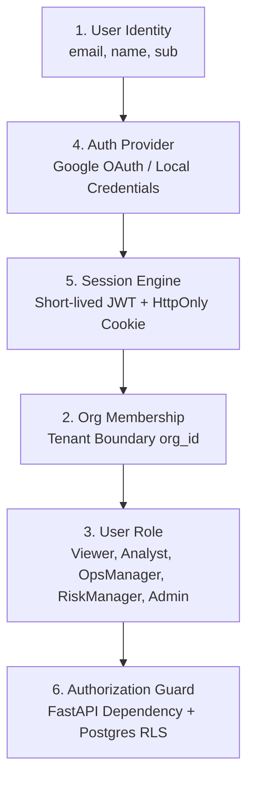
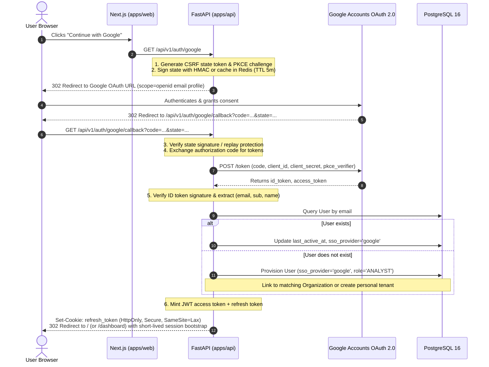
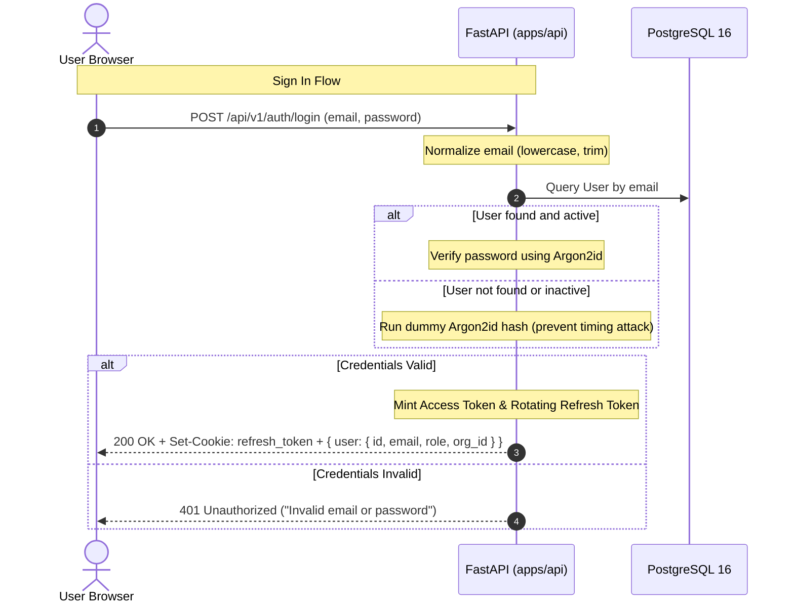
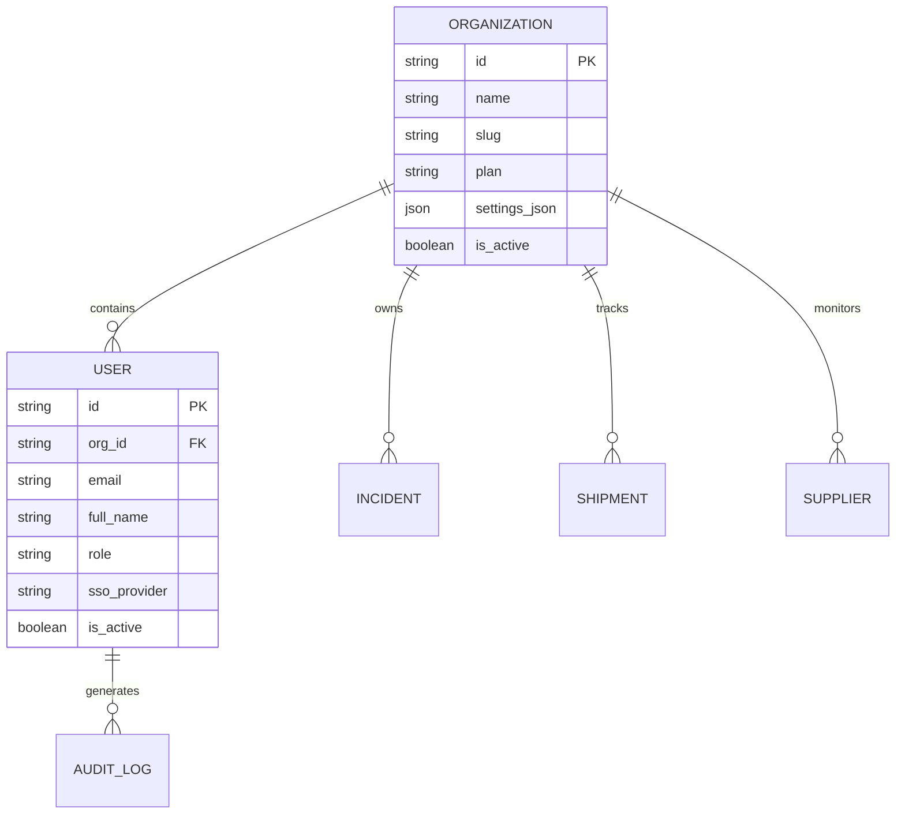
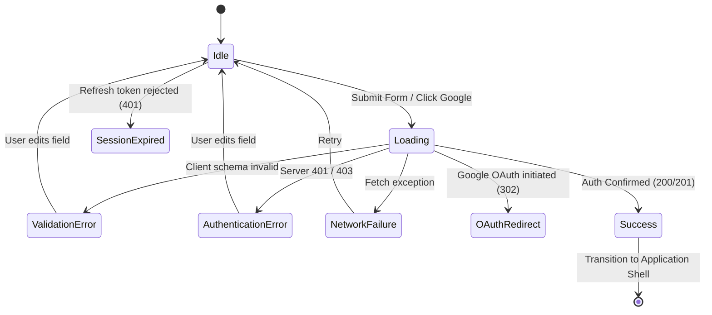

# RiskWise 2.0 — Authentication Architecture & API Contract Specification

> **Status:** Draft / Architectural Specification  
> **Phase:** Phase 2 — Step 1  
> **Date:** September 2026  
> **Target Services:** `apps/api` (FastAPI), `apps/web` (Next.js 16 App Router), PostgreSQL 16 (AWS RDS)

---

## 1. Authentication Goals

The primary goal of the RiskWise 2.0 authentication architecture is to provide an enterprise-grade, multi-tenant authentication and authorization foundation that guarantees strict tenant isolation, seamless Single Sign-On (Google OAuth), and secure credential-based access while maintaining a clear separation between **Authentication** and **Authorization**:

- **Authentication ("Who are you?"):** Validates and establishes user identity across supported identity providers (Google OAuth 2.0 and native Email/Password credentials).
- **Authorization ("What are you allowed to do?"):** Enforces multi-tenant data boundaries (`org_id`) and Role-Based Access Control (RBAC) permissions at both the API layer and the PostgreSQL database level via Row-Level Security (RLS).
- **Zero Token Leakage:** Authentication credentials and refresh tokens must never be exposed to JavaScript browser storage (`localStorage` or `sessionStorage`). Sessions must rely on hardened, `HttpOnly`, `Secure`, `SameSite=Lax` cookies.
- **Enterprise Multi-Tenancy:** Every user action is strictly anchored to an `Organization`. Multi-tenant isolation is cryptographically carried in the session claim and enforced in every database transaction.
- **Auditability & Observability:** All authentication events (successful logins, failures, logouts, token revocations, OAuth links) are deterministically logged for compliance and security forensics.

---

## 2. Existing Database Findings & Gap Analysis

An inspection of the existing database models (`apps/api/app/models/tenancy.py` and `governance.py`) reveals the current database schema state for `organizations` and `users`.

### 2.1 The Existing `organizations` Schema
The `organizations` table acts as the multi-tenant root entity:

| Column | Type | Constraints / Defaults | Description |
|---|---|---|---|
| `id` | `VARCHAR(64)` | `PRIMARY KEY`, default: `UUID4` | Unique tenant identifier |
| `name` | `VARCHAR(255)` | `NOT NULL` | Legal or display organization name |
| `slug` | `VARCHAR(255)` | `UNIQUE`, `NULLABLE` | URL-safe tenant identifier (e.g. `acme-logistics`) |
| `plan` | `VARCHAR(50)` | `DEFAULT 'ENTERPRISE'` | Subscription/feature tier |
| `settings_json` | `JSON` | `DEFAULT {}` | Tenant-wide configuration parameters |
| `is_active` | `BOOLEAN` | `DEFAULT TRUE` | Global organization status toggle |
| `created_at` | `TIMESTAMP WITH TIME ZONE` | `server_default=func.now()` | Record creation timestamp |
| `updated_at` | `TIMESTAMP WITH TIME ZONE` | `onupdate=func.now()` | Last modification timestamp |

### 2.2 The Existing `users` Schema
The `users` table models user accounts linked to organizations:

| Column | Type | Constraints / Defaults | Description |
|---|---|---|---|
| `id` | `VARCHAR(64)` | `PRIMARY KEY`, default: `UUID4` | Unique user identifier |
| `org_id` | `VARCHAR(64)` | `FOREIGN KEY (organizations.id)`, `NULLABLE` | Enclosing organization tenancy link |
| `email` | `VARCHAR(255)` | `UNIQUE`, `NOT NULL` | Normalized primary email address |
| `full_name` | `VARCHAR(255)` | `NULLABLE` | Display name of the user |
| `role` | `VARCHAR(50)` | `DEFAULT 'ANALYST'` | RBAC role tag |
| `sso_provider` | `VARCHAR(50)` | `NULLABLE` | Identity provider tag (`google`, `oidc`, etc.) |
| `is_active` | `BOOLEAN` | `DEFAULT TRUE` | Account active toggle |
| `last_active_at` | `TIMESTAMP WITH TIME ZONE` | `NULLABLE` | Timestamp of last user API activity |
| `created_at` | `TIMESTAMP WITH TIME ZONE` | `server_default=func.now()` | Record creation timestamp |
| `updated_at` | `TIMESTAMP WITH TIME ZONE` | `onupdate=func.now()` | Last modification timestamp |

### 2.3 Existing Capabilities
1. **Unique Email Identity:** Guarantees no two accounts share an email address.
2. **SSO Provider Attribution:** Supports tagging users originating from external identity providers via `sso_provider`.
3. **Tenant Association:** Direct foreign key reference to `organizations.id`.
4. **Built-in Role:** Direct storage of the user's role with a safe default (`ANALYST`).
5. **Account Lifecycle & Activity Tracking:** Native flags for account deactivation (`is_active`) and recency tracking (`last_active_at`).

### 2.4 Documented Schema Gaps (For Future Migrations)
*(Note: As mandated by Phase 2 Step 1, these gaps are documented here only; no database schema modifications or Alembic migrations are executed in this step.)*

1. **Missing Password Storage Column:** The current `users` table does not contain a `password_hash` column. Native email/password authentication will require either:
   - *Option A (Direct Column):* Adding `password_hash VARCHAR(255) NULLABLE` to `users`.
   - *Option B (Recommended - Credential Isolation):* A dedicated `auth_credentials` table linking `user_id` to `password_hash`, salt, and failed attempt counters.
2. **Missing OAuth Subject Link:** The table lacks an `sso_subject_id` (Google's unique immutable numeric `sub`). Relying strictly on email can cause account hijacking or dissociation if an employee's enterprise email alias changes.
3. **Missing Email Verification Flag:** No `is_verified` or `email_verified_at` column exists to track whether an email/password registrant has completed proof-of-inbox verification.
4. **Missing Password Reset State:** No columns exist for temporary reset tokens (`reset_token_hash`, `reset_token_expires_at`).
5. **Session / Refresh Token Storage:** If refresh tokens are managed in PostgreSQL rather than an in-memory Redis/Valkey cache, a `user_sessions` or `refresh_tokens` table will be required to track revocation.

---

## 3. Authentication Design: Separation of Concerns

RiskWise separates identity validation from authorization decisions across six distinct layers:



1. **User Identity:** Answers *"Who is this user?"*. Verified by proving possession of a Google account or a secret password.
2. **Authentication Provider:** Encapsulates provider-specific verification logic (Google OAuth 2.0 PKCE exchange or Argon2id password verification).
3. **Session:** A cryptographically signed proof of authentication holding claims (`user_id`, `org_id`, `role`) with strict expiration.
4. **Organization Membership:** Determines which tenant context is active for the current request.
5. **User Role:** Dictates the functional capabilities granted to the user within that organization.
6. **Authorization Guard:** Answers *"Is this user allowed to execute this action?"*. Evaluated on every request via FastAPI dependencies before controller execution and backed by database Row-Level Security.

---

## 4. Google OAuth Flow Architecture

RiskWise implements Google OAuth 2.0 with Proof Key for Code Exchange (PKCE) and secure server-side state verification:



### Google OAuth Security Rules
- **No Client Secrets in Frontend:** The Next.js frontend never possesses `GOOGLE_OAUTH_CLIENT_SECRET`. All token exchanges occur purely backend-to-Google over HTTPS.
- **Cryptographic State Parameter:** The `state` parameter is an HMAC-SHA256 signed payload containing a nonce, timestamp, and optional return URL. Requests with missing, expired (>5 min), or altered `state` tokens are rejected with HTTP 400.
- **Verified Email Only:** Only Google accounts with `email_verified: true` in the ID token payload are permitted entry.

---

## 5. Email / Password Authentication Flow

For users authenticating with native credentials, RiskWise specifies a hardened password lifecycle:



### Planned Capabilities
1. **Sign In (`POST /api/v1/auth/login`):** Validates credentials, updates `last_active_at`, issues session.
2. **Registration (`POST /api/v1/auth/register`):** Creates an inactive or active user, provisions or associates an organization, and begins the onboarding lifecycle.
3. **Password Reset Initiation (`POST /api/v1/auth/forgot-password`):** Generates a high-entropy 256-bit token with a 15-minute TTL. Dispatches an email containing the reset link. Always returns HTTP 200 with an identical message to eliminate user enumeration vectors.
4. **Password Reset Completion (`POST /api/v1/auth/reset-password`):** Validates the token, applies the new Argon2id hash, and revokes all active refresh tokens for the user.

---

## 6. API Contracts

All authentication endpoints are scoped under `/api/v1/auth/`. Standardized error responses use FastAPI's error schema `{"detail": "..."}` or `{"detail": [...]}`.

### 6.1 `POST /api/v1/auth/login`
- **Purpose:** Authenticate a user via email and password credentials.
- **Authentication Requirement:** Public (Anonymous).
- **Request Headers:** `Content-Type: application/json`
- **Request Body:**
  ```json
  {
    "email": "analyst@riskwise.io",
    "password": "SecurePassword123!"
  }
  ```
- **Validation Rules:**
  - `email`: Valid email format, max 255 characters, trimmed, lowercased.
  - `password`: String, min 8 characters, max 128 characters.
- **Success Response (HTTP 200 OK):**
  - **Headers:** `Set-Cookie: riskwise_refresh_token=<token>; HttpOnly; Secure; SameSite=Lax; Path=/api/v1/auth; Max-Age=604800`
  - **Body:**
    ```json
    {
      "access_token": "eyJhbGciOi...",
      "token_type": "bearer",
      "expires_in": 900,
      "user": {
        "id": "usr_c8f3a1d9e2b4",
        "email": "analyst@riskwise.io",
        "full_name": "Jane Doe",
        "role": "Analyst",
        "org_id": "org_7a9b1c3d5e2f",
        "sso_provider": null
      }
    }
    ```
- **Error Responses:**
  - `401 Unauthorized`: `{"detail": "Invalid email or password"}` (generic message; no distinction between nonexistent user and wrong password).
  - `403 Forbidden`: `{"detail": "Account has been deactivated"}`.
  - `422 Unprocessable Entity`: Input validation error.
  - `429 Too Many Requests`: Rate limit exceeded.

---

### 6.2 `POST /api/v1/auth/register`
- **Purpose:** Register a new user and initialize organizational tenancy.
- **Authentication Requirement:** Public (Anonymous) or Invite-Gated.
- **Request Body:**
  ```json
  {
    "email": "new.user@supplycorp.com",
    "password": "ComplexPassword!2026",
    "full_name": "Alex Mercer",
    "organization_name": "SupplyCorp Global"
  }
  ```
- **Validation Rules:**
  - `password`: Min 12 chars, must contain uppercase, lowercase, number, and special character.
  - `organization_name`: Min 2, max 100 characters.
- **Success Response (HTTP 201 Created):**
  - **Headers:** `Set-Cookie: riskwise_refresh_token=...`
  - **Body:**
    ```json
    {
      "access_token": "eyJhbGciOi...",
      "token_type": "bearer",
      "expires_in": 900,
      "user": {
        "id": "usr_91a8e7d2",
        "email": "new.user@supplycorp.com",
        "full_name": "Alex Mercer",
        "role": "Admin",
        "org_id": "org_48f0b1a3",
        "sso_provider": null
      }
    }
    ```
- **Error Responses:**
  - `409 Conflict`: `{"detail": "An account with this email address already exists"}`.
  - `422 Unprocessable Entity`: Password complexity failure or invalid email.

---

### 6.3 `POST /api/v1/auth/logout`
- **Purpose:** Terminate user session and revoke refresh tokens.
- **Authentication Requirement:** Authenticated (Bearer Token or Refresh Cookie).
- **Request Body:** None.
- **Success Response (HTTP 200 OK):**
  - **Headers:** `Set-Cookie: riskwise_refresh_token=; HttpOnly; Secure; SameSite=Lax; Path=/api/v1/auth; Max-Age=0`
  - **Body:**
    ```json
    {
      "status": "ok",
      "message": "Successfully logged out"
    }
    ```

---

### 6.4 `GET /api/v1/auth/me`
- **Purpose:** Retrieve the currently authenticated user's profile, active organization, and permissions.
- **Authentication Requirement:** Authenticated (`Authorization: Bearer <access_token>`).
- **Request Body:** None.
- **Success Response (HTTP 200 OK):**
  ```json
  {
    "id": "usr_c8f3a1d9e2b4",
    "email": "analyst@riskwise.io",
    "full_name": "Jane Doe",
    "role": "Analyst",
    "org_id": "org_7a9b1c3d5e2f",
    "organization": {
      "id": "org_7a9b1c3d5e2f",
      "name": "Acme Global Logistics",
      "slug": "acme-logistics",
      "plan": "ENTERPRISE"
    },
    "permissions": [
      "views:read",
      "scenarios:run",
      "recommendations:write"
    ]
  }
  ```
- **Error Responses:**
  - `401 Unauthorized`: Token expired, invalid, or revoked.

---

### 6.5 `GET /api/v1/auth/google`
- **Purpose:** Initiate Google OAuth 2.0 handshake.
- **Authentication Requirement:** Public.
- **Query Parameters:**
  - `return_to` (optional): Validated relative path to redirect after successful authentication (e.g. `/shipments`).
- **Response (HTTP 302 Found):**
  - Redirects to `https://accounts.google.com/o/oauth2/v2/auth?client_id=...&redirect_uri=...&response_type=code&scope=openid%20email%20profile&state=...`

---

### 6.6 `GET /api/v1/auth/google/callback`
- **Purpose:** Process Google authorization code, complete identity lookup/provisioning, and establish session.
- **Authentication Requirement:** Public (invoked by browser redirect from Google).
- **Query Parameters:**
  - `code`: Google authorization code.
  - `state`: Cryptographic anti-CSRF state token.
- **Response:**
  - **On Success (HTTP 302 Found):** Sets `Set-Cookie: riskwise_refresh_token=...` and redirects to `/` or the validated `return_to` parameter.
  - **On Failure (HTTP 302 Found):** Redirects to `/login?error=oauth_failed`.

---

### 6.7 `POST /api/v1/auth/refresh`
- **Purpose:** Exchange a valid `HttpOnly` refresh token cookie for a new short-lived access token and rotated refresh token.
- **Authentication Requirement:** Valid refresh token cookie present.
- **Success Response (HTTP 200 OK):**
  - **Headers:** Rotated `Set-Cookie: riskwise_refresh_token=...`
  - **Body:**
    ```json
    {
      "access_token": "eyJhbGciOi...",
      "token_type": "bearer",
      "expires_in": 900
    }
    ```
- **Error Response:**
  - `401 Unauthorized`: Refresh token expired, invalid, or reused (triggers immediate revocation of token family).

---

### 6.8 Proposed Password Reset Endpoints
- **`POST /api/v1/auth/forgot-password`**
  - *Request:* `{"email": "user@riskwise.io"}`
  - *Response:* `200 OK` `{"message": "If the account exists, a password reset link has been dispatched."}`
- **`POST /api/v1/auth/reset-password`**
  - *Request:* `{"token": "string", "new_password": "string"}`
  - *Response:* `200 OK` `{"status": "ok", "message": "Password has been successfully updated."}`

---

## 7. Session Architecture & Cookie Strategy

RiskWise employs a **Dual-Token with Refresh Token Rotation** strategy:

| Attribute | Access Token | Refresh Token |
|---|---|---|
| **Type** | Signed JWT (HMAC-SHA256 or RS256) | High-entropy Opaque String / Encrypted Token |
| **Lifespan** | 15 minutes (`900s`) | 7 days (`604800s`) |
| **Transmission** | `Authorization: Bearer <token>` or Memory | `Set-Cookie` Header |
| **Storage Location** | In-memory (JavaScript closure / React State) | Browser Cookie (`HttpOnly`) |
| **Cookie Flags** | N/A | `HttpOnly`, `Secure` (prod), `SameSite=Lax`, `Path=/api/v1/auth` |
| **Rotation** | Re-issued on refresh | **Single-use**: Rotated on every refresh call |

```
Client                             FastAPI API
  |                                     |
  |--- (1) API Call + Access Token ---->| (Validates JWT signature & expiry locally)
  |                                     |
  |--- (2) Access Token Expired (401) ->|
  |                                     |
  |--- (3) POST /auth/refresh --------->| (Reads HttpOnly refresh cookie)
  |    (Cookie: riskwise_refresh_token) | (Validates & invalidates old refresh token)
  |<-- (4) 200 OK + New Access Token ---| (Issues new access token + new refresh cookie)
  |    (Set-Cookie: new_refresh_token)  |
```

### Critical Security Protections
1. **No localStorage / sessionStorage:** Prevents token theft through Cross-Site Scripting (XSS).
2. **Refresh Token Rotation (RTR):** Every time a refresh token is used, it is invalidated and replaced. If a previously consumed refresh token is presented a second time, the authentication subsystem flags a potential token theft and revokes all active sessions for that user family.
3. **SameSite=Lax:** Protects against Cross-Site Request Forgery (CSRF) by preventing the browser from attaching the cookie on third-party cross-origin requests.

---

## 8. Organization Model & Multi-Tenancy

RiskWise is an enterprise control plane where all supply-chain risks, shipments, suppliers, simulations, and incidents are tenant-scoped:



### Multi-Tenant Isolation Enforcement
1. **JWT Claim Resolution:** Every access token embeds `org_id`. The application never trusts client-supplied `org_id` parameters in request bodies or query parameters.
2. **FastAPI Dependency Injection:**
   ```python
   # Architectural specification for Phase 2 implementation:
   def get_current_tenant(user: User = Depends(get_current_active_user)) -> str:
       if not user.org_id:
           raise HTTPException(status_code=403, detail="User not assigned to an organization")
       return user.org_id
   ```
3. **PostgreSQL Row-Level Security (RLS):**
   The API sets a local PostgreSQL session setting at the start of each transaction:
   ```sql
   SET LOCAL app.current_org_id = 'org_7a9b1c3d5e2f';
   ```
   All tenant-scoped tables enforce:
   ```sql
   CREATE POLICY tenant_isolation_policy ON shipments
   USING (org_id = current_setting('app.current_org_id'));
   ```

---

## 9. Role-Based Access Control (RBAC) Specification

RiskWise defines 5 standard organizational roles, as documented in `docs/RiskWise_2.0_Technical_Project_Spec.md` §10.2:

| Role | Meaning / Target Persona | Description & Core Privileges |
|---|---|---|
| **`Viewer`** | Executive, Auditor, Stakeholder | Read-only access to high-level dashboards, risk scores, shipment statuses, and network topology. Cannot trigger simulations or alter configurations. |
| **`Analyst`** | Supply Chain Analyst *(Default)* | Operational triage. Can inspect root causes, run digital twin scenario simulations, generate recommendations, and trigger AI agent investigations. |
| **`OpsManager`** | Operations Manager, Logistics Lead | Direct operational execution. Can execute standard low- and medium-impact actions (e.g. rerouting purchase orders, adjusting carrier allocations). |
| **`RiskManager`** | Chief Risk Officer, Risk Lead | High-impact governance. Approves or rejects critical mitigation actions, overrides AI agent proposals, and inspects full audit trails. |
| **`Admin`** | Enterprise IT Administrator | Full tenant governance. Manages users, assigns roles, configures integration credentials (Project44, AISStream), manages billing, and configures security policies. |

### RBAC Permission Matrix

| Capability | Viewer | Analyst | OpsManager | RiskManager | Admin |
|---|:---:|:---:|:---:|:---:|:---:|
| View dashboards, risks, shipments | ✓ | ✓ | ✓ | ✓ | ✓ |
| Run scenarios / simulations | | ✓ | ✓ | ✓ | ✓ |
| Create / edit recommendations | | ✓ | ✓ | ✓ | ✓ |
| Trigger AI agent runs | | ✓ | ✓ | ✓ | ✓ |
| Execute operational actions directly | | | ✓ | ✓ | ✓ |
| Approve / reject high-impact mitigations | | | | ✓ | ✓ |
| View complete audit trail | | | | ✓ | ✓ |
| Manage users, roles & tenant integrations | | | | | ✓ |

---

## 10. Security Requirements Checklist

Future implementations must strictly enforce the following security controls:

- [ ] **Password Hashing:** Use Argon2id (`argon2-cffi`) with minimum parameters: memory cost `65536 KB` (64 MB), time cost `3` iterations, parallelism `4`.
- [ ] **Timing Attack Mitigation:** Constant-time comparisons (`hmac.compare_digest`) for all token and password validations. When a user does not exist during login, run a dummy Argon2id computation to equalize response latency.
- [ ] **Rate Limiting:** Protect `/api/v1/auth/login`, `/register`, and `/forgot-password` with an IP and account-based rate limiter (maximum 5 attempts per IP/email window of 15 minutes; HTTP 429).
- [ ] **Enumeration Defense:** Generic error messages across login and password recovery ("Invalid email or password" and "If your email is registered, you will receive a reset link").
- [ ] **Open Redirect Prevention:** All OAuth and login redirect parameters (`return_to`) must be validated against a strict regex whitelist allowing only local relative paths (`/^[a-zA-Z0-9_\-\/]+$/`). Absolute URLs or protocol-relative URLs (`//evil.com`) are rejected.
- [ ] **State & PKCE Validation:** OAuth flow must validate cryptographically signed state parameters and verify PKCE `code_verifier`.
- [ ] **Session Invalidation:** Revoke all issued tokens upon password reset or role demotion.
- [ ] **Zero Secrets in Source Code:** `GOOGLE_OAUTH_CLIENT_SECRET`, JWT signing keys, and database credentials must only be injected via environment variables or AWS Secrets Manager.
- [ ] **Audit Logging:** Every authentication attempt (success, failure, logout, password change) must emit a structured log record linked to `AuditLog`.

---

## 11. Frontend Integration Contract (Next.js 16 App Router)

Based on RiskWise UI/UX guidelines and the Vesper design tokens (`.agents/skills/ui-ux-pro-max` & `design-system`), the future authentication interface must follow standard accessible form patterns:

### 11.1 Planned Frontend Pages
1. `/login` — Sign In (Email/Password & "Continue with Google")
2. `/register` — Sign Up (User registration & Organization onboarding)
3. `/forgot-password` — Password reset request form
4. `/reset-password` — New password confirmation form

### 11.2 Frontend State Machine



### 11.3 UI States & Accessible Authentication Contract (WCAG 2.2 AA)
- **`Idle`:** Clean form with explicit `<label for="...">` associated with every input. Inputs must use semantic attributes: `autocomplete="email"`, `autocomplete="current-password"`, `autocomplete="new-password"`.
- **`Loading`:** Submit buttons show an accessible spinner, state changes to `aria-busy="true"`, and inputs are disabled to prevent duplicate submissions.
- **`ValidationError`:**
  - Displays a top-level focusable Error Summary (`role="alert"`, `tabindex="-1"`, `aria-labelledby="error-summary-title"`).
  - Individual inputs highlight with `--border-danger` (`#EF4444`) and have `aria-invalid="true"` linked via `aria-describedby` to the error text.
- **`AuthenticationError`:** Displays high-contrast alert banner (`surface-danger`, `text-danger`) at the top of the form with clear, un-enumerated messaging.
- **`OAuthRedirect`:** Accessible loading interstitial with status text ("Connecting to Google Accounts...").
- **`SessionExpired`:** In-app modal or non-destructive toast notifying the user that their session has expired, providing single-click re-authentication without losing unsaved form state.
- **Password Manager & Paste Support:** **Never** block clipboard paste (`onpaste` must remain fully enabled) to guarantee compatibility with 1Password, Bitwarden, Apple Keychain, and browser password managers.

---

## 12. Open Questions & Architectural Decisions Requiring Attention

Before beginning Phase 2 Step 2 implementation, the following architectural choices should be aligned:

1. **Password Storage Model:**
   - *Decision:* Should `password_hash` be added directly as a column to `users` via an Alembic migration, or should a distinct `auth_credentials` table be established?
   - *Recommendation:* Direct column `password_hash VARCHAR(255) NULLABLE` on `users` is the simplest, most performant approach for the initial release, with `NULL` indicating an SSO-only user.
2. **Google OAuth User Provisioning Policy:**
   - *Decision:* When an unknown user authenticates with Google, should RiskWise:
     - Automatically provision a new personal Organization for them?
     - Match their email domain (e.g. `@acmelogistics.com`) to an existing Organization?
     - Or require an existing Organization invite token?
   - *Recommendation:* Require an organization invite token or automatically create a single-user trial organization.
3. **Session Store Engine:**
   - *Decision:* Should refresh tokens and revocation lists be stored in **Valkey / Redis** (fast in-memory lookup, native TTL) or in **PostgreSQL** (`refresh_tokens` table)?
   - *Recommendation:* Valkey / Redis (using `REDIS_URL` from `.env`) provides sub-millisecond session validation and automatic TTL expiration.
4. **Multi-Organization Membership:**
   - *Decision:* Can a single user email belong to multiple organizations (requiring a `user_organizations` join table), or is a user strictly 1:1 with an organization via `users.org_id`?
   - *Recommendation:* The current schema implements 1:1 (`users.org_id`). We recommend preserving 1:1 for Phase 2 to prevent complexity, with multi-org membership deferred to enterprise roadmap.
