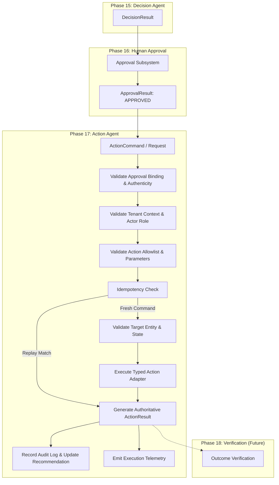

# Phase 17 — Action Agent Specification & Implementation Guide

## 1. Executive Summary & Purpose

The **Action Agent (Phase 17)** is the authoritative execution engine of the RiskWise 2.0 autonomous supply chain risk intelligence platform. Positioned immediately downstream of the Human Approval Subsystem (Phase 16) and upstream of the Verification Subsystem (Phase 18), the Action Agent is strictly an **execution mechanism, not a decision maker**.

> **Non-Negotiable Architectural Boundary:**
> **The Action Agent does not approve decisions and does not verify business outcomes.**
> - It does NOT decide what should happen (Phase 15 Decision Agent).
> - It does NOT approve or reject recommendations (Phase 16 Human Approval).
> - It does NOT verify whether physical or operational real-world objectives were achieved (Phase 18 Verification).
> - It executes ONLY explicitly approved, typed, tenant-validated action commands against authoritative operational adapters.

---

## 2. Core Action Pipeline Topology



---

## 3. Strict Human Approval Enforcement

Human approval is the primary security perimeter protecting operational supply chain state from unauthorized modification.

### 3.1 Mandatory Approval Preconditions
Every operational `ActionCommand` must satisfy all of the following checks before any execution logic or target mutation is evaluated:
1. **Approval Presence**: `approval_id` and `approval_result` must be present. Unapproved commands raise `ActionApprovalMissingError`.
2. **Approval Status**: `approval_result.status` must equal `ApprovalStatus.APPROVED`. Requests with `PENDING`, `REJECTED`, `EXPIRED`, or `REVOKED` statuses are unconditionally rejected (`ActionApprovalInvalidError`).
3. **Decision Binding**: `approval_result.decision_id` must match `command.decision_id` exactly.
4. **Action Candidate Binding**: `approval_result.candidate_id` must match `command.candidate_id` exactly.
5. **Tenant Isolation**: `approval_result.organization_id` must match `command.organization_id`. Cross-tenant approvals raise `ActionTenantIsolationError`.
6. **Freshness Window**: Approvals older than `max_approval_age_seconds` (default: 86,400s / 24 hours) or where `expires_at < current_time` are rejected (`ActionStaleDecisionError`).
7. **Approver Role Authority**: The actor who signed the approval must possess an authorized role (`RiskManager` or `Admin`).
8. **Tamper Detection**: If the approval payload contains a pre-computed fingerprint or parameters, any discrepancy with the action command raises `ActionApprovalInvalidError`.

### 3.2 Prohibited Patterns
- **No Bypass Flags**: Flags such as `skip_approval=true`, `emergency_override=true`, or `force_execution=true` are strictly prohibited.
- **No Agent Self-Approval**: Neither LLM agents (Claude), the Decision Agent, nor the Action Agent have approval authority.
- **No Free-Form Execution**: Actions cannot be created ad-hoc from unvalidated natural language.

---

## 4. Supported Action Types & Allowlist

The platform enforces a strict, static allowlist (`ACTION_ALLOWLIST`). Any unsupported action type raises `ActionAllowlistError`.

| Action Type | Allowed Target | Required Parameters | Executor Adapter | Primary Mutation |
| :--- | :--- | :--- | :--- | :--- |
| `SHIPMENT_REROUTE` | `shipment` | `route_id` | `ShipmentRerouteExecutor` | Updates `Shipment.current_route_id` |
| `CARRIER_REALLOCATION` | `carrier` | `reallocated_capacity` | `CarrierReallocationExecutor` | Updates `Carrier.reallocated_capacity` |
| `FACILITY_REALLOCATION` | `facility` | `reallocated_capacity` | `FacilityReallocationExecutor` | Updates `Facility.reallocated_capacity` |
| `EXPEDITE_SHIPMENT` | `shipment` | `target_delivery_date` | `ShipmentExpediteExecutor` | Updates `Shipment.estimated_delivery` |
| `HOLD_SHIPMENT` | `shipment` | `hold_reason` | `ShipmentHoldExecutor` | Sets `Shipment.status = "HELD"` |
| `MONITOR` | `incident` | *(none)* | `MonitorExecutor` | Sets incident monitoring active |

---

## 5. Security & Safety Architecture

### 5.1 Arbitrary URL & Code Execution Prohibition (SSRF / RCE Prevention)
- **Zero URL Execution**: No parameter accepting an arbitrary HTTP URL is permitted. Any parameter containing `http://`, `https://`, `ftp://`, or URI protocols is rejected immediately during contract validation.
- **Zero Code Execution**: Evaluation functions (`eval()`, `exec()`, `__import__()`), shell commands, sub-processes, and dynamic module loading are strictly prohibited.
- **Prompt Injection Neutralization**: Parameter values are treated purely as inert data. Prompt-injection patterns (e.g., `IGNORE ALL PREVIOUS INSTRUCTIONS`, `DROP TABLE`) are rejected by structural parameter validators.

### 5.2 Deterministic Identifiers & Action Fingerprint
- **Action ID**: Generated deterministically using UUIDv5 (`generate_deterministic_action_id`) based on `(organization_id, decision_id, approval_id, action_type, target_id)`.
- **Action Fingerprint**: SHA-256 hash (`compute_action_fingerprint`) over canonicalized JSON containing tenant, decision, approval, action type, target entity, parameters, and policy version (`1.0`). Ensures immutable binding between approval and execution.

### 5.3 Tenant Isolation
Multi-tenancy is enforced at every boundary:
- Database queries include explicit `organization_id` filters.
- Cross-tenant approvals, decisions, target entities, or actors trigger immediate `ActionTenantIsolationError`.
- Tenant context is threaded into all audit logs and telemetry records.

### 5.4 RBAC Enforcement
- Execution of operational actions requires `RiskManager` or `Admin` role.
- Read-only roles (`Viewer`, `Analyst`) are denied execution access with HTTP 403 Forbidden.

---

## 6. Idempotency & Lifecycle

### 6.1 State Machine Lifecycle
```
PENDING ──► VALIDATING ──► EXECUTING ──► SUCCEEDED
                                     ├──► FAILED
                                     ├──► TIMEOUT
                                     ├──► AMBIGUOUS
                                     └──► NOT_AVAILABLE
```

### 6.2 Strict Idempotency Handling
1. **Identical Replay**: If an action has already been executed for the given `action_id` (or `idempotency_key`) and the computed action fingerprint matches the existing record, the cached `ActionResult` is returned with `idempotency_result = IdempotencyResult.REPLAY_CACHED`. The underlying target entity is **never mutated twice**.
2. **Conflict Detection**: If an existing action record shares the same `action_id` or `idempotency_key` but has different parameters or a different fingerprint, an `ActionIdempotencyConflictError` (HTTP 409 Conflict) is raised.
3. **Execution Ordering**: Idempotency checks are evaluated *before* target entity state validation, ensuring that replaying an already-completed reroute command returns the cached success rather than reporting a spurious "already on route" state conflict.

---

## 7. Execution Semantics vs Phase 18 Verification

| Concept | Phase 17 Action Agent | Phase 18 Verification (Future) |
| :--- | :--- | :--- |
| **Question Answered** | "Was the execution command accepted and processed by the authoritative adapter?" | "Did the real-world operational outcome match the intended business goal?" |
| **Output Model** | `ActionResult` (`status = SUCCEEDED, FAILED, TIMEOUT, etc.`) | `VerificationResult` (`outcome = ACHIEVED, DEVIATED, FAILED`) |
| **Temporal Scope** | Synchronous execution acknowledgement | Asynchronous future monitoring over operational timeline |
| **Example** | Carrier API confirmed shipment reroute command. | GPS telemetry confirms container actually arrived at alternative port. |

---

## 8. REST API Specifications

### 8.1 Execute Approved Action
- **Method**: `POST /api/v1/actions/execute`
- **Auth**: Bearer Token (`RiskManager` or `Admin`)
- **Headers**: `X-Idempotency-Key` (optional, recommended)
- **Request Body**: `ActionCommand`
- **Response**: `200 OK` (`ActionResult`) | `400 Bad Request` | `403 Forbidden` | `404 Not Found` | `409 Conflict`

### 8.2 Get Action by ID
- **Method**: `GET /api/v1/actions/{action_id}`
- **Auth**: Bearer Token (`Viewer`, `RiskManager`, `Admin`)
- **Response**: `200 OK` (`ActionRead`) | `404 Not Found`

### 8.3 List Actions
- **Method**: `GET /api/v1/actions`
- **Auth**: Bearer Token (`Viewer`, `RiskManager`, `Admin`)
- **Query Params**: `status`, `target_type`, `skip`, `limit`
- **Response**: `200 OK` (`List[ActionRead]`)

---

## 9. Database & Audit Invariants

- **Table Invariant**: The database strictly maintains **34 tables** with **0 new migrations** introduced.
- **Model Reuse**: Reuses the authoritative `actions` table, `approvals` table, `recommendations` table, and `audit_logs` table.
- **Audit Logging**: Every execution attempt records an immutable, structured audit entry in `audit_logs` with event type `ACTION_EXECUTED` or `ACTION_EXECUTION_FAILED`.
- **Recommendation Status**: Successfully executed recommendations are automatically transitioned to `status = "EXECUTED"`.

---

## 10. Limitations

1. **Adapter Scope**: Implemented adapters are scoped strictly to the supply chain domains present in the data model (shipment reroute, carrier reallocation, facility reallocation, expedite shipment, hold shipment, monitor).
2. **Phase 18 Independence**: The Action Agent makes zero assumptions about whether the physical outcome succeeds. Outcome tracking is deferred entirely to Phase 18.
