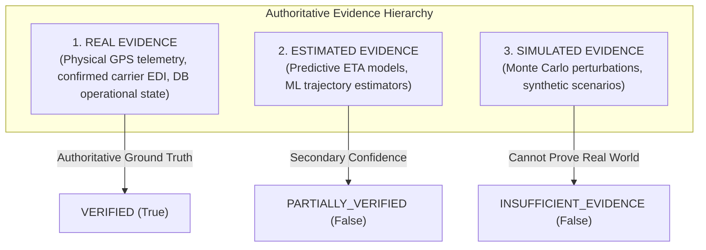
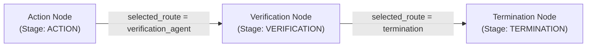

# Phase 18 — Verification Agent Architecture & Specification

> **Operational Outcome Verification, Precedence Hierarchy & Bounded Evidence Matching**
> 
> *Deterministic evaluation subsystem answering: "Did the approved operational action actually produce the intended operational outcome?"*

---

## 1. Executive Summary & Architectural Scope

Phase 18 implements the **Verification Agent** in the RiskWise 2.0 multi-agent intelligence platform.

### Strict Phase Boundary
- **Phase 15 (Decision Agent)**: Evaluates risk and synthesizes recommended mitigation candidate actions.
- **Phase 16 (Human Approval)**: Human operator reviews and signs off on actions (`APPROVED` / `REJECTED`).
- **Phase 17 (Action Agent)**: Dispatches and executes approved actions via allowlisted adapters (`ActionResult`).
- **Phase 18 (Verification Agent)**: Ingests `ActionResult` and authoritative post-action evidence, evaluates operational outcome against intent, and outputs immutable `VerificationResult`.
- **Phase 19 (Control Tower UI)**: Frontend visual command center (strictly out of scope for Phase 18).

```
Phase 17:
Approved DecisionResult → Action Agent → ActionResult
                                             ↓
Phase 18:
ActionResult + Authoritative Post-Action Evidence → Verification Agent → VerificationResult
```

### Core Invariants
1. **Submitted / Acknowledged != Verified**: Action submission or adapter acknowledgement proves dispatch, but only authoritative post-action operational evidence can prove real-world outcome.
2. **Strict Precedence**: `REAL > ESTIMATED > SIMULATED`. Simulated evidence can NEVER prove real-world operational success.
3. **Deterministic & Non-Probabilistic**: No LLM or probabilistic model determines whether an action succeeded or failed. Claude 3.5 Sonnet remains strictly explanation-only.
4. **Zero Autonomous Remediation**: If verification fails, the pipeline halts at Stage `VERIFICATION -> TERMINATION`. The graph never automatically loops back or triggers new actions.
5. **Zero DB Schema Changes**: Exactly 34 tables maintained. Reuses the existing `verification_results` table.

---

## 2. Verification Status Taxonomy

The Verification Agent enforces conservative, fail-closed status semantics across all action types:

| Status | Semantics & Transition Criteria |
| :--- | :--- |
| `VERIFIED` | Intended operational outcome observed and proven by authoritative `REAL` evidence. |
| `PARTIALLY_VERIFIED` | Expected outcome observed, but evidence is `ESTIMATED` or awaiting secondary operational sync. |
| `FAILED` | Authoritative evidence explicitly proves intended outcome did not occur (e.g. route unchanged, rejected). |
| `PENDING` | Action executed within allowable observation window; awaiting arrival of post-action telemetry. |
| `INSUFFICIENT_EVIDENCE` | No authoritative evidence exists, or only `SIMULATED` evidence was provided. |
| `NOT_APPLICABLE` | Passive operations (e.g. `MONITOR`) that do not alter operational state. |
| `EXPIRED` | Verification evaluated after the configured observation window without telemetry arrival. |
| `CONFLICT` | Contradictory authoritative evidence detected (e.g. reroute confirmed alongside carrier failure). |
| `ERROR` | Unhandled runtime or infrastructure exception encountered during verification evaluation. |

---

## 3. Supported Action Verification Handlers

| Action Type | Target Entity | Intended Outcome Derivation | Authoritative Verification Logic |
| :--- | :--- | :--- | :--- |
| `SHIPMENT_REROUTE` | `SHIPMENT` | `route_id` updated to approved corridor | Confirms `Shipment.route_id` in DB or `REROUTE_CONFIRMED` telemetry event. Detects conflicts against failure signals. |
| `CARRIER_REALLOCATION` | `SHIPMENT` / `CARRIER` | `carrier_id` reassigned to approved carrier | Confirms `Shipment.carrier_id` or `CARRIER_ACCEPTED` telemetry. Detects rejection conflicts. |
| `FACILITY_REALLOCATION` | `FACILITY` / `SHIPMENT` | Rebalancing of warehouse / factory capacity | Confirms facility operational state (`OPERATIONAL`, `ACTIVE`). |
| `EXPEDITE_SHIPMENT` | `SHIPMENT` | Mode upgraded (e.g. `AIR`), ETA reduced | Confirms transit mode is `AIR` or `AIR_FREIGHT_BOOKED` event. |
| `HOLD_SHIPMENT` | `SHIPMENT` | Status transitioned to `HELD` | Confirms status is `HELD` or `CUSTOMS_HOLD` event. Detects release/delivery conflicts. |
| `MONITOR` | Any | Passive monitoring | Evaluated as `NOT_APPLICABLE` (no state mutation required). |

---

## 4. Evidence Ingestion & Precedence Hierarchy



### Ingestion Controls
- **Tenant Scoping**: All queries filtered strictly by `org_id == command.organization_id`.
- **Temporal Window**: Bounded by `[executed_at - 5s, executed_at + observation_window_seconds]`. Stale historical events and distant future events are discarded.
- **Deduplication**: Events deduplicated via `evidence_id` and `raw_reference_id`.
- **Sorting**: Chronologically ordered by timestamp (normalized to UTC).
- **Read-Only**: The collector performs zero mutations on source-of-truth database records.

---

## 5. Idempotency & Cryptographic Fingerprinting

Each verification evaluation produces:
1. **Deterministic Verification ID**: RFC 4122 UUIDv5 derived from namespace `3456789a-bcde-0123-4567-89abcdef0123` and token `verification:{org_id}:{action_id}:{policy_version}`.
2. **Canonical Fingerprint**: SHA-256 hash of sorted canonical JSON representing the evaluation state:
```json
{
  "action_id": "act_123",
  "intended_outcome": { ... },
  "observed_outcome": { ... },
  "organization_id": "org_tenant",
  "policy_version": "1.0",
  "status": "VERIFIED"
}
```

Repeated verification requests with identical fingerprints return the existing database record without redundant writes.

---

## 6. LangGraph Orchestration Integration



- **Contract**: `VERIFICATION_NODE_CONTRACT` with `stage = AgentStage.VERIFICATION` and `is_side_effecting = False`.
- **State Ownership**: Exclusively owns `verification_id`, `verification_reference`, `verification_result`, and `verification_status`.
- **Pipeline Halting**: Always routes to `termination`. Zero autonomous retry loops.

---

## 7. REST API Endpoints

All endpoints require authentication and enforce strict multi-tenant containment:

- `POST /api/v1/verification-results/verify`: Deterministic outcome verification for an executed action (`RiskManager`, `Admin`).
- `GET /api/v1/verification-results`: List verification results with pagination, filtering, search, and sorting (`Viewer+`).
- `GET /api/v1/verification-results/{id}`: Retrieve an individual verification result ensuring tenant ownership (`Viewer+`).
