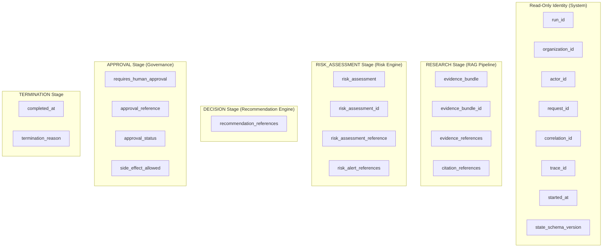

# Phase 9 Step 2 — LangGraph Agent State Contract & Execution Context

## 1. State Architecture
RiskWise 2.0 multi-agent orchestration is built on top of LangGraph `StateGraph`. In Step 2, the graph state contract (`AgentState` / `AgentGraphState`) and runtime boundary (`AgentExecutionContext`) are formalized into production-safe, strongly-typed, tenant-isolated Pydantic contracts.
The state represents **what happened** (facts, evidence IDs, risk references, lifecycle statuses, route history, structured limitations, and conflicts), strictly forbidding hidden internal reasoning, raw credentials, or unrestricted document blobs.

## 2. State Fields
`AgentState` is organized conceptually into 11 sections (A through K) plus schema versioning:

| Section | Concept | Fields | Types | Semantics |
|---|---|---|---|---|
| **A** | **Identity** | `run_id`, `organization_id`, `actor_id` | `str`, `str`, `str` | Immutable, read-only operational identity. Validated on every update. |
| **B** | **Correlation** | `request_id`, `correlation_id`, `trace_id` | `str`, `str`, `str` | End-to-end tracing identifiers across distributed services. |
| **C** | **Objective** | `objective`, `input_references`, `input_reference`, `requested_operation` | `str`, `dict`, `str?`, `str?` | Scoped goal and query criteria for the graph run. String length capped to 4096. |
| **D** | **Lifecycle** | `status`, `current_stage`, `current_node`, `step_count` | `AgentLifecycleStatus`, `AgentStage`, `str?`, `int` | Deterministic pipeline state and node execution step counter. |
| **E** | **Evidence** | `evidence_bundle_id`, `evidence_references`, `citation_references`, `evidence_bundle` | `str?`, `List[str]`, `List[str]`, `RAGEvidenceReference?` | Lightweight deterministic references to Phase 8 RAG evidence bundles and items. |
| **F** | **Risk** | `risk_assessment_id`, `risk_assessment_reference`, `risk_assessment`, `risk_alert_references`, `recommendation_references` | `str?`, `RiskAssessmentReference?`, `RiskAssessmentReference?`, `List[str]`, `List[str]` | Authoritative Phase 7 Risk Engine references. Retains scores without recalculating. |
| **G** | **Findings** | `findings`, `structured_findings`, `warnings`, `limitations`, `conflicts` | `dict`, `List[AgentFinding]`, `List[str]`, `List[AgentLimitation]`, `List[AgentConflict]` | Explicit factual findings, audit warnings, limitations, and unresolved conflicts. |
| **H** | **Routing** | `selected_route`, `next_node`, `route_reason`, `route_history` | `str?`, `str?`, `str?`, `List[RouteEvent]` | Deterministic routing choices and full hop-by-hop audit trail. |
| **I** | **Recovery** | `retry_count`, `last_error`, `error_category`, `recovery_status`, `errors` | `int`, `AgentErrorState?`, `str?`, `str?`, `List[dict]` | Structured error telemetry distinguishing retryable from non-retryable failures. |
| **J** | **Governance** | `requires_human_approval`, `approval_reference`, `side_effect_allowed`, `approval_status` | `bool`, `str?`, `bool`, `str?` | Mandatory approval boundary protecting external systems from side effects. |
| **K** | **Termination**| `termination_reason`, `started_at`, `completed_at`, `metadata` | `str?`, `datetime`, `datetime?`, `dict` | Terminal reason codes and execution timestamps. |
| **Ver**| **Version** | `state_schema_version` | `str` | Default `"1.0.0"`. Deterministic schema version indicator. |

## 3. Field Ownership Model
To prevent arbitrary agents from fabricating or silently replacing authoritative subsystem results, state fields are partitioned into strict ownership categories:



Any attempt by a node in stage X to update a field authoritative to stage Y raises `AgentStateOwnershipViolationError`.

## 4. Immutable Fields
The following fields are strictly immutable once initialized:
- `organization_id`: Must match across execution context, state, evidence bundles, risk assessments, and references. Attempts to mutate or inject another tenant fail closed immediately with `AgentTenantIsolationError`.
- `run_id`: Read-only execution identifier.
- `actor_id`: Read-only user/service actor identity.
- `request_id`, `correlation_id`, `trace_id`: Distributed tracing context.
- `started_at`: Original run start timestamp.
- `state_schema_version`: Contract schema version.

Any node update attempting to modify these identity fields triggers `AgentTenantIsolationError` (for `organization_id`) or `AgentValidationError` (for other identity fields).

## 5. Execution Context
`AgentExecutionContext` is separate from graph state and immutable (`frozen=True`):
```python
class AgentExecutionContext(BaseModel):
    organization_id: str
    actor_id: str
    request_id: str
    correlation_id: str
    trace_id: str
    role: str = "SYSTEM"
    allowed_stages: List[AgentStage] = Field(default_factory=lambda: list(AgentStage))
    is_admin: bool = False
    feature_flags: Dict[str, bool] = Field(default_factory=dict)
    max_steps: int = 25
    max_retries: int = 3
    timeout_seconds: float = 120.0
    max_state_size_bytes: int = 1_000_000
```
Nodes cannot escalate their own privileges, mutate execution limits, or alter the tenant context.

## 6. State Update Contract
State mutations must pass through `validate_state_update` or `apply_state_update`:
```python
def apply_state_update(
    current_state: AgentGraphState,
    updates: Dict[str, Any],
    node_id: str,
    stage: AgentStage,
) -> AgentGraphState:
    validate_state_update(current_state, updates, node_id, stage)
    ...
```
1. Verifies that no forbidden keys (credentials, chain-of-thought) exist in updates.
2. Enforces tenant immutability (`organization_id`).
3. Enforces read-only identity protection (`IDENTITY_FIELDS`).
4. Enforces authoritative field ownership (`AUTHORITATIVE_FIELD_OWNERS`).
5. Records route transitions automatically into `route_history` as `RouteEvent` instances.

## 7. Evidence References
State references Phase 8 RAG evidence by deterministic IDs (`evi_...`, `cit_...`, `bnd_...`). Raw provider payloads, full document bodies, and unrestricted text chunks are never copied into graph state. When raw evidence details are needed, agents query the RAG service using validated bundle IDs.

## 8. Risk References
State references authoritative Phase 7 Risk Engine assessments (`risk_assessment_id`, `risk_assessment_reference`, `risk_alert_references`). The graph state never recalculates risk scores; the Risk Engine remains the single source of truth.

## 9. Structured Findings
The `AgentFinding` contract captures factual findings without internal chain-of-thought:
- `finding_id`: Deterministic or UUID identifier.
- `category`: Domain finding classification (e.g. `SUPPLY_CHAIN_BOTTLENECK`, `PORT_CONGESTION`).
- `title`: Summary headline (max 256 chars).
- `summary`: Factual finding body (max 4096 chars).
- `severity`: Optional severity rating (`LOW`, `MEDIUM`, `HIGH`, `CRITICAL`).
- `confidence`: Calibrated confidence metric (0.0 to 1.0).
- `evidence_ids`: Traceable list of Phase 8 evidence identifiers.
- `source_references`: Document and entity references.
- `limitations`: Contextual limitations noted when creating the finding.
- `created_by_node`: Node identifier responsible for the finding.

## 10. Conflicts
The `AgentConflict` contract preserves discrepancies across sources:
- `conflict_id`: Unique identifier.
- `category`: Conflict domain (e.g., `CARRIER_SCHEDULE_DISCREPANCY`, `ETA_MISMATCH`).
- `affected_references`: Signal or entity IDs in dispute.
- `source_evidence_ids`: Evidence items backing opposing claims.
- `description`: Objective description of the conflict.
- `resolution_status`: `UNRESOLVED`, `ACKNOWLEDGED`, `RESOLVED`, or `ESCALATED`.
Conflicts are never silently resolved or deleted.

## 11. Limitations
The `AgentLimitation` contract tracks operational limitations:
- `limitation_id`: Unique identifier.
- `category`: `INSUFFICIENT_EVIDENCE`, `STALE_DATA`, `CONFLICTING_SOURCES`, `UNAVAILABLE_PROVIDER`, `UNSUPPORTED_OPERATION`, `INCOMPLETE_CORRELATION`, `STATE_SIZE_LIMIT`.
- `description`: Plain-text explanation of the limitation.
- `affected_nodes`: List of downstream nodes impacted.
- `mitigation_or_impact`: Operational impact or fallback strategy applied.

## 12. Route History
`RouteEvent` tracks each deterministic hop:
- `from_node`: Source node.
- `to_node`: Destination node.
- `reason_code`: Short machine-readable code (e.g., `REQUIRE_FACTUAL_EVIDENCE`, `MAX_STEPS_EXCEEDED`).
- `step_number`: Execution step index.
- `timestamp`: UTC event timestamp.
No prompts or reasoning tokens are stored in route history.

## 13. Error State
`AgentErrorState` captures failure telemetry safely:
- `error_code`: Domain error code (e.g., `RATE_LIMIT_EXCEEDED`, `DEPENDENCY_TIMEOUT`).
- `category`: Error classification (`EXTERNAL_API`, `VALIDATION`, `TIMEOUT`).
- `message`: Sanitized error text (passwords and API keys automatically screened).
- `retryable`: Boolean indicating recovery eligibility.
- `occurred_at`: UTC timestamp.
- `correlation_information`: Trace and request IDs.

## 14. Execution Limits & Loop Protection
- `max_steps`: Graph terminates when `step_count >= max_steps` (default 25).
- `repeated-node protection`: If 3 consecutive routing hops target the same non-terminal node, `RouteEvaluator` transitions to `termination` with reason `REPEATED_NODE_LOOP_DETECTED`.
- Collection caps: `structured_findings` <= 100, `limitations` <= 50, `conflicts` <= 50, `route_history` <= 100, `errors` <= 50.

## 15. Authorization Context
Authorization is determined through caller context (`role`, `allowed_stages`, `is_admin`) and validated before tool invocation. No access tokens, OAuth cookies, or credentials are saved in state.

## 16. State Versioning
`state_schema_version` is tracked as a string (default `"1.0.0"`). Future revisions will bump minor or major numbers with backward-compatible field defaults.

## 17. Serialization
`AgentState` is 100% JSON-serializable:
- All models inherit from Pydantic `BaseModel` with `extra="forbid"`.
- Values in `findings`, `metadata`, and `input_references` are validated against standard JSON primitives (`validate_json_serializable_primitives`).
- Arbitrary Python objects (DB sessions, sockets, clients) are rejected with `AgentValidationError`.
- `AgentGraphStateDict` (`TypedDict`) maps 1:1 with serialized state for LangGraph nodes.

## 18. Security & Secret Redaction
- Recursive screening for sensitive patterns: `password`, `secret`, `token`, `api_key`, `authorization`, `cookie`, `bearer`.
- Content in `AgentFinding.summary` and `AgentErrorState.message` is checked for embedded bearer tokens or password strings (`validate_no_sensitive_values`).
- Prompt injection screening ensures untrusted inputs remain pure data.

## 19. Tenant Isolation
Strict multi-tenancy is enforced at multiple layers:
1. `validate_tenant_isolation` verifies matching `organization_id` between context and state.
2. Model validators reject cross-tenant evidence bundles, risk assessments, and references.
3. Node updates cannot alter `organization_id`.
All tenant violations fail closed with `AgentTenantIsolationError`.

## 20. Database Impact
- Zero database migrations.
- 34 PostgreSQL tables remain completely unchanged.
- Tables `agent_runs`, `agent_tasks`, `agent_tool_calls`, `audit_logs` are preserved for future persistence.

## 21. API Impact
- Zero public API modifications.
- OpenAPI contract remains exactly 60 paths, 96 operations, 104 schemas.
- The state contract remains internal to the backend multi-agent orchestration layer.

## 22. Tests
- 82 focused unit and integration tests in `tests/test_phase9_langgraph_agent_state_contract.py`.
- 64 Step 1 tests in `tests/test_phase9_langgraph_architecture_contracts.py` (146 total Phase 9 tests passing).
- Zero regressions across Phase 8, Phase 7, Phase 6, Phase 5 suites.

## 23. Future Compatibility
The state contract is ready for future agents in Phase 9 Steps 3+:
- Research Agent: Populates `evidence_bundle`, `evidence_references`, `structured_findings`.
- Risk Agent: Populates `risk_assessment`, `risk_alert_references`.
- Prediction Agent: Adds forecast findings and limitations.
- Scenario Agent: Simulates scenarios and appends conflicts.
- Decision Agent: Populates `recommendation_references`.
- Approval Stage: Evaluates `requires_human_approval` and waits for human input.
- Action Agent: Executes side effects only after approval boundary clearance.
