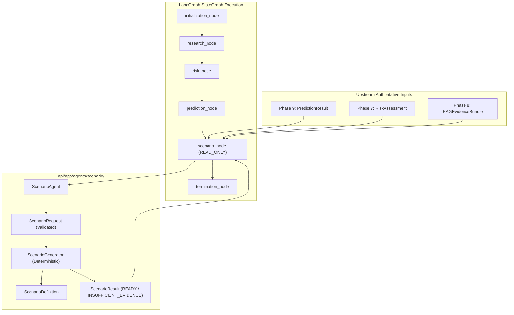

# Phase 9 Step 7 — Scenario Agent Integration

## 1. Objective

The primary objective of Phase 9 Step 7 is to integrate the **Scenario Agent** as the next orchestration node in the RiskWise 2.0 LangGraph multi-agent pipeline:

$$\text{Research Agent} \longrightarrow \text{Risk Agent} \longrightarrow \text{Prediction Agent} \longrightarrow \mathbf{Scenario\ Agent} \longrightarrow \text{Termination}$$

The Scenario Agent converts validated, authoritative upstream findings (Phase 6 NormalizedRiskSignals, Phase 7 RiskAssessments, Phase 8 RAG Evidence, and Phase 9 PredictionResults) into **strongly typed, deterministic What-If Scenario Definitions**. 

It defines the boundaries and parameters of possible future states without calculating simulation physics, network propagation, financial projections, or optimization policies.

---

## 2. Architecture



The Scenario Agent is encapsulated in `api/app/agents/scenario/`:
- `contract.py`: Pydantic V2 immutable domain contracts (`ScenarioRequest`, `ScenarioDefinition`, `ScenarioParameter`, `ScenarioTrigger`, `ScenarioConstraint`, `ScenarioResult`).
- `generator.py`: Deterministic scenario transformation engine with zero heuristics and zero probability invention.
- `agent.py`: Orchestration agent validating requests, coordinating generation, and constructing structured `AgentFinding` records.
- `node.py`: LangGraph execution handler (`scenario_node`) and metadata specification (`SCENARIO_NODE_CONTRACT`).
- `errors.py`: Fail-closed exception hierarchy rooted in `AgentGraphError`.

---

## 3. Scenario Definition

A **Scenario** is an explicit specification of a posited future condition or perturbation.

| Concept | Question Answered | Responsible Component |
| :--- | :--- | :--- |
| **Risk** | *"How risky is the current situation?"* | Phase 7 Risk Engine / Risk Agent |
| **Prediction** | *"What is expected to happen empirically?"* | Phase 9 Prediction Agent |
| **Scenario** | *"What could happen if a defined condition occurs?"* | **Phase 9 Scenario Agent** |
| **Simulation** | *"What happens when that condition propagates through the network?"* | Future Digital Twin / Simulation Engine |
| **Optimization** | *"What is the mathematically optimal response?"* | Future Prescriptive / OR-Tools Engine |
| **Decision** | *"Which mitigation strategy is selected?"* | Future Decision Agent / Governance |
| **Action** | *"Execute approved operational changes."* | Future Action Agent |

A scenario definition contains parameters (e.g. `delay_minutes = 95.0`), operational triggers, and boundary constraints. It contains zero simulation metrics, zero financial losses, and zero route changes.

---

## 4. ScenarioRequest

`ScenarioRequest` is a strictly validated Pydantic model (`extra="forbid"`) dispatched to the generator:

```python
class ScenarioRequest(ScenarioBaseModel):
    scenario_id: Optional[str] = Field(default=None, max_length=64)
    organization_id: str = Field(..., min_length=1, max_length=64)
    shipment_id: Optional[str] = Field(default=None, max_length=64)
    scenario_type: ScenarioType = Field(default=ScenarioType.SHIPMENT_DELAY)
    target_reference: Optional[str] = Field(default=None, max_length=128)
    risk_assessment_id: Optional[str] = Field(default=None, max_length=64)
    risk_assessment_reference: Optional[Dict[str, Any]] = None
    prediction_id: Optional[str] = Field(default=None, max_length=64)
    prediction_reference: Optional[Dict[str, Any]] = None
    prediction_result: Optional[Dict[str, Any]] = None
    evidence_references: List[str] = Field(default_factory=list)
    parameters: List[ScenarioParameter] = Field(default_factory=list)
    trigger: Optional[ScenarioTrigger] = None
    constraints: List[ScenarioConstraint] = Field(default_factory=list)
    horizon_hours: Optional[float] = None
    provenance: Dict[str, Any] = Field(default_factory=dict)
    correlation_id: Optional[str] = Field(default=None, max_length=64)
    trace_id: Optional[str] = Field(default=None, max_length=64)
```

Arbitrary or unvalidated dictionaries are strictly rejected. Tenant consistency across `organization_id`, `prediction_result`, `risk_assessment_reference`, and `evidence_references` is enforced at model validation.

---

## 5. ScenarioResult

`ScenarioResult` encapsulates the output of scenario generation:

```python
class ScenarioResult(ScenarioBaseModel):
    scenario_id: str = Field(..., min_length=1, max_length=64)
    organization_id: str = Field(..., min_length=1, max_length=64)
    scenario_definition: Optional[ScenarioDefinition] = None
    status: str = Field(default=ScenarioStatus.READY.value, min_length=1, max_length=64)
    upstream_references: Dict[str, Any] = Field(default_factory=dict)
    evidence_references: List[str] = Field(default_factory=list)
    limitations: List[AgentLimitation] = Field(default_factory=list)
    provenance: Dict[str, Any] = Field(default_factory=dict)
    fingerprint: Optional[str] = Field(default=None, max_length=64)
    created_by_node: str = Field(default="scenario_agent", min_length=1, max_length=64)
    evaluated_at: datetime = Field(default_factory=lambda: datetime.now(timezone.utc))
```

If status is `READY`, a non-null `scenario_definition` and `fingerprint` are mandatory. If status is `INSUFFICIENT_EVIDENCE`, `scenario_definition` is `None` and an explicit `AgentLimitation` is populated.

---

## 6. ScenarioParameter

`ScenarioParameter` defines a discrete, typed perturbation:

- `name`: string identifier (e.g. `delay_minutes`, `port_capacity_reduction`).
- `value`: finite float, int, string, or boolean. Non-finite values (`NaN`, `inf`) are rejected.
- `unit`: optional unit of measurement (e.g. `minutes`, `percentage`).
- `source`: identifier of originating agent or sensor (e.g. `PredictionAgent:pred_123`).
- `source_type`: classification (`PREDICTION`, `EXPLICIT`, `RISK_CONTEXT`).
- `evidence_references`: list of grounding evidence identifiers.
- `provenance`: audit metadata scrubbed of credentials and internal monologue.

---

## 7. ScenarioTrigger

`ScenarioTrigger` specifies activation conditions without executing arbitrary code:

- `trigger_type`: categorized trigger identifier (e.g. `PREDICTED_DELAY_THRESHOLD`).
- `source_reference`: upstream node or signal reference.
- `condition`: deterministic comparison operator (e.g. `GREATER_THAN`, `EQUALS`). Rejects dynamic code injection tokens (`eval`, `exec`, `__import__`, `lambda`, `;`).
- `threshold`: finite float value.
- `evidence_references`: lineage tracking.

---

## 8. ScenarioConstraint

`ScenarioConstraint` defines operational bounds:

- `constraint_type`: category (e.g. `MAXIMUM_DELAY`, `PLANNING_HORIZON`).
- `name`: unique constraint key.
- `value`: finite number, boolean, or bounded string.
- `unit`: optional unit string.

---

## 9. Supported Scenario Types

The initial scenario taxonomy is strictly bounded and deterministic:

1. `SHIPMENT_DELAY`: Posits temporal transit delays derived from upstream delay predictions.
2. `PORT_DISRUPTION`: Posits port capacity degradation or closure (contextual).
3. `WEATHER_DISRUPTION`: Posits severe meteorological impact along transit corridors.
4. `SUPPLIER_DISRUPTION`: Posits supplier production or dispatch bottlenecks.
5. `ROUTE_DISRUPTION`: Posits route blockage or corridor speed reduction.

---

## 10. Deterministic Generation

The `ScenarioGenerator` is a pure deterministic state machine:
- Same inputs produce identical `scenario_id` (UUIDv5) and `fingerprint` (SHA-256).
- Zero random number generators, zero heuristic guesses, and zero LLM text completion.
- Parameters are sorted canonically prior to hashing.

---

## 11. Scenario Identity

Scenario IDs are generated deterministically using UUIDv5 under the `RAG_UUID_NAMESPACE`:

$$\text{token} = \text{org\_id} : \text{scenario\_type} : \text{target\_reference} : \text{param\_fp} : \text{pred\_id} : \text{risk\_id}$$
$$\text{scenario\_id} = \text{UUIDv5}(\text{RAG\_UUID\_NAMESPACE}, \text{token})$$

Volatile inputs (system clock, trace ID, request ID, random numbers) are strictly excluded from identity generation.

---

## 12. Fingerprinting

A 256-bit SHA-256 fingerprint is computed over canonicalized, key-sorted JSON:

$$\text{fingerprint} = \text{SHA-256}(\text{JSON}_{\text{canonical}}(\{\text{org}, \text{type}, \text{target}, \text{params}, \text{constraints}, \text{trigger}, \text{upstream}\}))$$

Any alteration in parameter values, units, or upstream bindings produces a distinct fingerprint.

---

## 13. Prediction Integration

The Scenario Agent natively consumes `PredictionResult`:
- When upstream prediction status is `COMPLETED`, `predicted_value` is converted directly into a `ScenarioParameter` (e.g. `delay_minutes`).
- Lineage (`PredictionAgent:pred_id`), model metadata, and evidence references are preserved.
- When prediction status is `NOT_AVAILABLE`, `INSUFFICIENT_FEATURES`, or `FAILED`, the generator does **not** fabricate a prediction. It returns `INSUFFICIENT_EVIDENCE` with an explicit `AgentLimitation`.

---

## 14. Risk Integration

Upstream Phase 7 `RiskAssessment` provides contextual boundaries:
- Risk score and risk level are preserved as upstream context references.
- The Scenario Agent **never** recalculates risk, changes weights, or re-scores threats.
- Risk scores are **never** converted into scenario occurrence probabilities.

---

## 15. Research Integration

Structured findings from Phase 9 `ResearchAgent` provide contextual grounding:
- Finding IDs, evidence bundle IDs, and citations are propagated in `evidence_references`.
- Research prose is **never** converted into numeric scenario parameters using heuristic guessing.

---

## 16. Evidence Lineage

Every scenario maintains auditable, tamper-resistant provenance:

$$\text{Scenario} \longrightarrow \text{Prediction} / \text{Risk} \longrightarrow \text{RAG Evidence Unit} \longrightarrow \text{Normalized Risk Signal}$$

Lineage is preserved through immutable ID references rather than duplicating unvalidated external payloads.

---

## 17. State Ownership

The Scenario Agent operates under strict authoritative field ownership:

- **Owned fields (`AgentStage.SCENARIO_ANALYSIS`)**:
  - `scenario_id`
  - `scenario_reference`
  - `scenario_result`
- **Protected fields (Read-Only)**:
  - `organization_id`, `run_id`, `actor_id`, `request_id`, `correlation_id`, `trace_id`
  - Research fields (`evidence_bundle_id`, `evidence_references`)
  - Risk fields (`risk_assessment_id`, `risk_assessment_reference`, `risk_assessment`)
  - Prediction fields (`prediction_id`, `prediction_reference`, `prediction_result`)
  - Approval / Action / Verification fields

Any attempt by `scenario_agent` to write to unowned fields raises `AgentStateOwnershipViolationError` via `validate_state_update()`.

---

## 18. Tenant Isolation

Multi-tenant isolation enforces fail-closed semantics across all layers:
- `ExecutionContext.organization_id == GraphState.organization_id == ScenarioRequest.organization_id == PredictionResult.organization_id == RiskAssessment.organization_id`.
- Any mismatch raises `ScenarioTenantIsolationError` or `AgentTenantIsolationError`.
- Validated at request construction, model validation, graph initialization, and execution completion.

---

## 19. Security

Security controls adhere to RiskWise 2.0 zero-trust invariants:
- **Credential Scrubbing**: `validate_no_forbidden_keys` and `validate_no_sensitive_values` reject passwords, API keys, secrets, tokens, and authorization headers in parameters, provenance, and state.
- **Monologue Protection**: `validate_no_reasoning_content` strictly forbids `chain_of_thought`, `private_reasoning`, and `internal_monologue`.
- **Code Injection Defense**: Trigger conditions reject `eval`, `exec`, and dynamic expression evaluators.

---

## 20. Observability

The Scenario Agent emits structured `NodeExecutionTelemetry` via `AgentObservability`:
- Captured: `run_id`, `organization_id`, `actor_id`, `request_id`, `correlation_id`, `trace_id`, `node_name="scenario_agent"`, `status`, `duration_ms`, `error_code`, `step_count`.
- Emitted in a `finally` block on both success and failure.
- Redaction ensures credentials and private tokens are never logged.

---

## 21. Error Handling

Scenario Agent errors inherit from `AgentGraphError` and fail closed (`retryable=False`):
- `InvalidScenarioRequestError`: malformed requests or illegal extra fields.
- `ScenarioTenantIsolationError`: cross-tenant data access attempts.
- `InvalidScenarioParameterError`: non-finite floats, invalid units, dynamic syntax in triggers.
- `UnsupportedScenarioTypeError`: taxonomy violations.
- `InsufficientEvidenceError`: absent upstream evidence where parameter cannot be derived.
- `ScenarioGenerationError`: internal structural failures.

---

## 22. LangGraph Integration

- **Node ID**: `scenario_agent`
- **Node Contract**: `SCENARIO_NODE_CONTRACT`
- **Stage**: `AgentStage.SCENARIO_ANALYSIS` (alias `AgentStage.SCENARIO`)
- **Side Effect Type**: `ToolSideEffectType.READ_ONLY`
- **Allowed Stage Transitions**:
  - `PREDICTION -> SCENARIO_ANALYSIS`
  - `SCENARIO_ANALYSIS -> DECISION` (future)
  - `SCENARIO_ANALYSIS -> TERMINATION`

---

## 23. Database Impact

- **PostgreSQL Tables**: exactly 34 tables in `Base.metadata.tables`.
- **Existing `scenarios` table**: preserved unchanged.
- **Migrations**: 0 new migrations. No schema drift.

---

## 24. API Impact

- **OpenAPI Paths**: exactly 60 paths.
- **OpenAPI Operations**: exactly 96 operations.
- **OpenAPI Schemas**: exactly 104 schemas.
- **Public API**: 0 new public endpoints (Scenario Agent is an internal LangGraph orchestration node).

---

## 25. Tests

104 focused tests covering:
- Contracts & Pydantic V2 validation (extra forbidding, types, bounds)
- Parameter sanitization (NaN/inf rejection, unit validation)
- Trigger expression safety (injection defense)
- Deterministic ID & fingerprint generation
- Prediction integration without data fabrication
- Risk context preservation without recalculation
- Research finding preservation without prose heuristics
- State ownership and authoritative write boundaries
- Multi-tenant isolation and fail-closed violations
- Credential scrubbing and reasoning protection
- LangGraph node registration, execution, and telemetry
- Read-only non-side-effect enforcement
- Zero probability invention
- Zero simulation / optimization boundary

---

## 26. Non-Goals

The following remain strictly out of scope for Phase 9 Step 7:
- No Digital Twin simulation execution.
- No network flow or ETA delay propagation.
- No OR-Tools optimization solvers.
- No Decision Agent recommendations.
- No Human Approval gates.
- No Action Agent operational executions.
- No carrier rerouting or shipment mutation.
- No Claude, Bedrock, or LLM-based text generation.
- No new database tables or schema migrations.
- No public Scenario API endpoints.

---

## 27. Future Digital Twin / Simulation Boundary

The Scenario Agent produces `ScenarioDefinition` instances that define *what* perturbation to evaluate. Downstream systems consume this definition:
- **Digital Twin**: Ingests `ScenarioDefinition` to propagate network delay across multi-modal edges.
- **Simulation Engine**: Runs Monte Carlo or stochastic variance on the scenario definition.
- **Prescriptive Optimization (OR-Tools)**: Formulates MILP models to minimize total cost and delay under the posited scenario conditions.
- **Decision Agent**: Evaluates optimization trade-offs to prepare human approval proposals.
