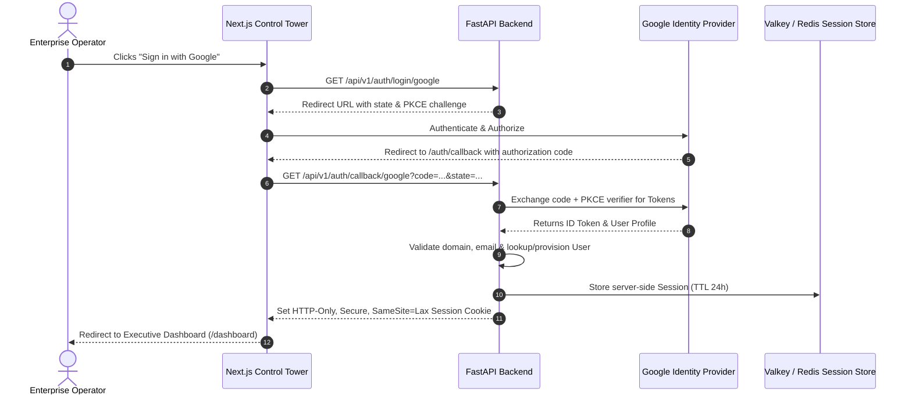

# RiskWise 2.0 — Enterprise Security & Governance Architecture

## 1. Zero-Trust Security Architecture

RiskWise 2.0 operates on a strict zero-trust security paradigm:

- **Perimeter Defense**: All incoming traffic passes through AWS CloudFront WAF and Application Load Balancer with TLS 1.3 encryption.
- **Identity First**: No unauthenticated API endpoint exists except for health probes (`/health`, `/ready`) and OAuth initiation routes.
- **Least Privilege**: Microservices, background workers, and database connections operate with minimal necessary privileges.
- **KMS Envelope Encryption**: Sensitive data at rest (OAuth tokens, carrier credentials, contract clauses) is encrypted using AWS KMS Customer Managed Keys.

---

## 2. Authentication: Google OAuth 2.0 with PKCE

Authentication is managed via Google OAuth 2.0 Authorization Code Flow enhanced with Proof Key for Code Exchange (PKCE) to prevent authorization code interception attacks:

---

## 3. Role-Based Access Control (RBAC)

The system defines 5 hierarchical, mutually enforced roles:

| Capability / Resource | `VIEWER` | `ANALYST` | `OPSMANAGER` | `RISKMANAGER` | `ADMIN` |
| :--- | :---: | :---: | :---: | :---: | :---: |
| **View Dashboard, Maps, Shipments** | Yes | Yes | Yes | Yes | Yes |
| **Inspect Risks & Incidents** | Yes | Yes | Yes | Yes | Yes |
| **Execute What-If Simulations** | No | Yes | Yes | Yes | Yes |
| **View Recommendation Dossiers** | Yes | Yes | Yes | Yes | Yes |
| **Formulate Optimization Runs** | No | No | Yes | Yes | Yes |
| **Draft Mitigation Decisions** | No | No | Yes | Yes | Yes |
| **Approve Mitigation Decisions** | No | No | No | Yes | Yes |
| **Execute Governed Actions** | No | No | Yes | No | Yes |
| **Verify Ground-Truth Actions** | No | No | Yes | Yes | Yes |
| **Manage Users & Tenant Settings**| No | No | No | No | Yes |
| **Export Audit Ledger** | No | No | No | Yes | Yes |

---

## 4. Multi-Tenant Isolation

Every operational record includes an indexed `tenant_id` column:

- **Repository Layer Enforcement**: Base repository classes automatically inject `WHERE tenant_id = :tenant_id` on all database read and write queries.
- **Session Context**: The current tenant is extracted from the cryptographically verified session token and bound to the request context via FastAPI dependency injection.
- **Cache Isolation**: All Valkey/Redis cache keys are prefixed with `tenant:{tenant_id}:`.

---

## 5. Cryptographic Governance & State Fingerprinting

### SHA-256 Decision Sealing
When the Mitigation Decision Agent formulates an operational plan, it computes a deterministic SHA-256 fingerprint:

$$\text{Fingerprint} = \text{SHA-256}(\text{RiskScore} \parallel \text{SimulationLoss} \parallel \text{OptimalCost} \parallel \text{AffectedShipments})$$

This fingerprint is permanently recorded on the `Decision` entity. When an authorized `RISKMANAGER` submits an approval:
1. The backend recalculates the live system fingerprint.
2. If telemetry has shifted (e.g., vessel has already entered the storm zone or carrier has departed), the fingerprints do not match.
3. The approval is **rejected** with `STATE_FINGERPRINT_MISMATCH`, preventing operators from approving stale mitigation proposals.

---

## 6. Ground-Truth Verification Hierarchy

RiskWise 2.0 enforces the verification hierarchy:

$$\text{REAL} > \text{ESTIMATED} > \text{SIMULATED}$$

- **SIMULATED**: Projected outcome from Monte Carlo or OR-Tools model. Never sufficient for action completion.
- **ESTIMATED**: Carrier estimated time of arrival (ETA) or booking confirmation. Marked as pending.
- **REAL**: Authoritative physical sensor confirmation (vessel AIS ping, port terminal gate timestamp, air cargo airway bill physical scan). Only this state transitions an action to `VERIFIED`.

---

## 7. Secrets Management & Credential Hygiene

1. **Zero Static Credentials**: CI/CD deployment authenticates to AWS via GitHub OIDC without hardcoded AWS access keys.
2. **Repository Protection**: `.gitignore` strictly excludes `.env`, `credentials.json`, `*.pem`, `*.key`, and `*.db`.
3. **Automated Secret Scanning**: Pre-push and CI pipeline scans enforce pattern matching against AWS access keys, private keys, and API tokens.
